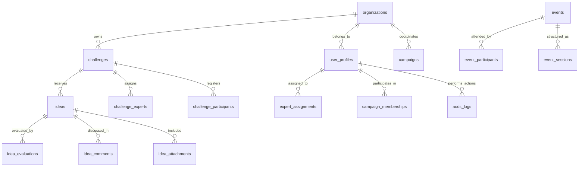

# 🗄️ Database Schema Documentation

## 📊 **SCHEMA OVERVIEW**

The Ruwād Innovation Platform uses **PostgreSQL via Supabase** with a comprehensive schema designed for enterprise innovation management. The database consists of **80+ tables** with sophisticated relationships, security policies, and audit trails.

### **Key Design Principles**
- **Multi-tenant Architecture**: Organization-scoped data isolation
- **Row Level Security (RLS)**: Database-level access control
- **Audit Trails**: Complete change tracking for compliance
- **Real-time Capabilities**: WebSocket-enabled live updates
- **JSONB Integration**: Flexible metadata and configuration storage

---

## 🏗️ **CORE ENTITY RELATIONSHIPS**



---

## 🏢 **ORGANIZATIONS & USERS**

### **organizations**
```sql
CREATE TABLE organizations (
    id UUID PRIMARY KEY DEFAULT gen_random_uuid(),
    name TEXT NOT NULL,
    slug TEXT UNIQUE NOT NULL,
    description TEXT,
    logo_url TEXT,
    website_url TEXT,
    settings JSONB DEFAULT '{}',
    subscription_tier TEXT DEFAULT 'free',
    is_active BOOLEAN DEFAULT true,
    created_at TIMESTAMPTZ DEFAULT NOW(),
    updated_at TIMESTAMPTZ DEFAULT NOW()
);

-- Indexes for performance
CREATE INDEX idx_organizations_slug ON organizations(slug);
CREATE INDEX idx_organizations_active ON organizations(is_active);
```

### **user_profiles**
```sql
CREATE TABLE user_profiles (
    id UUID PRIMARY KEY DEFAULT gen_random_uuid(),
    user_id UUID REFERENCES auth.users(id) ON DELETE CASCADE,
    organization_id UUID REFERENCES organizations(id) ON DELETE CASCADE,
    email TEXT NOT NULL,
    full_name TEXT NOT NULL,
    display_name TEXT,
    avatar_url TEXT,
    bio TEXT,
    role TEXT NOT NULL DEFAULT 'user',
    department TEXT,
    job_title TEXT,
    phone TEXT,
    location TEXT,
    timezone TEXT DEFAULT 'UTC',
    language_preference TEXT DEFAULT 'en',
    theme_preference TEXT DEFAULT 'system',
    notification_settings JSONB DEFAULT '{}',
    skills TEXT[],
    interests TEXT[],
    social_links JSONB DEFAULT '{}',
    is_active BOOLEAN DEFAULT true,
    last_login_at TIMESTAMPTZ,
    created_at TIMESTAMPTZ DEFAULT NOW(),
    updated_at TIMESTAMPTZ DEFAULT NOW(),
    
    UNIQUE(user_id, organization_id)
);

-- Comprehensive indexing
CREATE INDEX idx_user_profiles_organization ON user_profiles(organization_id);
CREATE INDEX idx_user_profiles_role ON user_profiles(role);
CREATE INDEX idx_user_profiles_active ON user_profiles(is_active);
CREATE INDEX idx_user_profiles_skills ON user_profiles USING GIN(skills);
```

---

## 🎯 **CHALLENGE MANAGEMENT SYSTEM**

### **challenges**
```sql
CREATE TABLE challenges (
    id UUID PRIMARY KEY DEFAULT gen_random_uuid(),
    organization_id UUID REFERENCES organizations(id) ON DELETE CASCADE,
    title TEXT NOT NULL,
    slug TEXT NOT NULL,
    description TEXT NOT NULL,
    challenge_brief TEXT,
    objectives JSONB DEFAULT '[]',
    success_criteria JSONB DEFAULT '[]',
    target_audience TEXT[],
    categories TEXT[],
    tags TEXT[],
    difficulty_level TEXT DEFAULT 'intermediate',
    estimated_duration TEXT,
    
    -- Timeline Management
    registration_start TIMESTAMPTZ,
    registration_end TIMESTAMPTZ,
    submission_start TIMESTAMPTZ NOT NULL,
    submission_end TIMESTAMPTZ NOT NULL,
    evaluation_start TIMESTAMPTZ,
    evaluation_end TIMESTAMPTZ,
    announcement_date TIMESTAMPTZ,
    
    -- Status and Configuration
    status TEXT DEFAULT 'draft',
    visibility TEXT DEFAULT 'public',
    max_participants INTEGER,
    team_size_min INTEGER DEFAULT 1,
    team_size_max INTEGER DEFAULT 1,
    submission_guidelines TEXT,
    evaluation_criteria JSONB DEFAULT '{}',
    
    -- Rewards and Recognition
    rewards JSONB DEFAULT '[]',
    prize_pool_amount DECIMAL(10,2),
    prize_currency TEXT DEFAULT 'SAR',
    
    -- Media and Resources
    banner_image_url TEXT,
    gallery_images JSONB DEFAULT '[]',
    resource_links JSONB DEFAULT '[]',
    
    -- Metadata
    created_by UUID REFERENCES user_profiles(id),
    updated_by UUID REFERENCES user_profiles(id),
    created_at TIMESTAMPTZ DEFAULT NOW(),
    updated_at TIMESTAMPTZ DEFAULT NOW(),
    
    UNIQUE(organization_id, slug)
);

-- Specialized indexes for queries
CREATE INDEX idx_challenges_org_status ON challenges(organization_id, status);
CREATE INDEX idx_challenges_timeline ON challenges(submission_start, submission_end);
CREATE INDEX idx_challenges_categories ON challenges USING GIN(categories);
CREATE INDEX idx_challenges_tags ON challenges USING GIN(tags);
```

### **ideas**
```sql
CREATE TABLE ideas (
    id UUID PRIMARY KEY DEFAULT gen_random_uuid(),
    challenge_id UUID REFERENCES challenges(id) ON DELETE CASCADE,
    organization_id UUID REFERENCES organizations(id) ON DELETE CASCADE,
    
    -- Basic Information
    title TEXT NOT NULL,
    summary TEXT NOT NULL,
    description TEXT NOT NULL,
    problem_statement TEXT,
    proposed_solution TEXT,
    implementation_plan TEXT,
    expected_impact TEXT,
    
    -- Categorization
    categories TEXT[],
    tags TEXT[],
    target_beneficiaries TEXT[],
    innovation_type TEXT,
    
    -- Team Information
    team_name TEXT,
    team_members JSONB DEFAULT '[]',
    lead_innovator UUID REFERENCES user_profiles(id),
    
    -- Status and Workflow
    status TEXT DEFAULT 'draft',
    submission_date TIMESTAMPTZ,
    is_featured BOOLEAN DEFAULT false,
    
    -- Evaluation Data
    total_score DECIMAL(5,2),
    evaluation_count INTEGER DEFAULT 0,
    average_rating DECIMAL(3,2),
    
    -- Engagement Metrics
    view_count INTEGER DEFAULT 0,
    like_count INTEGER DEFAULT 0,
    comment_count INTEGER DEFAULT 0,
    share_count INTEGER DEFAULT 0,
    
    -- Media and Attachments
    thumbnail_url TEXT,
    presentation_url TEXT,
    prototype_url TEXT,
    demo_video_url TEXT,
    
    -- Metadata
    created_by UUID REFERENCES user_profiles(id),
    updated_by UUID REFERENCES user_profiles(id),
    created_at TIMESTAMPTZ DEFAULT NOW(),
    updated_at TIMESTAMPTZ DEFAULT NOW()
);

-- Performance indexes
CREATE INDEX idx_ideas_challenge ON ideas(challenge_id);
CREATE INDEX idx_ideas_org_status ON ideas(organization_id, status);
CREATE INDEX idx_ideas_team_lead ON ideas(lead_innovator);
CREATE INDEX idx_ideas_submission_date ON ideas(submission_date);
CREATE INDEX idx_ideas_score ON ideas(total_score DESC);
```

### **idea_evaluations**
```sql
CREATE TABLE idea_evaluations (
    id UUID PRIMARY KEY DEFAULT gen_random_uuid(),
    idea_id UUID REFERENCES ideas(id) ON DELETE CASCADE,
    expert_id UUID REFERENCES user_profiles(id) ON DELETE CASCADE,
    challenge_id UUID REFERENCES challenges(id) ON DELETE CASCADE,
    
    -- Scoring System
    criteria_scores JSONB NOT NULL, -- {"innovation": 8.5, "feasibility": 7.0, ...}
    weighted_score DECIMAL(5,2) NOT NULL,
    confidence_level INTEGER DEFAULT 5, -- 1-10 scale
    
    -- Qualitative Feedback
    strengths TEXT[],
    weaknesses TEXT[],
    improvement_suggestions TEXT[],
    overall_feedback TEXT,
    
    -- Evaluation Metadata
    evaluation_round INTEGER DEFAULT 1,
    time_spent_minutes INTEGER,
    evaluation_method TEXT DEFAULT 'standard',
    
    -- Status Tracking
    status TEXT DEFAULT 'draft',
    submitted_at TIMESTAMPTZ,
    is_final BOOLEAN DEFAULT false,
    
    created_at TIMESTAMPTZ DEFAULT NOW(),
    updated_at TIMESTAMPTZ DEFAULT NOW(),
    
    UNIQUE(idea_id, expert_id, evaluation_round)
);

-- Evaluation analysis indexes
CREATE INDEX idx_evaluations_idea ON idea_evaluations(idea_id);
CREATE INDEX idx_evaluations_expert ON idea_evaluations(expert_id);
CREATE INDEX idx_evaluations_score ON idea_evaluations(weighted_score DESC);
```

---

## 📊 **CAMPAIGN COORDINATION**

### **campaigns**
```sql
CREATE TABLE campaigns (
    id UUID PRIMARY KEY DEFAULT gen_random_uuid(),
    organization_id UUID REFERENCES organizations(id) ON DELETE CASCADE,
    
    -- Basic Information
    name TEXT NOT NULL,
    slug TEXT NOT NULL,
    description TEXT NOT NULL,
    mission_statement TEXT,
    vision_statement TEXT,
    strategic_objectives JSONB DEFAULT '[]',
    
    -- Timeline and Phases
    start_date DATE NOT NULL,
    end_date DATE NOT NULL,
    phases JSONB DEFAULT '[]',
    milestones JSONB DEFAULT '[]',
    
    -- Scope and Resources
    target_outcomes JSONB DEFAULT '[]',
    success_metrics JSONB DEFAULT '[]',
    budget_allocation JSONB DEFAULT '{}',
    resource_requirements JSONB DEFAULT '{}',
    
    -- Stakeholder Management
    stakeholder_groups TEXT[],
    partner_organizations UUID[],
    sponsor_contacts JSONB DEFAULT '[]',
    
    -- Status and Progress
    status TEXT DEFAULT 'planning',
    progress_percentage INTEGER DEFAULT 0,
    current_phase TEXT,
    
    -- Media and Branding
    logo_url TEXT,
    banner_url TEXT,
    brand_colors JSONB DEFAULT '{}',
    
    created_by UUID REFERENCES user_profiles(id),
    updated_by UUID REFERENCES user_profiles(id),
    created_at TIMESTAMPTZ DEFAULT NOW(),
    updated_at TIMESTAMPTZ DEFAULT NOW(),
    
    UNIQUE(organization_id, slug)
);

-- Campaign analysis indexes
CREATE INDEX idx_campaigns_org_status ON campaigns(organization_id, status);
CREATE INDEX idx_campaigns_timeline ON campaigns(start_date, end_date);
CREATE INDEX idx_campaigns_stakeholders ON campaigns USING GIN(stakeholder_groups);
```

---

## 🎓 **EXPERT NETWORK**

### **expert_profiles**
```sql
CREATE TABLE expert_profiles (
    id UUID PRIMARY KEY DEFAULT gen_random_uuid(),
    user_profile_id UUID REFERENCES user_profiles(id) ON DELETE CASCADE,
    organization_id UUID REFERENCES organizations(id) ON DELETE CASCADE,
    
    -- Professional Information
    expertise_areas TEXT[] NOT NULL,
    industry_experience TEXT[],
    years_of_experience INTEGER,
    education_background JSONB DEFAULT '[]',
    certifications JSONB DEFAULT '[]',
    languages TEXT[] DEFAULT ARRAY['en'],
    
    -- Availability and Preferences
    availability_status TEXT DEFAULT 'available',
    max_concurrent_evaluations INTEGER DEFAULT 5,
    preferred_challenge_types TEXT[],
    time_zone TEXT,
    working_hours JSONB DEFAULT '{}',
    
    -- Performance Metrics
    total_evaluations INTEGER DEFAULT 0,
    average_rating DECIMAL(3,2),
    consensus_rate DECIMAL(5,2), -- Agreement with other experts
    response_time_hours DECIMAL(5,2),
    
    -- Recognition and Rankings
    expert_level TEXT DEFAULT 'junior',
    reputation_score INTEGER DEFAULT 0,
    badges JSONB DEFAULT '[]',
    achievements JSONB DEFAULT '[]',
    
    is_active BOOLEAN DEFAULT true,
    created_at TIMESTAMPTZ DEFAULT NOW(),
    updated_at TIMESTAMPTZ DEFAULT NOW()
);

-- Expert discovery indexes
CREATE INDEX idx_expert_profiles_expertise ON expert_profiles USING GIN(expertise_areas);
CREATE INDEX idx_expert_profiles_availability ON expert_profiles(availability_status);
CREATE INDEX idx_expert_profiles_rating ON expert_profiles(average_rating DESC);
```

### **expert_assignments**
```sql
CREATE TABLE expert_assignments (
    id UUID PRIMARY KEY DEFAULT gen_random_uuid(),
    expert_id UUID REFERENCES expert_profiles(id) ON DELETE CASCADE,
    challenge_id UUID REFERENCES challenges(id) ON DELETE CASCADE,
    assigner_id UUID REFERENCES user_profiles(id),
    
    -- Assignment Details
    assignment_type TEXT DEFAULT 'evaluator', -- evaluator, mentor, advisor
    assignment_date TIMESTAMPTZ DEFAULT NOW(),
    expected_start_date TIMESTAMPTZ,
    expected_completion_date TIMESTAMPTZ,
    
    -- Workload and Compensation
    estimated_hours DECIMAL(5,2),
    hourly_rate DECIMAL(8,2),
    total_compensation DECIMAL(10,2),
    
    -- Status Tracking
    status TEXT DEFAULT 'pending', -- pending, accepted, declined, active, completed
    acceptance_date TIMESTAMPTZ,
    completion_date TIMESTAMPTZ,
    
    -- Performance Tracking
    actual_hours DECIMAL(5,2),
    quality_rating DECIMAL(3,2),
    timeliness_rating DECIMAL(3,2),
    
    notes TEXT,
    created_at TIMESTAMPTZ DEFAULT NOW(),
    updated_at TIMESTAMPTZ DEFAULT NOW()
);

-- Assignment management indexes
CREATE INDEX idx_expert_assignments_expert ON expert_assignments(expert_id);
CREATE INDEX idx_expert_assignments_challenge ON expert_assignments(challenge_id);
CREATE INDEX idx_expert_assignments_status ON expert_assignments(status);
```

---

## 🚀 **AI & ANALYTICS**

### **ai_interactions**
```sql
CREATE TABLE ai_interactions (
    id UUID PRIMARY KEY DEFAULT gen_random_uuid(),
    user_id UUID REFERENCES user_profiles(id) ON DELETE CASCADE,
    organization_id UUID REFERENCES organizations(id) ON DELETE CASCADE,
    
    -- Interaction Details
    interaction_type TEXT NOT NULL, -- idea_analysis, content_generation, evaluation_assist
    entity_type TEXT, -- idea, challenge, campaign, etc.
    entity_id UUID,
    
    -- AI Request/Response
    prompt TEXT NOT NULL,
    response TEXT,
    model_used TEXT,
    tokens_consumed INTEGER,
    processing_time_ms INTEGER,
    
    -- Quality Metrics
    user_rating INTEGER, -- 1-5 stars
    user_feedback TEXT,
    was_helpful BOOLEAN,
    
    -- Technical Metadata
    request_metadata JSONB DEFAULT '{}',
    response_metadata JSONB DEFAULT '{}',
    error_message TEXT,
    
    status TEXT DEFAULT 'completed',
    created_at TIMESTAMPTZ DEFAULT NOW()
);

-- AI analytics indexes
CREATE INDEX idx_ai_interactions_user ON ai_interactions(user_id);
CREATE INDEX idx_ai_interactions_type ON ai_interactions(interaction_type);
CREATE INDEX idx_ai_interactions_date ON ai_interactions(created_at);
```

### **analytics_events**
```sql
CREATE TABLE analytics_events (
    id UUID PRIMARY KEY DEFAULT gen_random_uuid(),
    organization_id UUID REFERENCES organizations(id) ON DELETE CASCADE,
    user_id UUID REFERENCES user_profiles(id),
    
    -- Event Classification
    event_category TEXT NOT NULL, -- user_action, system_event, business_metric
    event_name TEXT NOT NULL,     -- page_view, idea_submitted, challenge_created
    event_label TEXT,
    
    -- Event Data
    properties JSONB DEFAULT '{}',
    value DECIMAL(10,2),
    
    -- Session and Context
    session_id TEXT,
    page_url TEXT,
    referrer_url TEXT,
    user_agent TEXT,
    ip_address INET,
    
    -- Timing
    timestamp TIMESTAMPTZ DEFAULT NOW(),
    duration_ms INTEGER,
    
    -- Geographic Data
    country_code TEXT,
    city TEXT,
    timezone TEXT
);

-- Analytics performance indexes
CREATE INDEX idx_analytics_org_category ON analytics_events(organization_id, event_category);
CREATE INDEX idx_analytics_timestamp ON analytics_events(timestamp);
CREATE INDEX idx_analytics_user_session ON analytics_events(user_id, session_id);
```

---

## 🔐 **SECURITY & AUDIT**

### **Row Level Security (RLS) Policies**

#### **Organization-Based Data Isolation**
```sql
-- Universal organization scoping policy template
CREATE POLICY "organization_isolation" ON [table_name]
FOR ALL USING (
    organization_id IN (
        SELECT organization_id 
        FROM user_profiles 
        WHERE user_id = auth.uid()
    )
);

-- Applied to all multi-tenant tables:
-- challenges, ideas, campaigns, expert_profiles, etc.
```

#### **Role-Based Access Control**
```sql
-- Admin-only access to sensitive operations
CREATE POLICY "admin_only_access" ON organizations
FOR UPDATE USING (
    EXISTS (
        SELECT 1 FROM user_profiles 
        WHERE user_id = auth.uid() 
        AND role IN ('admin', 'super_admin')
    )
);

-- Expert access to assigned challenges
CREATE POLICY "expert_challenge_access" ON challenges
FOR SELECT USING (
    status = 'published' OR
    id IN (
        SELECT challenge_id 
        FROM expert_assignments 
        WHERE expert_id IN (
            SELECT id FROM expert_profiles 
            WHERE user_profile_id IN (
                SELECT id FROM user_profiles 
                WHERE user_id = auth.uid()
            )
        )
    )
);
```

### **audit_logs**
```sql
CREATE TABLE audit_logs (
    id UUID PRIMARY KEY DEFAULT gen_random_uuid(),
    organization_id UUID REFERENCES organizations(id) ON DELETE CASCADE,
    user_id UUID REFERENCES user_profiles(id),
    
    -- Action Details
    action_type TEXT NOT NULL, -- CREATE, UPDATE, DELETE, LOGIN, etc.
    table_name TEXT NOT NULL,
    record_id UUID,
    
    -- Change Tracking
    old_values JSONB,
    new_values JSONB,
    changed_fields TEXT[],
    
    -- Context Information
    ip_address INET,
    user_agent TEXT,
    request_id UUID,
    session_id TEXT,
    
    -- Security Classification
    severity_level TEXT DEFAULT 'INFO', -- DEBUG, INFO, WARN, ERROR, CRITICAL
    risk_category TEXT,
    
    -- Compliance Fields
    compliance_tags TEXT[],
    retention_period INTERVAL DEFAULT '7 years',
    
    timestamp TIMESTAMPTZ DEFAULT NOW()
);

-- Audit trail indexes for compliance queries
CREATE INDEX idx_audit_logs_user_action ON audit_logs(user_id, action_type);
CREATE INDEX idx_audit_logs_table_record ON audit_logs(table_name, record_id);
CREATE INDEX idx_audit_logs_timestamp ON audit_logs(timestamp);
CREATE INDEX idx_audit_logs_severity ON audit_logs(severity_level);
```

---

## 🔄 **DATABASE FUNCTIONS & TRIGGERS**

### **Automatic Timestamp Updates**
```sql
CREATE OR REPLACE FUNCTION update_updated_at_column()
RETURNS TRIGGER AS $$
BEGIN
    NEW.updated_at = NOW();
    RETURN NEW;
END;
$$ LANGUAGE plpgsql;

-- Applied to all tables with updated_at columns
CREATE TRIGGER update_challenges_updated_at
    BEFORE UPDATE ON challenges
    FOR EACH ROW
    EXECUTE FUNCTION update_updated_at_column();
```

### **Challenge Status Automation**
```sql
CREATE OR REPLACE FUNCTION auto_update_challenge_status()
RETURNS TRIGGER AS $$
BEGIN
    -- Auto-transition from published to submission_closed
    IF NEW.submission_end < NOW() AND OLD.status = 'published' THEN
        NEW.status = 'submission_closed';
    END IF;
    
    -- Auto-transition to evaluation phase
    IF NEW.evaluation_start < NOW() AND OLD.status = 'submission_closed' THEN
        NEW.status = 'evaluation';
    END IF;
    
    RETURN NEW;
END;
$$ LANGUAGE plpgsql;

CREATE TRIGGER challenge_status_automation
    BEFORE UPDATE ON challenges
    FOR EACH ROW
    EXECUTE FUNCTION auto_update_challenge_status();
```

### **Audit Trail Automation**
```sql
CREATE OR REPLACE FUNCTION create_audit_log()
RETURNS TRIGGER AS $$
BEGIN
    INSERT INTO audit_logs (
        organization_id, user_id, action_type, table_name, 
        record_id, old_values, new_values
    ) VALUES (
        COALESCE(NEW.organization_id, OLD.organization_id),
        get_current_user_id(),
        TG_OP,
        TG_TABLE_NAME,
        COALESCE(NEW.id, OLD.id),
        CASE WHEN TG_OP = 'DELETE' THEN to_jsonb(OLD) ELSE NULL END,
        CASE WHEN TG_OP != 'DELETE' THEN to_jsonb(NEW) ELSE NULL END
    );
    
    RETURN COALESCE(NEW, OLD);
END;
$$ LANGUAGE plpgsql;

-- Applied to sensitive tables
CREATE TRIGGER audit_challenges AFTER INSERT OR UPDATE OR DELETE 
ON challenges FOR EACH ROW EXECUTE FUNCTION create_audit_log();
```

---

## 📈 **PERFORMANCE OPTIMIZATION**

### **Strategic Indexing**
```sql
-- Composite indexes for common query patterns
CREATE INDEX idx_ideas_challenge_status_score 
ON ideas(challenge_id, status, total_score DESC);

CREATE INDEX idx_evaluations_expert_status 
ON idea_evaluations(expert_id, status, submitted_at DESC);

CREATE INDEX idx_campaigns_org_timeline 
ON campaigns(organization_id, start_date, end_date);

-- Partial indexes for active records
CREATE INDEX idx_active_challenges 
ON challenges(organization_id, status) 
WHERE status IN ('published', 'submission_closed', 'evaluation');

CREATE INDEX idx_available_experts 
ON expert_profiles(expertise_areas, availability_status) 
WHERE is_active = true AND availability_status = 'available';
```

### **Materialized Views for Analytics**
```sql
-- Challenge performance summary
CREATE MATERIALIZED VIEW challenge_performance_summary AS
SELECT 
    c.id,
    c.organization_id,
    c.title,
    c.status,
    COUNT(i.id) as total_ideas,
    COUNT(DISTINCT i.lead_innovator) as unique_participants,
    AVG(i.total_score) as average_idea_score,
    COUNT(ie.id) as total_evaluations,
    AVG(ie.weighted_score) as average_evaluation_score
FROM challenges c
LEFT JOIN ideas i ON c.id = i.challenge_id
LEFT JOIN idea_evaluations ie ON i.id = ie.idea_id AND ie.is_final = true
GROUP BY c.id, c.organization_id, c.title, c.status;

-- Refresh schedule (via cron job or trigger)
CREATE INDEX idx_challenge_perf_summary_org 
ON challenge_performance_summary(organization_id);
```

---

## 🔧 **MAINTENANCE & MONITORING**

### **Health Check Queries**
```sql
-- Database performance monitoring
SELECT 
    schemaname,
    tablename,
    n_tup_ins as inserts,
    n_tup_upd as updates,
    n_tup_del as deletes,
    n_live_tup as live_tuples,
    n_dead_tup as dead_tuples
FROM pg_stat_user_tables 
ORDER BY n_live_tup DESC;

-- Index usage analysis
SELECT 
    schemaname,
    tablename,
    indexname,
    idx_tup_read,
    idx_tup_fetch
FROM pg_stat_user_indexes 
ORDER BY idx_tup_read DESC;
```

### **Data Cleanup Procedures**
```sql
-- Clean up expired AI interactions (>90 days)
DELETE FROM ai_interactions 
WHERE created_at < NOW() - INTERVAL '90 days'
AND interaction_type NOT IN ('critical_analysis', 'audit_required');

-- Archive completed evaluations (>1 year)
WITH archived_evaluations AS (
    DELETE FROM idea_evaluations 
    WHERE status = 'completed' 
    AND submitted_at < NOW() - INTERVAL '1 year'
    RETURNING *
)
INSERT INTO archived_idea_evaluations SELECT * FROM archived_evaluations;
```

---

This comprehensive database schema provides the foundation for all platform functionality, with proper security, performance optimization, and audit capabilities. The schema supports the complex requirements of enterprise innovation management while maintaining data integrity and scalability.

*For API access patterns and query optimization examples, see the [API Documentation](./API-Documentation.md).*