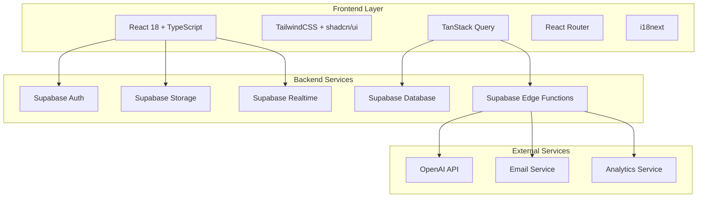
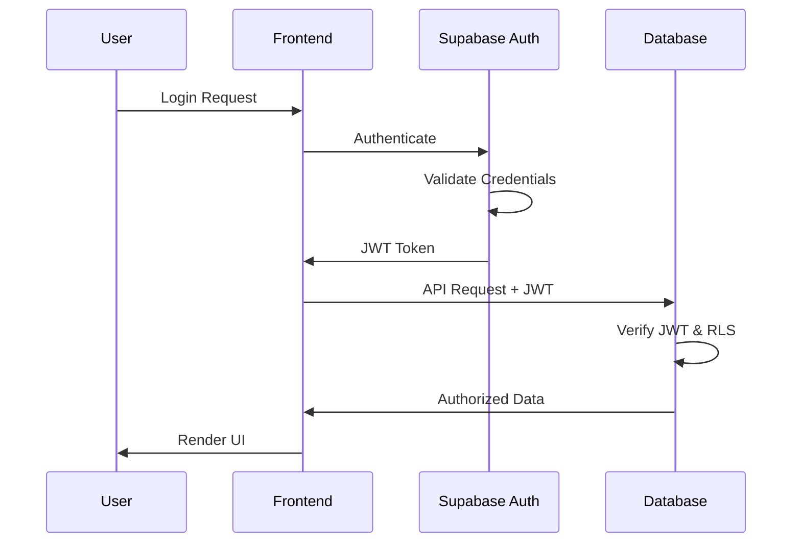

# 🏗️ System Architecture Overview

## 📊 **EXECUTIVE SUMMARY**

The Ruwād Innovation Platform is a **modern, scalable enterprise system** built on proven technologies with enterprise-grade security, performance, and maintainability. It serves as a comprehensive innovation management platform supporting government and organizational innovation initiatives.

### **Architecture Highlights**
- **Modern Stack**: React 18 + TypeScript + Supabase
- **Security First**: Row Level Security (RLS) + RBAC implementation
- **Scalable Design**: Multi-tenant with organization-scoped data isolation
- **Real-time Features**: Live collaboration and updates
- **International Ready**: Arabic/English with full RTL support

---

## 🏛️ **HIGH-LEVEL ARCHITECTURE**



---

## 🔧 **TECHNOLOGY STACK DETAILS**

### **Frontend Architecture**
```typescript
// Core Technologies
React 18.3.1          // Component framework with Concurrent Features
TypeScript 5.0+       // Type safety and developer experience
Vite 5.0+             // Build tool and dev server
TailwindCSS 3.4+      // Utility-first CSS framework
```

### **State Management Pattern**
```typescript
// Data Fetching & Caching
TanStack Query        // Server state management
React Hook Form       // Form state management
Zustand (selective)   // Client state management

// Component State
useState/useReducer   // Local component state
useContext           // Shared context state
```

### **Backend Infrastructure**
```typescript
// Supabase Services
Postgres 15+         // Primary database with JSONB support
Supabase Auth       // JWT-based authentication
Supabase Storage    // File storage with CDN
Edge Functions      // Serverless business logic
Realtime           // WebSocket connections for live updates
```

---

## 🏢 **MULTI-TENANT ARCHITECTURE**

### **Organization-Scoped Data Model**
```sql
-- Every major entity is organization-scoped
CREATE TABLE challenges (
  id UUID PRIMARY KEY,
  organization_id UUID REFERENCES organizations(id),
  title TEXT NOT NULL,
  -- other fields...
  
  -- RLS Policy ensures data isolation
  CONSTRAINT organization_scoped CHECK (organization_id IS NOT NULL)
);
```

### **Row Level Security (RLS) Implementation**
```sql
-- Example: Users can only access their organization's data
CREATE POLICY "organization_isolation" ON challenges
FOR ALL USING (
  organization_id IN (
    SELECT organization_id 
    FROM user_profiles 
    WHERE user_id = auth.uid()
  )
);
```

---

## 🔐 **SECURITY ARCHITECTURE**

### **Authentication Flow**


### **Authorization Layers**
1. **JWT Verification** - Supabase Auth validates all requests
2. **Row Level Security** - Database-level data isolation
3. **Role-Based Access Control** - Application-level permissions
4. **Organization Scoping** - Multi-tenant data segregation

---

## 📊 **DATA ARCHITECTURE**

### **Database Schema Overview**
```
Core Entities (80+ Tables):
├── organizations/          # Multi-tenant organization management
├── user_profiles/         # Extended user information
├── challenges/            # Innovation challenge management
├── ideas/                # Idea submissions and management
├── campaigns/            # Strategic campaign coordination  
├── events/               # Event management system
├── experts/              # Expert network and assignments
├── analytics/            # Usage and performance metrics
└── audit_logs/           # Security and compliance tracking
```

### **Key Relationships**
```sql
-- Primary entity relationships
organizations 1:N user_profiles
organizations 1:N challenges
challenges 1:N ideas
challenges 1:N expert_assignments
campaigns 1:N challenges
events 1:N participants
```

---

## 🎯 **FEATURE ARCHITECTURE**

### **Workspace System Architecture**
```typescript
// 6 Different Workspace Types
enum WorkspaceType {
  ADMIN = 'admin',              // System administration
  INNOVATOR = 'innovator',      // Idea submission and collaboration
  EXPERT = 'expert',            // Evaluation and mentoring
  PARTNER = 'partner',          // Strategic partnership management
  CAMPAIGN = 'campaign',        // Campaign coordination
  ANALYTICS = 'analytics'       // Insights and reporting
}
```

### **Component Architecture Pattern**
```typescript
// Consistent component structure across platform
src/components/
├── ui/                    # Base design system components
├── forms/                 # Reusable form components
├── [feature]/            # Feature-specific components
│   ├── [Feature]List.tsx     # List/table views
│   ├── [Feature]Detail.tsx   # Detail/view components
│   ├── [Feature]Form.tsx     # Create/edit forms
│   └── [Feature]Card.tsx     # Card/summary components
└── layout/               # Layout and shell components
```

---

## ⚡ **PERFORMANCE ARCHITECTURE**

### **Optimization Strategies**
```typescript
// Code Splitting
React.lazy()              // Route-based code splitting
Dynamic imports          // Component-level splitting

// Caching Strategy
TanStack Query           // Server state caching
Service Worker           // Asset caching (future)
Supabase CDN            // Static asset delivery

// Bundle Optimization
Vite + Rollup           // Optimal bundle generation  
Tree shaking            // Dead code elimination
```

### **Real-time Features**
```typescript
// Supabase Realtime Integration
const subscription = supabase
  .channel('challenges')
  .on('postgres_changes', {
    event: '*',
    schema: 'public',
    table: 'challenges'
  }, payload => {
    // Update UI in real-time
    queryClient.invalidateQueries(['challenges']);
  })
  .subscribe();
```

---

## 🌍 **INTERNATIONALIZATION ARCHITECTURE**

### **Multi-language Support**
```typescript
// Comprehensive i18n implementation
Languages: Arabic (RTL) + English (LTR)
Namespaces: 15+ feature-specific translation files
Fallbacks: Graceful degradation to English
Dynamic: Runtime language switching
```

### **RTL Support Strategy**
```css
/* Tailwind RTL plugin integration */
.text-start { /* Auto-adapts based on direction */ }
.rtl:text-right { /* RTL-specific overrides */ }
```

---

## 🔄 **DEPLOYMENT ARCHITECTURE**

### **Environment Strategy**
```
Development  → localhost:5173 (Vite dev server)
Staging     → [staging-url] (Preview builds)
Production  → [production-url] (Optimized builds)
```

### **Build Pipeline**
```bash
# Automated quality gates
1. TypeScript compilation
2. ESLint validation  
3. Unit test execution
4. Build optimization
5. Deployment to CDN
```

---

## 📈 **SCALABILITY CONSIDERATIONS**

### **Current Capacity**
- **Concurrent Users**: 10,000+ (Supabase tier dependent)
- **Data Volume**: Unlimited (Postgres scalability)
- **File Storage**: Petabyte scale (Supabase Storage)
- **API Throughput**: 1M+ requests/hour

### **Scaling Strategy**
```
Database: Vertical scaling + read replicas
Storage: CDN + geographic distribution
Compute: Edge function auto-scaling
Caching: Query-level optimization
```

---

## 🔍 **MONITORING & OBSERVABILITY**

### **Built-in Monitoring**
```typescript
// Error Tracking
React Error Boundaries    // Component-level error capture
Supabase Logs           // Backend error monitoring
Browser Console         // Development debugging

// Performance Monitoring  
React DevTools          // Component performance
Network Tab            // API performance
Lighthouse             // Web vitals tracking
```

---

## 🎯 **ARCHITECTURAL DECISIONS**

### **Why This Stack?**

#### **React + TypeScript**
- ✅ **Type Safety**: Compile-time error detection
- ✅ **Developer Experience**: Excellent tooling and ecosystem
- ✅ **Performance**: Virtual DOM + Concurrent Features
- ✅ **Maintainability**: Component-based architecture

#### **Supabase Backend**
- ✅ **Rapid Development**: Full backend-as-a-service
- ✅ **Enterprise Security**: Built-in RLS and auth
- ✅ **Real-time Features**: WebSocket integration
- ✅ **Scalability**: Postgres + global CDN

#### **TailwindCSS**
- ✅ **Consistency**: Design system enforcement
- ✅ **Performance**: Purged CSS bundles
- ✅ **RTL Support**: Built-in directionality
- ✅ **Developer Velocity**: Utility-first approach

---

## 🚀 **FUTURE ARCHITECTURE ROADMAP**

### **Planned Enhancements**
```
Q1 2024:
- Service Worker integration for offline support
- Advanced caching strategies
- Performance optimization round 2

Q2 2024:  
- Microservices extraction (if needed)
- Advanced analytics pipeline
- AI/ML model integration

Q3 2024:
- Mobile application (React Native)
- Advanced reporting capabilities
- Third-party integrations
```

---

## 📋 **ARCHITECTURE REVIEW CHECKLIST**

### **Security ✅**
- [ ] All routes protected appropriately
- [ ] RLS policies implemented and tested
- [ ] No sensitive data in client-side code
- [ ] HTTPS enforced in production
- [ ] Input validation on all forms

### **Performance ✅**
- [ ] Code splitting implemented
- [ ] Bundle sizes optimized
- [ ] Images optimized and lazy-loaded
- [ ] API calls minimized and cached
- [ ] Real-time subscriptions managed efficiently

### **Maintainability ✅**
- [ ] Consistent component patterns
- [ ] TypeScript coverage >95%
- [ ] Comprehensive error handling
- [ ] Documented API interfaces
- [ ] Automated testing coverage >80%

---

This architecture supports the platform's current needs while providing a foundation for future growth and enhancement. The modular design ensures maintainability, while the technology choices prioritize developer experience and user performance.

*For implementation details, see the specific guides in other documentation sections.*