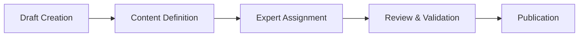
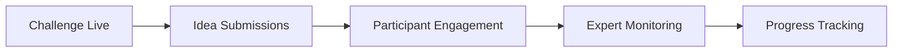
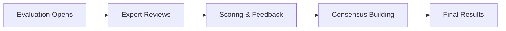

# 🎯 Challenge Management System

## 📊 **SYSTEM OVERVIEW**

The Challenge Management System is the **core feature** of the Ruwād Innovation Platform, enabling end-to-end management of innovation challenges from creation through evaluation and results.

### **Key Capabilities**
- **Challenge Lifecycle Management** - Complete workflow from draft to completion
- **Expert Assignment & Evaluation** - Multi-expert evaluation with weighted scoring
- **Idea Submission & Management** - Participant idea collection and organization
- **Real-time Collaboration** - Live updates and collaborative features
- **Multi-language Support** - Arabic/English with full RTL support

---

## 🔄 **CHALLENGE LIFECYCLE**

### **Phase 1: Challenge Creation & Setup**


#### **Components Involved**
- `ChallengeForm.tsx` - Main creation/editing form
- `ChallengePreview.tsx` - Preview before publication  
- `ExpertAssignment.tsx` - Expert selection and assignment
- `ChallengeSettings.tsx` - Timeline and configuration

#### **Database Tables**
```sql
challenges             -- Main challenge data
challenge_experts      -- Expert assignments  
challenge_settings     -- Configuration options
challenge_media       -- Attached files and images
```

### **Phase 2: Active Challenge Period**


#### **Components Involved**
- `ChallengeDetail.tsx` - Public challenge display
- `IdeaSubmissionForm.tsx` - Participant idea submission
- `ChallengeParticipants.tsx` - Participant management
- `ChallengeProgress.tsx` - Real-time progress tracking

#### **Database Tables**
```sql
ideas                  -- Submitted ideas
challenge_participants -- Participant registrations
idea_attachments      -- Supporting files
idea_comments         -- Discussion threads
```

### **Phase 3: Evaluation & Scoring**


#### **Components Involved**
- `EvaluationDashboard.tsx` - Expert evaluation interface
- `IdeaEvaluationForm.tsx` - Individual idea scoring
- `EvaluationSummary.tsx` - Aggregated results view
- `ExpertFeedback.tsx` - Feedback and comments

#### **Database Tables**
```sql
idea_evaluations      -- Expert scores and feedback
evaluation_criteria   -- Scoring framework
evaluation_sessions   -- Evaluation tracking
expert_assignments    -- Expert-to-idea assignments
```

---

## 🏗️ **TECHNICAL ARCHITECTURE**

### **Component Hierarchy**
```
ChallengeManagement/
├── ChallengeList.tsx          # List view with filters
├── ChallengeDetail.tsx        # Public challenge view
├── ChallengeForm.tsx          # Create/edit form
├── ChallengeCard.tsx          # Summary card component
├── evaluation/
│   ├── EvaluationDashboard.tsx
│   ├── IdeaEvaluationForm.tsx
│   └── EvaluationSummary.tsx
├── ideas/
│   ├── IdeaSubmissionForm.tsx
│   ├── IdeaList.tsx
│   └── IdeaDetail.tsx
└── admin/
    ├── ChallengeSettings.tsx
    ├── ExpertAssignment.tsx
    └── ChallengeAnalytics.tsx
```

### **Key Hooks & Services**
```typescript
// Core Data Hooks
useChallenges()           // Challenge CRUD operations
useChallenge(id)         // Single challenge with ideas
useIdeaSubmission()      // Idea submission workflow
useEvaluation()          // Expert evaluation system

// Real-time Hooks  
useChallengeSubscription() // Live challenge updates
useIdeaUpdates()          // Real-time idea submissions
useEvaluationProgress()   // Live evaluation status

// Business Logic Hooks
useChallengePermissions() // Role-based access control
useExpertAssignment()     // Expert assignment logic
useEvaluationWorkflow()   // Evaluation state management
```

---

## 📋 **BUSINESS RULES & VALIDATION**

### **Challenge Creation Rules**
```typescript
interface ChallengeValidation {
  title: {
    minLength: 10,
    maxLength: 200,
    required: true
  },
  description: {
    minLength: 100,
    maxLength: 5000,
    required: true
  },
  timeline: {
    submissionStart: Date,    // Must be future date
    submissionEnd: Date,      // Must be after start
    evaluationEnd: Date,      // Must be after submission end
    announcementDate: Date    // Must be after evaluation end
  },
  experts: {
    minCount: 3,              // Minimum 3 experts required
    maxCount: 10,             // Maximum 10 experts per challenge
    diversityRequired: true   // Must have diverse expertise
  }
}
```

### **Idea Submission Rules**
```typescript
interface IdeaValidation {
  title: {
    minLength: 5,
    maxLength: 100,
    required: true,
    unique: true              // Per challenge uniqueness
  },
  description: {
    minLength: 200,
    maxLength: 2000,
    required: true
  },
  attachments: {
    maxFiles: 5,
    maxSize: '10MB',
    allowedTypes: ['pdf', 'doc', 'ppt', 'jpg', 'png']
  },
  submission: {
    onlyDuringActivePhase: true,
    oneIdeaPerParticipant: true,
    requiresApproval: false
  }
}
```

### **Evaluation Rules**
```typescript
interface EvaluationValidation {
  scoring: {
    scale: '1-10',            // 10-point scale
    criteriaRequired: [       // Required evaluation criteria
      'innovation',
      'feasibility', 
      'impact',
      'presentation'
    ],
    weightedScoring: true,    // Criteria can have different weights
    consensusRequired: false  // Individual expert scores
  },
  timeline: {
    evaluationWindow: '14 days', // Default evaluation period
    expertDeadline: 'strict',    // Deadlines are enforced
    lateSubmissionHandling: 'disabled'
  }
}
```

---

## 🔐 **PERMISSIONS & SECURITY**

### **Role-Based Access Control**
```typescript
enum ChallengePermissions {
  // Admin Permissions
  CREATE_CHALLENGE = 'challenges:create',
  EDIT_CHALLENGE = 'challenges:edit',  
  DELETE_CHALLENGE = 'challenges:delete',
  MANAGE_EXPERTS = 'challenges:manage_experts',
  VIEW_ANALYTICS = 'challenges:analytics',
  
  // Expert Permissions  
  VIEW_ASSIGNED_CHALLENGES = 'evaluation:view_assigned',
  EVALUATE_IDEAS = 'evaluation:evaluate',
  PROVIDE_FEEDBACK = 'evaluation:feedback',
  VIEW_OTHER_EVALUATIONS = 'evaluation:view_others',
  
  // Participant Permissions
  VIEW_PUBLIC_CHALLENGES = 'challenges:view_public',
  SUBMIT_IDEAS = 'ideas:submit',
  VIEW_OWN_SUBMISSIONS = 'ideas:view_own',
  EDIT_DRAFT_IDEAS = 'ideas:edit_draft'
}
```

### **Data Access Policies (RLS)**
```sql
-- Challenges are visible based on organization and status
CREATE POLICY "challenge_visibility" ON challenges
FOR SELECT USING (
  organization_id = current_organization_id() AND
  (status = 'published' OR 
   user_has_permission('challenges:edit'))
);

-- Ideas are only visible to authorized users
CREATE POLICY "idea_access_control" ON ideas  
FOR SELECT USING (
  -- Participant can see their own ideas
  user_id = auth.uid() OR
  -- Experts can see assigned challenge ideas
  EXISTS (
    SELECT 1 FROM challenge_experts ce
    WHERE ce.challenge_id = ideas.challenge_id 
    AND ce.expert_id = auth.uid()
  ) OR
  -- Admins can see all ideas in their organization
  user_has_permission('challenges:manage')
);
```

---

## 🔄 **WORKFLOW AUTOMATION**

### **Automated Status Transitions**
```typescript
// Challenge status automatically updates based on timeline
enum ChallengeStatus {
  DRAFT = 'draft',                    // Initial creation
  PUBLISHED = 'published',            // Public and accepting submissions
  SUBMISSION_CLOSED = 'submission_closed', // No more submissions
  EVALUATION = 'evaluation',          // Expert evaluation phase  
  COMPLETED = 'completed'             // Results published
}

// Automated transitions via Edge Functions
const statusTransitions = {
  'published → submission_closed': {
    trigger: 'submission_deadline',
    action: 'close_submissions',
    notification: 'participants_and_experts'
  },
  'submission_closed → evaluation': {
    trigger: 'evaluation_start',  
    action: 'activate_evaluation_dashboard',
    notification: 'assigned_experts'
  },
  'evaluation → completed': {
    trigger: 'evaluation_deadline',
    action: 'calculate_results',
    notification: 'all_stakeholders'
  }
}
```

### **Notification System**
```typescript
interface ChallengeNotifications {
  // Participant Notifications
  challengePublished: 'Email + In-app',
  submissionDeadlineReminder: 'Email (72h, 24h)',
  evaluationCompleted: 'Email + In-app',
  resultsAnnounced: 'Email + In-app + SMS',
  
  // Expert Notifications  
  expertAssigned: 'Email + In-app',
  evaluationStart: 'Email + In-app',
  evaluationDeadlineReminder: 'Email (48h, 12h)',
  consensusRequired: 'Email + In-app',
  
  // Admin Notifications
  challengeStatusChange: 'In-app',
  expertAcceptance: 'In-app',
  evaluationProgress: 'Daily digest',
  issuesRequireAttention: 'Immediate alert'
}
```

---

## 📊 **ANALYTICS & REPORTING**

### **Key Performance Indicators**
```typescript
interface ChallengeMetrics {
  participation: {
    totalParticipants: number,
    ideaSubmissions: number,
    completionRate: number,          // Ideas submitted vs registrations
    demographicDistribution: object
  },
  engagement: {
    averageTimeSpent: number,
    attachmentRate: number,          // Ideas with attachments  
    discussionActivity: number,
    revisitRate: number
  },
  evaluation: {
    expertParticipation: number,
    averageEvaluationTime: number,
    consensusLevel: number,          // Agreement between experts
    qualityScores: number[]
  },
  outcomes: {
    winnerSelection: object,
    implementationPlanned: number,
    innovatorRecognition: object,
    followUpActions: number
  }
}
```

### **Reporting Dashboard Components**
- `ChallengeAnalytics.tsx` - Overall challenge performance
- `ParticipationMetrics.tsx` - Participant engagement analysis  
- `EvaluationInsights.tsx` - Expert evaluation patterns
- `OutcomeTracking.tsx` - Post-challenge impact measurement

---

## 🚀 **ADVANCED FEATURES**

### **AI-Powered Enhancements**
```typescript  
interface AIFeatures {
  ideaAnalysis: {
    similarityDetection: 'Identify duplicate/similar ideas',
    qualityPreScoring: 'AI preliminary quality assessment',
    categoryClassification: 'Automatic idea categorization',
    keywordExtraction: 'Relevant tags and themes'
  },
  expertSupport: {
    evaluationAssistance: 'AI-suggested scores and feedback',
    biasDetection: 'Identify potential evaluation bias',
    consensusAnalysis: 'Highlight evaluation discrepancies',
    feedbackImprovement: 'Suggest constructive feedback'
  },
  participantExperience: {
    ideaRefinementSuggestions: 'AI-powered idea improvement tips',
    relevanceValidation: 'Check idea alignment with challenge',
    qualityChecking: 'Pre-submission quality assessment',
    resourceRecommendations: 'Suggest helpful resources'
  }
}
```

### **Integration Capabilities**
```typescript
interface ExternalIntegrations {
  calendar: {
    outlookIntegration: 'Sync challenge deadlines',
    googleCalendar: 'Automated reminder setup',
    icalExport: 'Calendar file generation'
  },
  communication: {
    slackNotifications: 'Team collaboration integration',
    teamsIntegration: 'Microsoft Teams notifications',  
    emailAutomation: 'Advanced email workflows'
  },
  analytics: {
    googleAnalytics: 'Detailed usage tracking',
    powerBI: 'Advanced reporting integration',
    customDashboards: 'Organization-specific metrics'
  }
}
```

---

## 🔧 **MAINTENANCE & TROUBLESHOOTING**

### **Common Issues & Solutions**

#### **Performance Issues**
```typescript
// Issue: Challenge list loading slowly
// Solution: Implement pagination and filtering
const optimizedChallengeQuery = {
  pagination: { pageSize: 20 },
  filtering: { status: 'published' },
  sorting: { field: 'created_at', order: 'desc' },
  caching: { ttl: 300 } // 5-minute cache
}

// Issue: Real-time updates causing UI freezes  
// Solution: Debounce updates and batch changes
const debouncedUpdates = useMemo(() => 
  debounce(updateChallengeState, 500), []);
```

#### **Data Consistency Issues**
```sql
-- Issue: Challenge status not updating automatically
-- Solution: Database triggers for status management
CREATE OR REPLACE FUNCTION update_challenge_status()
RETURNS TRIGGER AS $$
BEGIN
  IF NEW.submission_end < NOW() AND OLD.status = 'published' THEN
    NEW.status = 'submission_closed';
  END IF;
  RETURN NEW;  
END;
$$ LANGUAGE plpgsql;
```

#### **Expert Assignment Problems**
```typescript
// Issue: Expert availability conflicts
// Solution: Advanced scheduling and conflict detection
const expertAvailabilityCheck = {
  conflictDetection: true,
  workloadBalancing: true,
  expertiseMatching: true,
  timezonConsiderations: true
}
```

---

## 📚 **DEVELOPER RESOURCES**

### **Testing Strategies**
```typescript
// Unit Tests
describe('Challenge Management', () => {
  test('challenge creation validation', () => {
    // Test all validation rules
  });
  
  test('expert assignment logic', () => {
    // Test assignment algorithms
  });
  
  test('evaluation scoring calculation', () => {
    // Test scoring aggregation
  });
});

// Integration Tests  
describe('Challenge Workflow', () => {
  test('complete challenge lifecycle', () => {
    // End-to-end workflow testing
  });
});

// E2E Tests
describe('User Journeys', () => {
  test('participant submission journey', () => {
    // Full user experience testing
  });
});
```

### **API Reference**
```typescript
// Key API endpoints for challenge management
GET    /api/challenges              // List challenges
POST   /api/challenges              // Create challenge
GET    /api/challenges/:id          // Get challenge details
PUT    /api/challenges/:id          // Update challenge
DELETE /api/challenges/:id          // Delete challenge

POST   /api/challenges/:id/ideas    // Submit idea
GET    /api/challenges/:id/ideas    // List ideas
POST   /api/ideas/:id/evaluate      // Submit evaluation  
GET    /api/evaluations/:id         // Get evaluation results
```

---

This comprehensive Challenge Management System serves as the backbone of the innovation platform, supporting the complete innovation challenge lifecycle from creation through results announcement. The system is designed for scalability, maintainability, and exceptional user experience across all stakeholder groups.

*For implementation details and code examples, see the relevant component documentation in the codebase.*