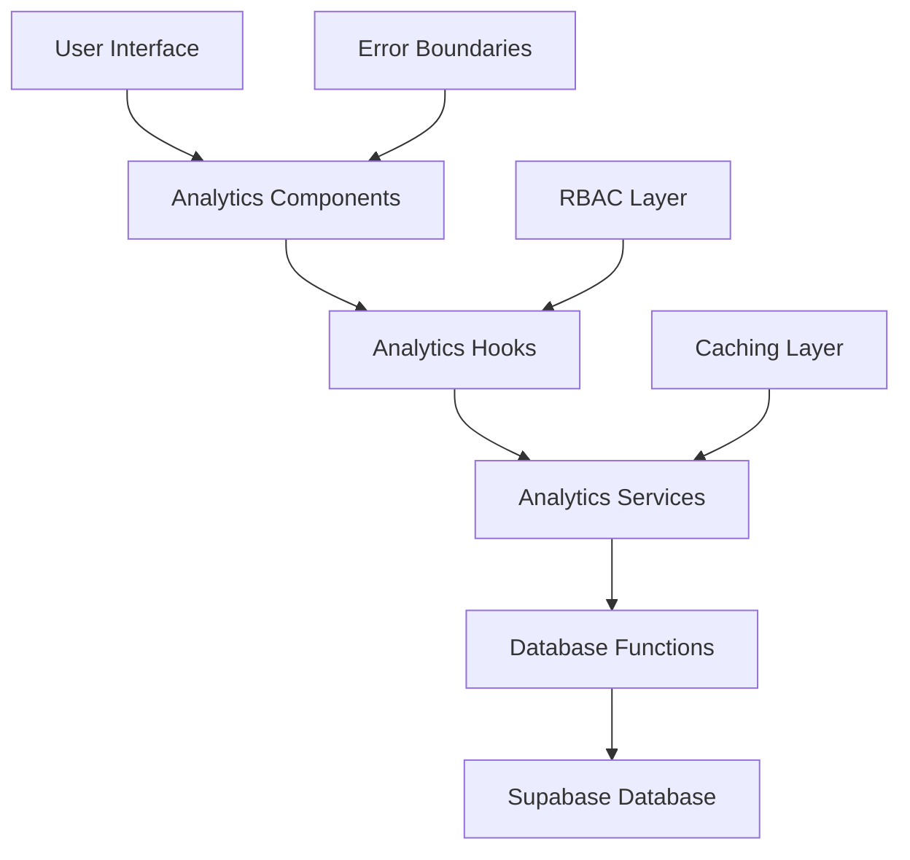

# Analytics System - Technical Documentation

## Overview

This document provides comprehensive technical documentation for the analytics system implementation. The system is built on a centralized, RBAC-enabled architecture that provides real-time analytics, metrics tracking, and comprehensive error handling across the entire platform.

The analytics system consists of two main components:
1. **Core Analytics System**: Built on the unified analytics architecture for platform metrics, user behavior, and business intelligence
2. **Logflare Analytics System**: External log management and analytics platform for comprehensive log analysis and monitoring

## Architecture

### Core Infrastructure

The analytics system follows a layered architecture pattern:



### Service Layer

#### AnalyticsService
Central service for core analytics operations:
- Fetches metrics data with role-based filtering
- Implements caching with intelligent invalidation
- Provides comprehensive error handling and fallbacks
- Integrates with existing Supabase functions

#### MetricsAnalyticsService
Specialized service for dashboard metrics:
- Aggregates user statistics
- Manages participation metrics
- Provides engagement analytics
- Implements system health monitoring

#### ChallengeAnalyticsService
Handles challenge-specific analytics:
- User behavior tracking for challenges
- Viewing session analytics
- Participation trend analysis
- Challenge-specific metrics aggregation

### React Hooks

#### useAnalytics
Core analytics hook providing:
- Centralized data fetching with RBAC
- Automatic refresh mechanisms
- Error handling and loading states
- Type-safe interfaces

```typescript
interface UseAnalyticsOptions {
  filters?: AnalyticsFilters;
  autoRefresh?: boolean;
  refreshInterval?: number;
  includeBasicMetrics?: boolean;
  includeAdvancedMetrics?: boolean;
  includeSecurityMetrics?: boolean;
  includeRoleSpecificMetrics?: boolean;
}

interface UseAnalyticsReturn {
  basicMetrics: AnalyticsMetric[] | null;
  advancedMetrics: AnalyticsMetric[] | null;
  securityMetrics: AnalyticsMetric[] | null;
  roleSpecificMetrics: AnalyticsMetric[] | null;
  loading: boolean;
  error: string | null;
  lastUpdated: Date | null;
  refresh: () => Promise<void>;
}
```

#### useMigratedDashboardStats
Specialized hook for dashboard statistics:
- Aggregates multiple data sources
- Transforms metrics to dashboard format
- Provides unified loading and error states
- Implements automatic refresh

#### Specialized Analytics Hooks
- `useDashboardAnalytics`: Dashboard-specific metrics
- `useAdminAnalytics`: Admin-level analytics with enhanced permissions
- `useSecurityAnalytics`: Security-focused metrics with frequent refresh

### Context & Providers

#### AnalyticsContext
Global analytics context providing:
- Event tracking capabilities (`trackEvent`, `trackPageView`, `trackUserAction`)
- RBAC integration with role-based access flags
- Analytics service instance access
- Centralized state management

#### AnalyticsProvider
Context provider integrated through AppShell:
- Wraps analytics context around the application
- Integrates with authentication and role access systems
- Provides global analytics tracking

## Role-Based Access Control (RBAC)

### Permission Levels

1. **Basic Metrics** - Available to all authenticated users
   - User counts, basic engagement metrics
   - Public opportunity statistics

2. **Advanced Metrics** - Requires analytics permission
   - Detailed engagement analytics
   - Conversion metrics and trends
   - User behavior patterns

3. **Security Metrics** - Admin/Super Admin only
   - Security-related analytics
   - System health monitoring
   - Access control metrics

4. **Admin Metrics** - Admin/Super Admin only
   - Administrative dashboard metrics
   - Platform-wide statistics
   - System performance metrics

### RBAC Implementation

#### Database Level
```sql
-- Example RLS policy for analytics data
CREATE POLICY "analytics_rbac_policy" ON analytics_events
FOR SELECT USING (
  CASE 
    WHEN auth.jwt() ->> 'role' = 'admin' THEN true
    WHEN auth.jwt() ->> 'role' = 'analytics' THEN event_type != 'security'
    ELSE event_type = 'basic'
  END
);
```

#### Component Level
```typescript
// Protected analytics wrapper
const ProtectedAnalyticsWrapper = ({ children, requiredRole }) => {
  const { hasRole } = useRoleAccess();
  
  if (!hasRole(requiredRole)) {
    return <AccessDeniedMessage />;
  }
  
  return (
    <AnalyticsErrorBoundary>
      {children}
    </AnalyticsErrorBoundary>
  );
};
```

#### Hook Level
```typescript
// Role-aware data fetching
const useAnalytics = (options) => {
  const { user } = useAuth();
  const { hasPermission } = useRoleAccess();
  
  const fetchMetrics = useCallback(async () => {
    const metrics = {};
    
    if (hasPermission('view_basic_analytics')) {
      metrics.basic = await AnalyticsService.getBasicMetrics();
    }
    
    if (hasPermission('view_advanced_analytics')) {
      metrics.advanced = await AnalyticsService.getAdvancedMetrics();
    }
    
    return metrics;
  }, [hasPermission]);
};
```

## Database Integration

### Core Database Functions

#### get_analytics_data()
Core analytics function providing:
- Role-based data filtering
- Aggregated metrics calculation
- Time-based filtering support
- Comprehensive error handling

#### get_security_analytics()
Security-specific analytics:
- Admin-only access control
- Security event tracking
- System health monitoring
- Audit trail analytics

#### get_role_specific_analytics()
Role-filtered analytics:
- Dynamic data filtering based on user role
- Department-specific metrics
- Hierarchical access control
- Custom metric aggregations

### Database Tables

#### Primary Analytics Tables
- `analytics_events` - User activity and event tracking
- `challenge_view_sessions` - Viewing session analytics
- `challenge_participants` - Participation tracking
- `opportunity_view_sessions` - Opportunity viewing analytics
- `opportunity_applications` - Application tracking

#### Supporting Tables
- `challenges` - Challenge-specific metrics source
- `ideas` - Ideas analytics data
- `focus_questions` - Focus question analytics
- `events` - Event analytics data
- `event_participants` - Event participation tracking

## Error Handling Strategy

### Multi-Level Error Handling

#### Component Level - AnalyticsErrorBoundary
```typescript
class AnalyticsErrorBoundary extends Component {
  constructor(props) {
    super(props);
    this.state = { hasError: false, error: null };
  }

  static getDerivedStateFromError(error) {
    return { hasError: true, error };
  }

  componentDidCatch(error, errorInfo) {
    // Log error to analytics service
    AnalyticsService.logError('component_error', error, errorInfo);
  }

  render() {
    if (this.state.hasError) {
      return <AnalyticsErrorFallback onRetry={this.handleRetry} />;
    }

    return this.props.children;
  }
}
```

#### Service Level
```typescript
class AnalyticsService {
  static async getMetrics(filters) {
    try {
      const data = await this.fetchMetrics(filters);
      return this.transformData(data);
    } catch (error) {
      logger.error('Failed to fetch metrics', { error, filters });
      return this.getFallbackData();
    }
  }

  static getFallbackData() {
    return {
      metrics: [],
      loading: false,
      error: 'Unable to load analytics data',
      lastUpdated: null
    };
  }
}
```

#### Database Level
```sql
CREATE OR REPLACE FUNCTION get_analytics_data(
  p_filters jsonb DEFAULT '{}'::jsonb
)
RETURNS jsonb AS $$
BEGIN
  -- Main analytics query with error handling
  RETURN (
    SELECT jsonb_build_object(
      'metrics', COALESCE(analytics_data, '[]'::jsonb),
      'error', null,
      'timestamp', EXTRACT(epoch FROM NOW())
    )
    FROM (
      -- Analytics calculation
    ) sub
  );
EXCEPTION
  WHEN OTHERS THEN
    RETURN jsonb_build_object(
      'metrics', '[]'::jsonb,
      'error', SQLERRM,
      'timestamp', EXTRACT(epoch FROM NOW())
    );
END;
$$ LANGUAGE plpgsql SECURITY DEFINER;
```

#### Network Level
```typescript
const fetchWithRetry = async (url, options, maxRetries = 3) => {
  for (let i = 0; i < maxRetries; i++) {
    try {
      const response = await fetch(url, {
        ...options,
        timeout: 10000 // 10 second timeout
      });
      
      if (response.ok) {
        return response;
      }
      
      throw new Error(`HTTP ${response.status}`);
    } catch (error) {
      if (i === maxRetries - 1) throw error;
      
      // Exponential backoff
      await new Promise(resolve => 
        setTimeout(resolve, Math.pow(2, i) * 1000)
      );
    }
  }
};
```

### Fallback Data Structure

```typescript
interface FallbackData {
  metrics: AnalyticsMetric[];
  loading: boolean;
  error: string | null;
  lastUpdated: Date | null;
  fallbackReason: 'network_error' | 'permission_denied' | 'data_unavailable';
}

const createFallbackMetric = (name: string): AnalyticsMetric => ({
  name,
  value: 0,
  change: 0,
  changeType: 'neutral',
  trend: [],
  displayValue: 'N/A',
  fallback: true
});
```

## Performance Optimizations

### Caching Strategy

#### Service-Level Caching
```typescript
class CacheManager {
  private cache = new Map();
  private readonly TTL = 5 * 60 * 1000; // 5 minutes

  set(key: string, data: any) {
    this.cache.set(key, {
      data,
      timestamp: Date.now()
    });
  }

  get(key: string) {
    const entry = this.cache.get(key);
    if (!entry) return null;
    
    if (Date.now() - entry.timestamp > this.TTL) {
      this.cache.delete(key);
      return null;
    }
    
    return entry.data;
  }

  invalidate(pattern: string) {
    for (const key of this.cache.keys()) {
      if (key.includes(pattern)) {
        this.cache.delete(key);
      }
    }
  }
}
```

#### Database-Level Optimization
```sql
-- Performance views for common analytics queries
CREATE MATERIALIZED VIEW analytics_summary AS
SELECT 
  date_trunc('day', created_at) as date,
  COUNT(*) as total_events,
  COUNT(DISTINCT user_id) as unique_users,
  AVG(session_duration) as avg_session_duration
FROM analytics_events
GROUP BY date_trunc('day', created_at);

-- Refresh strategy
CREATE OR REPLACE FUNCTION refresh_analytics_summary()
RETURNS void AS $$
BEGIN
  REFRESH MATERIALIZED VIEW CONCURRENTLY analytics_summary;
END;
$$ LANGUAGE plpgsql;
```

#### Component-Level Optimization
```typescript
const AnalyticsDashboard = memo(({ filters }) => {
  const memoizedData = useMemo(() => {
    return processAnalyticsData(rawData, filters);
  }, [rawData, filters]);

  const debouncedRefresh = useCallback(
    debounce(() => refresh(), 1000),
    [refresh]
  );

  return (
    <div>
      {/* Rendered content */}
    </div>
  );
});
```

### Auto-Refresh System

```typescript
const useAutoRefresh = (refreshFn, interval = 30000, dependencies = []) => {
  useEffect(() => {
    const intervalId = setInterval(refreshFn, interval);
    return () => clearInterval(intervalId);
  }, dependencies);
};
```

## Component Architecture

### Migrated Components

#### Critical Components
1. **MigratedAnalyticsDashboard** - Main analytics dashboard
2. **MigratedAdminDashboard** - Admin-specific analytics
3. **MigratedChallengeAnalytics** - Challenge analytics
4. **MigratedOpportunityAnalytics** - Opportunity metrics

#### Real-time Components
1. **LiveEngagementMonitor** - Real-time engagement tracking
2. **ParticipationTrendAnalyzer** - Historical trend analysis
3. **ViewingSessionAnalytics** - User behavior analytics
4. **UserBehaviorAnalytics** - Complete user journey analytics

#### Error Handling Components
1. **AnalyticsErrorBoundary** - Universal error containment
2. **AnalyticsErrorFallback** - Fallback UI for errors
3. **LoadingAnalyticsPlaceholder** - Loading state management

### Migration Pattern

#### Before Migration
```typescript
// Old hardcoded approach
const Dashboard = () => {
  const [metrics, setMetrics] = useState({
    users: 1234,
    engagement: 67,
    conversion: 12.5
  });

  return (
    <div>
      <MetricCard title="Users" value={metrics.users} />
      <MetricCard title="Engagement" value={`${metrics.engagement}%`} />
    </div>
  );
};
```

#### After Migration
```typescript
// New centralized approach
const Dashboard = () => {
  const { basicMetrics, loading, error, refresh } = useAnalytics({
    includeBasicMetrics: true,
    autoRefresh: true,
    refreshInterval: 30000
  });

  if (loading) return <LoadingAnalyticsPlaceholder />;
  if (error) return <AnalyticsErrorFallback onRetry={refresh} />;

  return (
    <AnalyticsErrorBoundary>
      <div>
        {basicMetrics?.map(metric => (
          <MetricCard 
            key={metric.name}
            title={metric.name}
            value={metric.displayValue || metric.value}
            change={metric.change}
            changeType={metric.changeType}
          />
        ))}
      </div>
    </AnalyticsErrorBoundary>
  );
};
```

## Type Definitions

### Core Analytics Interfaces

```typescript
interface AnalyticsMetric {
  name: string;
  value: number;
  change?: number;
  changeType?: 'increase' | 'decrease' | 'neutral';
  trend?: number[];
  displayValue?: string;
  fallback?: boolean;
  [key: string]: unknown;
}

interface ChartDataPoint {
  name: string;
  value: number;
  date?: string;
  category?: string;
  [key: string]: unknown;
}

interface EngagementData {
  likes: EngagementAction[];
  shares: EngagementAction[];
  comments: EngagementAction[];
  bookmarks: EngagementAction[];
  views: ViewSession[];
}

interface StatisticsData {
  overview: {
    total_users: number;
    active_users: number;
    total_opportunities: number;
    total_applications: number;
  };
  trends: TrendData[];
  engagement: EngagementData;
  [key: string]: unknown;
}
```

### Service Interfaces

```typescript
interface AnalyticsServiceConfig {
  cacheEnabled: boolean;
  cacheTTL: number;
  retryAttempts: number;
  retryDelay: number;
  timeout: number;
}

interface MetricsTransformOptions {
  includeCalculatedFields: boolean;
  applyFormatting: boolean;
  includeMetadata: boolean;
  filterNullValues: boolean;
}
```

## Translation & Internationalization

### Translation Integration

All analytics components use the unified translation system:

```typescript
const AnalyticsComponent = () => {
  const { t, isRTL } = useUnifiedTranslation();

  return (
    <div className={`analytics-container ${isRTL ? 'rtl' : 'ltr'}`}>
      <h2>{t('analytics.dashboard.title')}</h2>
      <MetricCard 
        title={t('analytics.metrics.users')}
        value={userCount}
      />
    </div>
  );
};
```

### RTL/LTR Support

RTL-aware layout patterns are implemented throughout:

```typescript
const MetricCard = ({ title, value, trend }) => {
  const { isRTL } = useUnifiedTranslation();

  return (
    <div className={`
      metric-card 
      ${isRTL ? 'flex-row-reverse' : 'flex-row'}
      ${isRTL ? 'text-right' : 'text-left'}
    `}>
      <div className="metric-content">
        <h3>{title}</h3>
        <p>{formatNumber(value, isRTL)}</p>
      </div>
      <TrendChart data={trend} rtl={isRTL} />
    </div>
  );
};
```

## Security Considerations

### Data Protection

#### Row Level Security (RLS)
```sql
-- Enable RLS on analytics tables
ALTER TABLE analytics_events ENABLE ROW LEVEL SECURITY;

-- Create policies for different user roles
CREATE POLICY "analytics_admin_policy" ON analytics_events
FOR ALL USING (
  auth.jwt() ->> 'role' IN ('admin', 'super_admin')
);

CREATE POLICY "analytics_user_policy" ON analytics_events
FOR SELECT USING (
  user_id = auth.uid() OR 
  (auth.jwt() ->> 'role' = 'analytics' AND event_type != 'sensitive')
);
```

#### Function Security
```sql
-- Secure analytics functions
CREATE OR REPLACE FUNCTION get_user_analytics(p_user_id uuid)
RETURNS jsonb
SECURITY DEFINER
SET search_path = public
AS $$
BEGIN
  -- Verify user has permission to view analytics
  IF NOT EXISTS (
    SELECT 1 FROM user_permissions 
    WHERE user_id = auth.uid() 
    AND permission = 'view_analytics'
  ) THEN
    RAISE EXCEPTION 'Insufficient permissions';
  END IF;

  -- Return analytics data
  RETURN (SELECT analytics_data FROM user_analytics WHERE user_id = p_user_id);
END;
$$ LANGUAGE plpgsql;
```

### Privacy Compliance

#### Data Anonymization
```typescript
const anonymizeUserData = (data: UserAnalytics) => {
  return {
    ...data,
    user_id: hashUserId(data.user_id),
    ip_address: null,
    personal_info: null,
    session_id: hashSessionId(data.session_id)
  };
};
```

#### Audit Logging
```typescript
const logAnalyticsAccess = async (userId: string, action: string, data: any) => {
  await supabase.from('audit_logs').insert({
    user_id: userId,
    action,
    resource: 'analytics',
    metadata: { accessed_data: data },
    timestamp: new Date().toISOString()
  });
};
```

## Testing Strategy

### Unit Testing

```typescript
describe('AnalyticsService', () => {
  it('should fetch basic metrics with proper fallback', async () => {
    const mockData = { metrics: [{ name: 'users', value: 100 }] };
    jest.spyOn(supabase, 'rpc').mockResolvedValue({ data: mockData });

    const result = await AnalyticsService.getBasicMetrics();
    
    expect(result.metrics).toEqual(mockData.metrics);
    expect(result.error).toBeNull();
  });

  it('should handle errors gracefully', async () => {
    jest.spyOn(supabase, 'rpc').mockRejectedValue(new Error('Network error'));

    const result = await AnalyticsService.getBasicMetrics();
    
    expect(result.metrics).toEqual([]);
    expect(result.error).toBe('Unable to load analytics data');
  });
});
```

### Integration Testing

```typescript
describe('Analytics Integration', () => {
  it('should load dashboard with proper RBAC', async () => {
    render(
      <AuthProvider user={{ role: 'admin' }}>
        <AnalyticsProvider>
          <MigratedAnalyticsDashboard />
        </AnalyticsProvider>
      </AuthProvider>
    );

    await waitFor(() => {
      expect(screen.getByText('Admin Metrics')).toBeInTheDocument();
      expect(screen.getByText('Security Analytics')).toBeInTheDocument();
    });
  });
});
```

### RBAC Testing

```typescript
describe('RBAC Analytics Access', () => {
  it('should deny security metrics to non-admin users', async () => {
    const { result } = renderHook(() => useAnalytics({
      includeSecurityMetrics: true
    }), {
      wrapper: ({ children }) => (
        <AuthProvider user={{ role: 'user' }}>
          {children}
        </AuthProvider>
      )
    });

    await waitFor(() => {
      expect(result.current.securityMetrics).toBeNull();
      expect(result.current.error).toContain('permission');
    });
  });
});
```

### Performance Testing

```typescript
describe('Analytics Performance', () => {
  it('should cache metrics data appropriately', async () => {
    const spyRpc = jest.spyOn(supabase, 'rpc');
    
    // First call
    await AnalyticsService.getBasicMetrics();
    // Second call within cache period
    await AnalyticsService.getBasicMetrics();

    expect(spyRpc).toHaveBeenCalledTimes(1);
  });
});
```

## Deployment

### Environment Variables

```bash
# Analytics Configuration
VITE_ANALYTICS_CACHE_TTL=300000
VITE_ANALYTICS_RETRY_ATTEMPTS=3
VITE_ANALYTICS_RETRY_DELAY=1000
VITE_ANALYTICS_TIMEOUT=10000

# Feature Flags
VITE_ENABLE_REAL_TIME_ANALYTICS=true
VITE_ENABLE_ADVANCED_METRICS=true
VITE_ENABLE_SECURITY_ANALYTICS=true
```

### Database Migration

```sql
-- Analytics system migration
-- Run in order:

-- 1. Create analytics tables
\i migrations/001_create_analytics_tables.sql

-- 2. Create analytics functions
\i migrations/002_create_analytics_functions.sql

-- 3. Set up RLS policies
\i migrations/003_setup_analytics_rls.sql

-- 4. Create performance views
\i migrations/004_create_analytics_views.sql

-- 5. Insert initial analytics configuration
\i migrations/005_setup_analytics_config.sql
```

## Troubleshooting

### Common Issues

#### 1. TypeScript Compilation Errors
```bash
# Check for interface mismatches
npm run type-check

# Common fixes:
# - Ensure all analytics interfaces extend Record<string, unknown>
# - Check logger function parameter compatibility
# - Verify Supabase table column references
```

#### 2. Analytics Data Not Loading
```typescript
// Debug steps:
console.log('User role:', user?.role);
console.log('Has analytics permission:', hasPermission('view_analytics'));
console.log('Analytics cache status:', CacheManager.getStatus());

// Check network requests in browser dev tools
// Verify database RLS policies allow access
```

#### 3. RBAC Permission Denied
```sql
-- Check user permissions
SELECT * FROM user_permissions WHERE user_id = 'user-id';

-- Verify RLS policies
SELECT * FROM pg_policies WHERE tablename = 'analytics_events';
```

### Debugging Tools

#### Analytics Debug Hook
```typescript
const useAnalyticsDebug = () => {
  const { user } = useAuth();
  const { hasPermission } = useRoleAccess();
  
  return {
    debugInfo: {
      userId: user?.id,
      userRole: user?.role,
      permissions: {
        basic: hasPermission('view_basic_analytics'),
        advanced: hasPermission('view_advanced_analytics'),
        security: hasPermission('view_security_analytics'),
        admin: hasPermission('view_admin_analytics')
      },
      cacheStatus: CacheManager.getDebugInfo()
    }
  };
};
```

#### Analytics Logger
```typescript
class AnalyticsLogger {
  static debug(message: string, data?: any) {
    if (process.env.NODE_ENV === 'development') {
      console.group(`[Analytics Debug] ${message}`);
      if (data) console.log(data);
      console.groupEnd();
    }
  }

  static error(message: string, error: any, context?: any) {
    console.error(`[Analytics Error] ${message}`, { error, context });
    
    // Send to error tracking service
    if (process.env.NODE_ENV === 'production') {
      ErrorTracker.captureException(error, { context });
    }
  }
}
```

## Future Enhancements

### Real-time Features
- WebSocket integration for live analytics updates
- Real-time user activity monitoring
- Live dashboard notifications

### Advanced Visualizations
- Interactive chart components
- Custom dashboard builder
- Advanced filtering and grouping

### Machine Learning Integration
- Predictive analytics
- Anomaly detection
- User behavior prediction

### Export Capabilities
- Enhanced export formats (PDF, Excel)
- Scheduled report generation
- Email report delivery

## Logflare Analytics System

The Logflare Analytics System provides comprehensive log management and analytics for the platform. It enables centralized logging, real-time analytics queries, and advanced log visualization through Logflare's platform.

### Technical Implementation

#### Edge Function: `logflare-analytics`
- **Location**: `supabase/functions/logflare-analytics/index.ts`
- **Purpose**: Secure bridge between frontend and Logflare API
- **Authentication**: Required (JWT verification enabled)
- **Actions**:
  - `send_logs`: Send application logs to Logflare
  - `get_analytics`: Query log data with SQL
  - `create_source`: Create new log sources

```typescript
interface LogflareActions {
  send_logs: {
    source_name: string;
    logs: LogEntry[];
  };
  get_analytics: {
    source_name?: string;
    query?: string;
  };
  create_source: {
    source_name: string;
    description?: string;
  };
}
```

#### React Hook: `useLogflareAnalytics`
- **Location**: `src/hooks/useLogflareAnalytics.ts`
- **Purpose**: Centralized log management and analytics interface
- **Features**:
  - Send structured logs to Logflare
  - Execute SQL queries on log data
  - Create and manage log sources
  - Automatic event logging with metadata

```typescript
interface LogEntry {
  timestamp: string;
  level: 'info' | 'warn' | 'error' | 'debug';
  message: string;
  metadata?: Record<string, any>;
}

interface UseLogflareAnalyticsResult {
  sendLogs: (logs: LogEntry[], sourceName?: string) => Promise<any>;
  getAnalytics: (query: AnalyticsQuery) => Promise<any>;
  createSource: (sourceName: string, description?: string) => Promise<any>;
  logEvent: (level: LogEntry['level'], message: string, metadata?: Record<string, any>) => Promise<void>;
  isLoading: boolean;
}
```

#### Dashboard Component: `LogflareAnalyticsDashboard`
- **Location**: `src/components/analytics/LogflareAnalyticsDashboard.tsx`
- **Route**: `/admin/logflare-analytics` (Admin access only)
- **Features**:
  - **Analytics Tab**: Custom SQL queries and data visualization
  - **Sources Tab**: Log source creation and management
  - **Testing Tab**: Log level testing and validation

### Log Management

#### Log Levels
| Level | Purpose | Icon | Color |
|-------|---------|------|-------|
| **INFO** | General information | ℹ️ | Blue |
| **WARN** | Warning conditions | ⚠️ | Yellow |
| **ERROR** | Error conditions | ❌ | Red |
| **DEBUG** | Debug information | 🐛 | Gray |

#### Log Structure
```typescript
interface LogEntry {
  timestamp: string;           // ISO 8601 timestamp
  level: 'info' | 'warn' | 'error' | 'debug';
  message: string;            // Human-readable message
  metadata?: {
    component?: string;       // Component generating the log
    user_id?: string;         // Associated user ID
    session_id?: string;      // Session identifier
    url?: string;             // Current page URL
    user_agent?: string;      // Browser user agent
    [key: string]: any;       // Additional metadata
  };
}
```

#### Default Log Sources
- **`innovation-platform`**: Main application logs
- **`user-actions`**: User interaction tracking
- **`system-events`**: System-level events
- **`error-tracking`**: Application error logs

### Analytics Capabilities

#### SQL Query Interface
Execute custom SQL queries on log data:

```sql
-- Example: Get error logs from last 24 hours
SELECT timestamp, message, metadata
FROM logs 
WHERE level = 'error' 
  AND timestamp > NOW() - INTERVAL '24 hours'
ORDER BY timestamp DESC;

-- Example: User activity analysis
SELECT 
  metadata->>'user_id' as user_id,
  COUNT(*) as action_count,
  MAX(timestamp) as last_activity
FROM logs 
WHERE level = 'info' 
  AND metadata->>'user_id' IS NOT NULL
GROUP BY metadata->>'user_id'
ORDER BY action_count DESC;
```

#### Pre-built Analytics
- **Error Rate Monitoring**: Track application error trends
- **User Activity Analysis**: Monitor user engagement patterns
- **Performance Metrics**: Analyze system performance logs
- **Feature Usage**: Track feature adoption and usage

### Security & Configuration

#### Environment Variables
Required secrets in Supabase Edge Functions:
- `LOGFLARE_API_KEY`: Logflare API key for secure communication

#### Access Control
- **Admin Only**: Analytics dashboard restricted to admin users
- **JWT Authentication**: All API calls require valid authentication
- **Source Isolation**: Log sources can be isolated by organization/team

#### Data Privacy
- **PII Filtering**: Automatic removal of sensitive information
- **Data Retention**: Configurable log retention policies
- **Access Logging**: Track who accesses log data

### Usage Examples

#### Basic Event Logging
```typescript
import { useLogflareAnalytics } from '@/hooks/useLogflareAnalytics';

function MyComponent() {
  const { logEvent } = useLogflareAnalytics();
  
  const handleUserAction = async (action: string) => {
    await logEvent('info', `User performed action: ${action}`, {
      component: 'MyComponent',
      action_type: action,
      timestamp: Date.now()
    });
  };
  
  return (
    <Button onClick={() => handleUserAction('button_click')}>
      Click Me
    </Button>
  );
}
```

#### Error Logging
```typescript
import { useLogflareAnalytics } from '@/hooks/useLogflareAnalytics';

function ApiCall() {
  const { logEvent } = useLogflareAnalytics();
  
  const fetchData = async () => {
    try {
      const response = await fetch('/api/data');
      if (!response.ok) throw new Error('API request failed');
      
      await logEvent('info', 'API call successful', {
        endpoint: '/api/data',
        status: response.status
      });
    } catch (error) {
      await logEvent('error', 'API call failed', {
        endpoint: '/api/data',
        error: error.message,
        stack: error.stack
      });
    }
  };
}
```

#### Custom Analytics Query
```typescript
import { useLogflareAnalytics } from '@/hooks/useLogflareAnalytics';

function AnalyticsReport() {
  const { getAnalytics } = useLogflareAnalytics();
  
  const getErrorRate = async () => {
    const result = await getAnalytics({
      query: `
        SELECT 
          DATE(timestamp) as date,
          COUNT(CASE WHEN level = 'error' THEN 1 END) as error_count,
          COUNT(*) as total_logs,
          (COUNT(CASE WHEN level = 'error' THEN 1 END) * 100.0 / COUNT(*)) as error_rate
        FROM logs 
        WHERE timestamp > NOW() - INTERVAL '7 days'
        GROUP BY DATE(timestamp)
        ORDER BY date DESC
      `
    });
    
    return result.data;
  };
}
```

## Conclusion

The analytics system provides a robust, scalable, and secure foundation for data-driven insights across the platform. With comprehensive RBAC, error handling, performance optimization, and real-time capabilities, it serves as a production-ready analytics solution that can scale with platform growth while maintaining security and performance standards.

The system successfully consolidates all analytics functionality into a centralized architecture while maintaining backward compatibility and providing a smooth migration path for existing components. The integration of both core analytics and Logflare log analytics provides complete visibility into platform operations and user behavior.