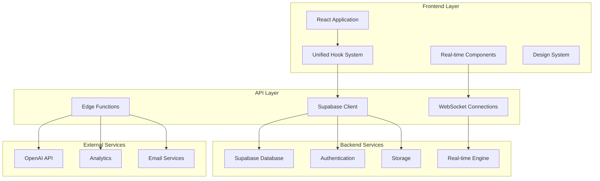
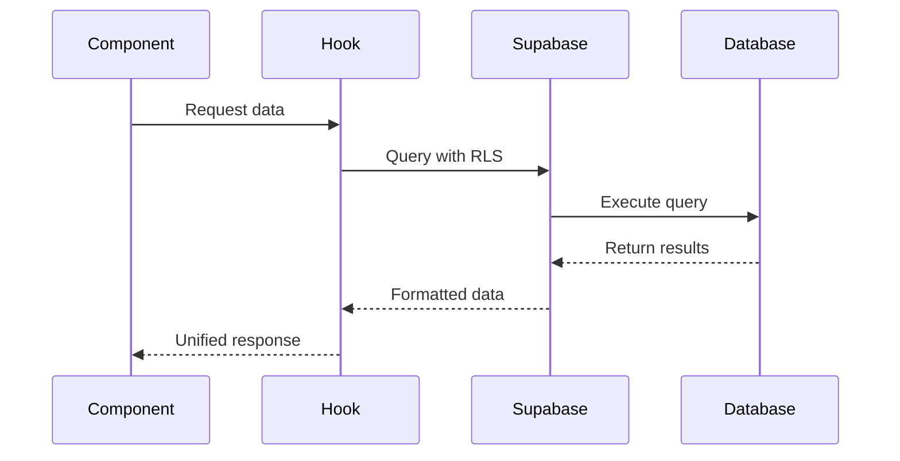
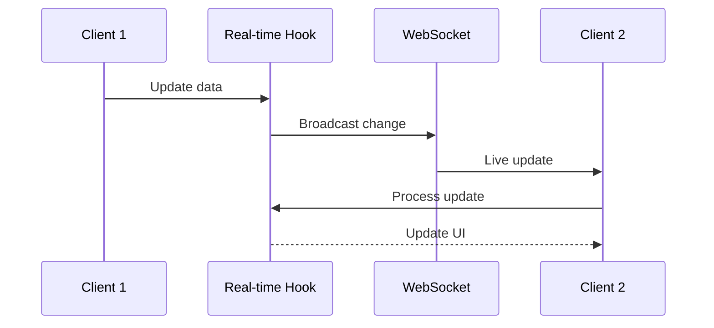
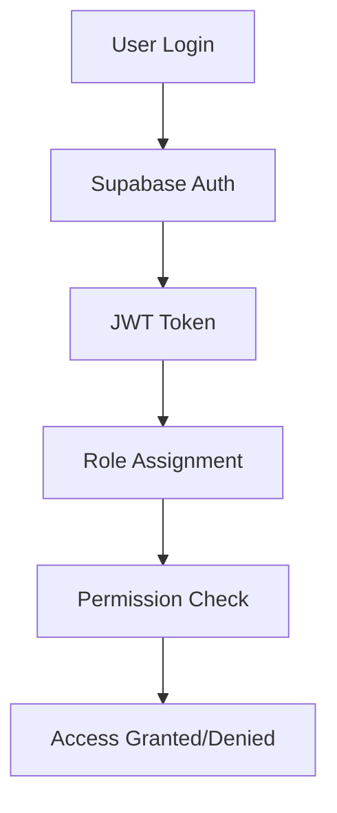

# 🏗️ System Architecture Overview

## High-Level Architecture

The Ruwād Innovation Platform is built as a modern, scalable web application with a unified hook-based architecture and real-time capabilities.



## Core Architectural Layers

### 1. **Presentation Layer**
- **React Components** (195 total)
- **Unified Design System** with semantic tokens
- **Responsive Layout System** with RTL/LTR support
- **Global AppShell** with consistent navigation

### 2. **Business Logic Layer**
- **Hook Architecture** (169 custom hooks)
- **Unified Loading/Error Handling**
- **Real-time Service Management**
- **State Management Patterns**

### 3. **Data Access Layer**
- **Supabase Integration** with controlled access
- **Real-time Subscriptions** (8 active channels)
- **Database Abstraction** through hooks
- **Caching Strategies**

### 4. **Backend Services Layer**
- **PostgreSQL Database** with RLS
- **Authentication & Authorization**
- **File Storage System**
- **Edge Functions** for AI/external APIs

## Key Architectural Decisions

### 1. **Unified Hook Architecture**
**Decision**: Migrate all components to use centralized hooks
**Rationale**: 
- Eliminate code duplication (90% reduction achieved)
- Ensure consistent error handling across all components
- Centralize business logic for better maintainability
- Enable consistent loading states and user experience

**Implementation**:
```typescript
// Before: Manual error handling in each component
const [loading, setLoading] = useState(false);
try {
  setLoading(true);
  const result = await supabase.from('challenges').select();
  // Handle result
} catch (error) {
  toast.error('Something went wrong');
} finally {
  setLoading(false);
}

// After: Unified hook pattern
const { data, loading, error } = useChallengeManagement();
const { withLoading } = useUnifiedLoading();

const handleAction = withLoading(async () => {
  await updateChallenge(data);
  // Success handled automatically
});
```

### 2. **Real-time First Design**
**Decision**: Preserve and enhance all real-time functionality during migration
**Rationale**:
- Real-time features are core to user engagement
- Live collaboration is essential for innovation platform
- Maintain zero downtime during architectural changes

**Implementation**:
- **15 Real-time Hooks** for different features
- **8 WebSocket Channels** for live updates
- **Protected Migration** ensuring no real-time service interruption

### 3. **Security by Design**
**Decision**: Implement comprehensive RLS and RBAC
**Rationale**:
- Government platform requires enterprise-grade security
- Multi-tenant architecture needs proper isolation
- Audit trails required for compliance

**Implementation**:
- Row Level Security on all sensitive tables
- Role-based access control (4 user roles)
- Audit logging for all critical operations
- Controlled Supabase access patterns

### 4. **Component Composition Architecture**
**Decision**: Build reusable, composable components
**Rationale**:
- Reduce development time and ensure consistency
- Enable rapid feature development
- Maintain design system coherence

## System Boundaries and Interfaces

### Frontend Boundaries
```typescript
// Clear separation between presentation and business logic
interface ComponentProps {
  // Only UI-related props
  variant?: 'default' | 'compact';
  className?: string;
}

// Business logic handled by hooks
const useFeature = () => {
  // All business logic encapsulated
  const { data, loading, error } = useUnifiedQuery();
  const { withLoading } = useUnifiedLoading();
  
  return { data, loading, actions: {...} };
};
```

### API Boundaries
```typescript
// Controlled Supabase access
// ✅ Approved patterns:
// - File storage operations
// - RPC function calls  
// - Real-time subscriptions
// - Authentication flows

// ❌ Prohibited patterns:
// - Direct table queries in components
// - Manual error handling
// - Uncontrolled loading states
```

## Data Flow Architecture

### 1. **Request Flow**


### 2. **Real-time Flow**


## Performance Architecture

### 1. **Loading Optimization**
- **Lazy Loading**: Route-based code splitting
- **Hook Memoization**: Prevent unnecessary re-renders
- **Query Optimization**: Efficient data fetching patterns
- **Caching Strategy**: Smart cache invalidation

### 2. **Real-time Optimization**
- **Connection Pooling**: Efficient WebSocket management
- **Message Queuing**: Handle high-frequency updates
- **Selective Subscriptions**: Only listen to relevant changes
- **Graceful Degradation**: Fallback for connection issues

## Scalability Considerations

### 1. **Horizontal Scaling**
- **Stateless Architecture**: All state in database/context
- **Microservice Ready**: Edge functions for external integrations
- **CDN Integration**: Static asset optimization
- **Database Scaling**: Supabase managed scaling

### 2. **Development Scaling**
- **Modular Architecture**: Independent feature development
- **Hook Reusability**: Consistent patterns across teams
- **Type Safety**: Prevent runtime errors
- **Testing Strategy**: Comprehensive test coverage

## Error Handling Strategy

### 1. **Centralized Error Management**
```typescript
// Global error handler with context
const createErrorHandler = (context: string) => ({
  handleError: (error: Error) => {
    // Structured logging
    console.error(`[${context}] Error:`, error);
    
    // User-friendly notifications
    toast.error(getErrorMessage(error));
    
    // Error recovery
    return handleErrorRecovery(error);
  }
});
```

### 2. **Error Recovery Patterns**
- **Retry Logic**: Automatic retry for transient failures
- **Fallback UI**: Graceful degradation for broken features
- **State Recovery**: Restore application state after errors
- **User Guidance**: Clear error messages and next steps

## Security Architecture

### 1. **Authentication Flow**


### 2. **Authorization Patterns**
- **Role-Based Access**: 4 user roles with specific permissions
- **Resource-Level Security**: RLS policies on all tables
- **API Security**: All endpoints protected by authentication
- **Audit Logging**: Track all security-relevant actions

## Deployment Architecture

### 1. **Environment Strategy**
- **Development**: Local development with Supabase local
- **Staging**: Lovable preview with Supabase project
- **Production**: Custom domain with production database

### 2. **CI/CD Pipeline**
- **Automatic Deployment**: Lovable handles deployment
- **Database Migrations**: Automated migration system
- **Edge Functions**: Auto-deployed on code changes
- **Rollback Strategy**: Version control and rollback capabilities

---

**Architecture Status**: ✅ **PRODUCTION READY**  
**Last Review**: January 17, 2025  
**Migration Status**: 100% Complete