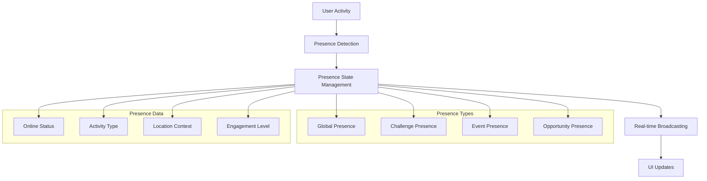

# 👥 User Presence & Tracking System

## Overview

The Ruwād Platform implements a **comprehensive user presence system** that tracks user activity, online status, and collaborative engagement across the platform. This system provides **real-time presence indicators**, **activity tracking**, and **collaborative features** for enhanced user experience.

## Presence Architecture

### 1. **Presence System Overview**



### 2. **Presence Data Models**

```typescript
// Core presence interfaces
interface PresenceUser {
  user_id: string;
  display_name: string;
  avatar_url?: string;
  status: PresenceStatus;
  last_seen: string;
  activity_type?: ActivityType;
  location_context?: LocationContext;
}

type PresenceStatus = 
  | 'online' 
  | 'away' 
  | 'busy' 
  | 'offline' 
  | 'invisible';

type ActivityType = 
  | 'viewing' 
  | 'editing' 
  | 'commenting' 
  | 'participating' 
  | 'idle';

interface LocationContext {
  page: string;
  section?: string;
  entity_type?: string;
  entity_id?: string;
}

interface GlobalPresenceState {
  total_online: number;
  by_role: Record<string, number>;
  by_location: Record<string, number>;
  recent_activity: ActivityRecord[];
}
```

## Presence Implementation

### 1. **Global Presence Tracking**

```typescript
// Global presence hook implementation
export const useGlobalPresenceChannel = () => {
  const [globalPresence, setGlobalPresence] = useState<GlobalPresenceState>({
    total_online: 0,
    by_role: {},
    by_location: {},
    recent_activity: []
  });
  const { user } = useAuth();
  const { handleError } = createErrorHandler('GlobalPresence');

  useEffect(() => {
    if (!user) return;

    const channel = supabase
      .channel('global-presence')
      .on('presence', { event: 'sync' }, () => {
        try {
          const state = channel.presenceState();
          
          // Calculate global statistics
          let totalOnline = 0;
          const byRole: Record<string, number> = {};
          const byLocation: Record<string, number> = {};
          
          Object.keys(state).forEach(key => {
            state[key].forEach((presence: any) => {
              totalOnline++;
              
              // Count by role
              const role = presence.role || 'innovator';
              byRole[role] = (byRole[role] || 0) + 1;
              
              // Count by location
              const location = presence.location_context?.page || 'unknown';
              byLocation[location] = (byLocation[location] || 0) + 1;
            });
          });
          
          setGlobalPresence(prev => ({
            ...prev,
            total_online: totalOnline,
            by_role: byRole,
            by_location: byLocation
          }));
        } catch (error) {
          handleError(error as Error);
        }
      })
      .on('presence', { event: 'join' }, ({ newPresences }) => {
        newPresences.forEach((presence: any) => {
          const activity: ActivityRecord = {
            id: uuidv4(),
            user_id: presence.user_id,
            display_name: presence.display_name,
            action: 'joined',
            timestamp: new Date().toISOString(),
            location: presence.location_context
          };
          
          setGlobalPresence(prev => ({
            ...prev,
            recent_activity: [activity, ...prev.recent_activity.slice(0, 19)]
          }));
          
          // Show subtle notification for team members
          if (presence.role === 'team_member' && presence.user_id !== user.id) {
            toast.info(`${presence.display_name} is now online`, {
              duration: 3000
            });
          }
        });
      })
      .on('presence', { event: 'leave' }, ({ leftPresences }) => {
        leftPresences.forEach((presence: any) => {
          const activity: ActivityRecord = {
            id: uuidv4(),
            user_id: presence.user_id,
            display_name: presence.display_name,
            action: 'left',
            timestamp: new Date().toISOString(),
            location: presence.location_context
          };
          
          setGlobalPresence(prev => ({
            ...prev,
            recent_activity: [activity, ...prev.recent_activity.slice(0, 19)]
          }));
        });
      })
      .subscribe(async (status) => {
        if (status === 'SUBSCRIBED') {
          // Get user profile for presence data
          const { data: profile } = await supabase
            .from('profiles')
            .select('display_name, avatar_url')
            .eq('user_id', user.id)
            .single();
          
          // Track initial presence
          await channel.track({
            user_id: user.id,
            display_name: profile?.display_name || user.email,
            avatar_url: profile?.avatar_url,
            role: user.user_metadata?.role || 'innovator',
            status: 'online',
            online_at: new Date().toISOString(),
            location_context: {
              page: window.location.pathname,
              section: 'main'
            }
          });
        }
      });

    // Cleanup on unmount
    return () => {
      supabase.removeChannel(channel);
    };
  }, [user, handleError]);

  // Update presence when location changes
  const updatePresenceLocation = useCallback(async (locationContext: LocationContext) => {
    if (!user) return;
    
    const channel = supabase.channel('global-presence');
    await channel.track({
      user_id: user.id,
      location_context: locationContext,
      last_activity: new Date().toISOString()
    });
  }, [user]);

  return {
    globalPresence,
    updatePresenceLocation,
    isOnline: globalPresence.total_online > 0
  };
};
```

### 2. **Challenge-Specific Presence**

```typescript
// Challenge presence tracking with typing indicators
export const useChallengePresence = (challengeId: string) => {
  const [presenceUsers, setPresenceUsers] = useState<PresenceUser[]>([]);
  const [typingUsers, setTypingUsers] = useState<TypingUser[]>([]);
  const { user } = useAuth();
  const { handleError } = createErrorHandler('ChallengePresence');

  useEffect(() => {
    if (!challengeId || !user) return;

    const channel = supabase
      .channel(`challenge-presence-${challengeId}`)
      .on('presence', { event: 'sync' }, () => {
        try {
          const state = channel.presenceState();
          
          const users: PresenceUser[] = [];
          Object.keys(state).forEach(key => {
            state[key].forEach((presence: any) => {
              users.push({
                user_id: presence.user_id,
                display_name: presence.display_name,
                avatar_url: presence.avatar_url,
                status: presence.status,
                last_seen: presence.online_at,
                activity_type: presence.activity_type
              });
            });
          });
          
          setPresenceUsers(users);
        } catch (error) {
          handleError(error as Error);
        }
      })
      .on('presence', { event: 'join' }, ({ newPresences }) => {
        newPresences.forEach((presence: any) => {
          if (presence.user_id !== user.id) {
            toast.info(`${presence.display_name} joined the challenge`, {
              duration: 3000
            });
          }
        });
      })
      .on('presence', { event: 'leave' }, ({ leftPresences }) => {
        leftPresences.forEach((presence: any) => {
          if (presence.user_id !== user.id) {
            toast.info(`${presence.display_name} left the challenge`, {
              duration: 2000
            });
          }
        });
      })
      .on('broadcast', { event: 'typing' }, (payload) => {
        const { user_id, display_name, is_typing } = payload;
        
        setTypingUsers(prev => {
          if (is_typing) {
            return prev.some(u => u.user_id === user_id) 
              ? prev 
              : [...prev, { user_id, display_name }];
          } else {
            return prev.filter(u => u.user_id !== user_id);
          }
        });
      })
      .subscribe(async (status) => {
        if (status === 'SUBSCRIBED') {
          const { data: profile } = await supabase
            .from('profiles')
            .select('display_name, avatar_url')
            .eq('user_id', user.id)
            .single();

          await channel.track({
            user_id: user.id,
            display_name: profile?.display_name || user.email,
            avatar_url: profile?.avatar_url,
            status: 'online',
            activity_type: 'viewing',
            online_at: new Date().toISOString()
          });
        }
      });

    return () => {
      supabase.removeChannel(channel);
    };
  }, [challengeId, user, handleError]);

  // Activity tracking functions
  const updateActivity = useCallback(async (activityType: ActivityType) => {
    if (!user) return;
    
    const channel = supabase.channel(`challenge-presence-${challengeId}`);
    await channel.track({
      user_id: user.id,
      activity_type: activityType,
      last_activity: new Date().toISOString()
    });
  }, [challengeId, user]);

  const sendTypingIndicator = useCallback(() => {
    if (!user) return;
    
    const channel = supabase.channel(`challenge-presence-${challengeId}`);
    channel.send({
      type: 'broadcast',
      event: 'typing',
      payload: {
        user_id: user.id,
        display_name: user.user_metadata?.display_name || user.email,
        is_typing: true
      }
    });

    // Auto-stop typing after 3 seconds
    setTimeout(() => {
      channel.send({
        type: 'broadcast',
        event: 'typing',
        payload: {
          user_id: user.id,
          is_typing: false
        }
      });
    }, 3000);
  }, [challengeId, user]);

  return {
    presenceUsers,
    typingUsers,
    onlineCount: presenceUsers.length,
    updateActivity,
    sendTypingIndicator,
    isUserOnline: (userId: string) => 
      presenceUsers.some(u => u.user_id === userId)
  };
};
```

### 3. **Event Presence Tracking**

```typescript
// Event-specific presence for live events
export const useEventPresence = (eventId: string) => {
  const [attendees, setAttendees] = useState<EventAttendee[]>([]);
  const [eventStats, setEventStats] = useState<EventPresenceStats>({
    registered_count: 0,
    checked_in_count: 0,
    active_participants: 0,
    engagement_score: 0
  });
  const { user } = useAuth();

  useEffect(() => {
    if (!eventId || !user) return;

    const channel = supabase
      .channel(`event-presence-${eventId}`)
      .on('presence', { event: 'sync' }, () => {
        const state = channel.presenceState();
        
        const activeAttendees: EventAttendee[] = [];
        let totalEngagement = 0;
        
        Object.keys(state).forEach(key => {
          state[key].forEach((presence: any) => {
            activeAttendees.push({
              user_id: presence.user_id,
              display_name: presence.display_name,
              avatar_url: presence.avatar_url,
              attendance_status: presence.attendance_status,
              joined_at: presence.joined_at,
              engagement_level: presence.engagement_level || 0
            });
            
            totalEngagement += presence.engagement_level || 0;
          });
        });
        
        setAttendees(activeAttendees);
        setEventStats(prev => ({
          ...prev,
          active_participants: activeAttendees.length,
          engagement_score: activeAttendees.length > 0 
            ? totalEngagement / activeAttendees.length 
            : 0
        }));
      })
      .on('broadcast', { event: 'engagement' }, (payload) => {
        // Track engagement actions (polls, Q&A, reactions)
        const { user_id, action_type, engagement_value } = payload;
        
        setAttendees(prev => 
          prev.map(attendee => 
            attendee.user_id === user_id 
              ? { 
                  ...attendee, 
                  engagement_level: Math.min(100, (attendee.engagement_level || 0) + engagement_value)
                }
              : attendee
          )
        );
      })
      .subscribe(async (status) => {
        if (status === 'SUBSCRIBED') {
          // Check if user is registered for the event
          const { data: registration } = await supabase
            .from('event_registrations')
            .select('status')
            .eq('event_id', eventId)
            .eq('user_id', user.id)
            .single();

          if (registration) {
            await channel.track({
              user_id: user.id,
              display_name: user.user_metadata?.display_name || user.email,
              avatar_url: user.user_metadata?.avatar_url,
              attendance_status: registration.status,
              joined_at: new Date().toISOString(),
              engagement_level: 0
            });
          }
        }
      });

    return () => {
      supabase.removeChannel(channel);
    };
  }, [eventId, user]);

  const recordEngagement = useCallback(async (actionType: string, value: number = 1) => {
    if (!user) return;
    
    const channel = supabase.channel(`event-presence-${eventId}`);
    channel.send({
      type: 'broadcast',
      event: 'engagement',
      payload: {
        user_id: user.id,
        action_type: actionType,
        engagement_value: value,
        timestamp: new Date().toISOString()
      }
    });

    // Update local engagement
    await channel.track({
      user_id: user.id,
      engagement_level: Math.min(100, (attendees.find(a => a.user_id === user.id)?.engagement_level || 0) + value)
    });
  }, [eventId, user, attendees]);

  return {
    attendees,
    eventStats,
    recordEngagement,
    myEngagement: attendees.find(a => a.user_id === user?.id)?.engagement_level || 0
  };
};
```

### 4. **Opportunity Collaboration Presence**

```typescript
// Opportunity-specific presence for collaboration
export const useOpportunityPresence = (opportunityId: string) => {
  const [collaborators, setCollaborators] = useState<CollaboratorPresence[]>([]);
  const [activeRegion, setActiveRegion] = useState<string | null>(null);
  const { user } = useAuth();

  useEffect(() => {
    if (!opportunityId || !user) return;

    const channel = supabase
      .channel(`opportunity-presence-${opportunityId}`)
      .on('presence', { event: 'sync' }, () => {
        const state = channel.presenceState();
        
        const activeCollaborators: CollaboratorPresence[] = [];
        Object.keys(state).forEach(key => {
          state[key].forEach((presence: any) => {
            activeCollaborators.push({
              user_id: presence.user_id,
              display_name: presence.display_name,
              avatar_url: presence.avatar_url,
              status: presence.status,
              current_section: presence.current_section,
              editing_field: presence.editing_field,
              cursor_position: presence.cursor_position,
              last_activity: presence.last_activity
            });
          });
        });
        
        setCollaborators(activeCollaborators);
      })
      .on('broadcast', { event: 'cursor_move' }, (payload) => {
        const { user_id, section, position } = payload;
        
        setCollaborators(prev => 
          prev.map(collab => 
            collab.user_id === user_id 
              ? { ...collab, current_section: section, cursor_position: position }
              : collab
          )
        );
      })
      .on('broadcast', { event: 'field_focus' }, (payload) => {
        const { user_id, field_name, action } = payload;
        
        setCollaborators(prev => 
          prev.map(collab => 
            collab.user_id === user_id 
              ? { 
                  ...collab, 
                  editing_field: action === 'focus' ? field_name : null,
                  status: action === 'focus' ? 'editing' : 'viewing'
                }
              : collab
          )
        );
      })
      .subscribe(async (status) => {
        if (status === 'SUBSCRIBED') {
          await channel.track({
            user_id: user.id,
            display_name: user.user_metadata?.display_name || user.email,
            avatar_url: user.user_metadata?.avatar_url,
            status: 'viewing',
            current_section: 'overview',
            last_activity: new Date().toISOString()
          });
        }
      });

    return () => {
      supabase.removeChannel(channel);
    };
  }, [opportunityId, user]);

  // Collaboration tracking functions
  const updateCursorPosition = useCallback((section: string, position: any) => {
    if (!user) return;
    
    const channel = supabase.channel(`opportunity-presence-${opportunityId}`);
    channel.send({
      type: 'broadcast',
      event: 'cursor_move',
      payload: {
        user_id: user.id,
        section,
        position,
        timestamp: new Date().toISOString()
      }
    });
  }, [opportunityId, user]);

  const notifyFieldFocus = useCallback((fieldName: string, action: 'focus' | 'blur') => {
    if (!user) return;
    
    const channel = supabase.channel(`opportunity-presence-${opportunityId}`);
    channel.send({
      type: 'broadcast',
      event: 'field_focus',
      payload: {
        user_id: user.id,
        field_name: fieldName,
        action,
        timestamp: new Date().toISOString()
      }
    });
  }, [opportunityId, user]);

  const updateSection = useCallback(async (section: string) => {
    if (!user) return;
    
    setActiveRegion(section);
    
    const channel = supabase.channel(`opportunity-presence-${opportunityId}`);
    await channel.track({
      user_id: user.id,
      current_section: section,
      last_activity: new Date().toISOString()
    });
  }, [opportunityId, user]);

  return {
    collaborators,
    activeRegion,
    updateCursorPosition,
    notifyFieldFocus,
    updateSection,
    getCollaboratorsInSection: (section: string) => 
      collaborators.filter(c => c.current_section === section),
    isFieldBeingEdited: (fieldName: string) => 
      collaborators.some(c => c.editing_field === fieldName && c.user_id !== user?.id)
  };
};
```

## Presence UI Components

### 1. **Presence Indicators**

```typescript
// User presence indicator component
export const UserPresenceIndicator: React.FC<{
  userId: string;
  showName?: boolean;
  size?: 'sm' | 'md' | 'lg';
}> = ({ userId, showName = false, size = 'md' }) => {
  const { presenceUsers } = useGlobalPresenceChannel();
  const user = presenceUsers.find(u => u.user_id === userId);
  
  if (!user) return null;
  
  const sizeClasses = {
    sm: 'w-6 h-6',
    md: 'w-8 h-8', 
    lg: 'w-10 h-10'
  };
  
  const statusColors = {
    online: 'bg-green-500',
    away: 'bg-yellow-500',
    busy: 'bg-red-500',
    offline: 'bg-gray-400'
  };

  return (
    <div className="flex items-center space-x-2">
      <div className="relative">
        <Avatar className={sizeClasses[size]}>
          <AvatarImage src={user.avatar_url} alt={user.display_name} />
          <AvatarFallback>
            {user.display_name.charAt(0).toUpperCase()}
          </AvatarFallback>
        </Avatar>
        
        <div 
          className={cn(
            "absolute -bottom-0.5 -right-0.5 w-3 h-3 border-2 border-white rounded-full",
            statusColors[user.status]
          )}
        />
      </div>
      
      {showName && (
        <div className="flex flex-col">
          <span className="text-sm font-medium">{user.display_name}</span>
          <span className="text-xs text-muted-foreground capitalize">
            {user.status}
          </span>
        </div>
      )}
    </div>
  );
};

// Presence list component
export const PresenceList: React.FC<{
  presenceUsers: PresenceUser[];
  maxVisible?: number;
}> = ({ presenceUsers, maxVisible = 5 }) => {
  const visibleUsers = presenceUsers.slice(0, maxVisible);
  const remainingCount = Math.max(0, presenceUsers.length - maxVisible);

  return (
    <div className="flex items-center space-x-2">
      <div className="flex -space-x-2">
        {visibleUsers.map(user => (
          <UserPresenceIndicator 
            key={user.user_id} 
            userId={user.user_id} 
            size="sm"
          />
        ))}
      </div>
      
      {remainingCount > 0 && (
        <div className="w-6 h-6 bg-gray-100 rounded-full flex items-center justify-center">
          <span className="text-xs font-medium">+{remainingCount}</span>
        </div>
      )}
      
      <span className="text-sm text-muted-foreground">
        {presenceUsers.length} online
      </span>
    </div>
  );
};
```

### 2. **Typing Indicators**

```typescript
// Typing indicator component
export const TypingIndicator: React.FC<{
  typingUsers: TypingUser[];
}> = ({ typingUsers }) => {
  if (typingUsers.length === 0) return null;

  return (
    <div className="flex items-center space-x-2 text-sm text-muted-foreground">
      <div className="flex space-x-1">
        <div className="w-1 h-1 bg-blue-500 rounded-full animate-bounce" />
        <div className="w-1 h-1 bg-blue-500 rounded-full animate-bounce delay-100" />
        <div className="w-1 h-1 bg-blue-500 rounded-full animate-bounce delay-200" />
      </div>
      
      <span>
        {typingUsers.length === 1 ? (
          `${typingUsers[0].display_name} is typing...`
        ) : typingUsers.length === 2 ? (
          `${typingUsers[0].display_name} and ${typingUsers[1].display_name} are typing...`
        ) : (
          `${typingUsers.length} people are typing...`
        )}
      </span>
    </div>
  );
};
```

### 3. **Activity Feed**

```typescript
// Real-time activity feed
export const ActivityFeed: React.FC<{
  activities: ActivityRecord[];
  maxItems?: number;
}> = ({ activities, maxItems = 10 }) => {
  const recentActivities = activities.slice(0, maxItems);

  return (
    <div className="space-y-2">
      <h3 className="text-sm font-medium text-muted-foreground">
        Recent Activity
      </h3>
      
      <div className="space-y-1">
        {recentActivities.map(activity => (
          <div key={activity.id} className="flex items-center space-x-2 text-sm">
            <UserPresenceIndicator userId={activity.user_id} size="sm" />
            
            <span className="flex-1">
              <span className="font-medium">{activity.display_name}</span>
              <span className="text-muted-foreground ml-1">
                {activity.action}
              </span>
              {activity.location && (
                <span className="text-muted-foreground ml-1">
                  in {activity.location.page}
                </span>
              )}
            </span>
            
            <span className="text-xs text-muted-foreground">
              {formatDistanceToNow(new Date(activity.timestamp))} ago
            </span>
          </div>
        ))}
      </div>
    </div>
  );
};
```

## Performance Optimization

### 1. **Presence Data Optimization**

```typescript
// Optimized presence data management
export const useOptimizedPresence = (channelId: string) => {
  const [presenceData, setPresenceData] = useState<Map<string, PresenceUser>>(new Map());
  const [lastUpdate, setLastUpdate] = useState<Date>(new Date());
  
  // Debounce presence updates to avoid excessive re-renders
  const debouncedUpdatePresence = useDebouncedCallback(
    (updates: PresenceUser[]) => {
      setPresenceData(prev => {
        const newMap = new Map(prev);
        updates.forEach(user => {
          newMap.set(user.user_id, user);
        });
        return newMap;
      });
      setLastUpdate(new Date());
    },
    500 // 500ms debounce
  );
  
  // Cleanup stale presence data
  useEffect(() => {
    const cleanup = setInterval(() => {
      const now = new Date();
      setPresenceData(prev => {
        const newMap = new Map();
        prev.forEach((user, userId) => {
          const lastSeen = new Date(user.last_seen);
          const timeDiff = now.getTime() - lastSeen.getTime();
          
          // Remove users not seen in last 5 minutes
          if (timeDiff < 5 * 60 * 1000) {
            newMap.set(userId, user);
          }
        });
        return newMap;
      });
    }, 60000); // Check every minute
    
    return () => clearInterval(cleanup);
  }, []);
  
  return {
    presenceUsers: Array.from(presenceData.values()),
    updatePresence: debouncedUpdatePresence,
    lastUpdate
  };
};
```

### 2. **Memory Management**

```typescript
// Presence memory management
export const usePresenceMemoryManagement = () => {
  const presenceChannels = useRef<Map<string, RealtimeChannel>>(new Map());
  const presenceData = useRef<Map<string, PresenceUser[]>>(new Map());
  
  const subscribeToPresence = useCallback((channelId: string, options: PresenceOptions) => {
    // Cleanup existing channel if exists
    const existingChannel = presenceChannels.current.get(channelId);
    if (existingChannel) {
      supabase.removeChannel(existingChannel);
    }
    
    // Create new channel
    const channel = supabase.channel(channelId);
    // ... setup channel with options
    
    presenceChannels.current.set(channelId, channel);
    
    return () => {
      const channel = presenceChannels.current.get(channelId);
      if (channel) {
        supabase.removeChannel(channel);
        presenceChannels.current.delete(channelId);
        presenceData.current.delete(channelId);
      }
    };
  }, []);
  
  // Cleanup all channels on unmount
  useEffect(() => {
    return () => {
      presenceChannels.current.forEach(channel => {
        supabase.removeChannel(channel);
      });
      presenceChannels.current.clear();
      presenceData.current.clear();
    };
  }, []);
  
  return { subscribeToPresence };
};
```

---

**Presence System Status**: ✅ **FULLY OPERATIONAL**  
**Presence Types**: 4 specialized presence systems  
**Real-time Features**: Complete with typing indicators  
**Performance**: Optimized with debouncing and cleanup  
**UI Components**: Comprehensive presence indicators  
**Memory Management**: Efficient resource handling