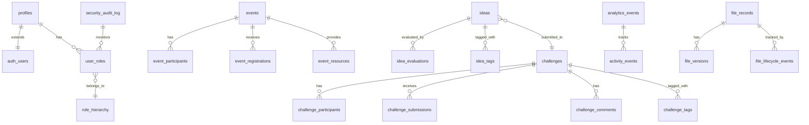

# 🗄️ Database Schema & Design

## Overview

The Ruwād Platform implements a comprehensive PostgreSQL database schema with **50+ tables**, **advanced RLS policies**, **custom functions**, and **enterprise-grade security**. The database is optimized for performance, scalability, and multi-tenant architecture.

## Database Architecture

### 1. **Schema Organization**



### 2. **Core Table Categories**

#### User Management Tables
```sql
-- User profiles extending Supabase auth.users
CREATE TABLE public.profiles (
  id UUID PRIMARY KEY DEFAULT gen_random_uuid(),
  user_id UUID UNIQUE NOT NULL REFERENCES auth.users(id) ON DELETE CASCADE,
  display_name VARCHAR(255),
  full_name VARCHAR(255),
  bio TEXT,
  avatar_url TEXT,
  location VARCHAR(255),
  website_url TEXT,
  linkedin_url TEXT,
  twitter_url TEXT,
  phone_number VARCHAR(20),
  date_of_birth DATE,
  gender VARCHAR(20),
  nationality VARCHAR(100),
  education_level VARCHAR(100),
  field_of_expertise VARCHAR(255),
  experience_years INTEGER,
  preferred_language VARCHAR(10) DEFAULT 'ar',
  notification_preferences JSONB DEFAULT '{}',
  privacy_settings JSONB DEFAULT '{}',
  onboarding_completed BOOLEAN DEFAULT false,
  email_verified BOOLEAN DEFAULT false,
  last_sign_in_at TIMESTAMPTZ,
  created_at TIMESTAMPTZ DEFAULT now(),
  updated_at TIMESTAMPTZ DEFAULT now()
);

-- Role-based access control system
CREATE TYPE public.app_role AS ENUM (
  'innovator',
  'expert', 
  'admin',
  'super_admin',
  'team_member',
  'evaluator',
  'partner',
  'stakeholder',
  'mentor',
  'domain_expert'
);

CREATE TABLE public.user_roles (
  id UUID PRIMARY KEY DEFAULT gen_random_uuid(),
  user_id UUID NOT NULL REFERENCES auth.users(id) ON DELETE CASCADE,
  role app_role NOT NULL,
  granted_by UUID REFERENCES auth.users(id),
  granted_at TIMESTAMPTZ DEFAULT now(),
  expires_at TIMESTAMPTZ,
  is_active BOOLEAN DEFAULT true,
  notes TEXT,
  UNIQUE(user_id, role)
);

-- Role hierarchy and permissions
CREATE TABLE public.role_hierarchy (
  id UUID PRIMARY KEY DEFAULT gen_random_uuid(),
  role app_role NOT NULL UNIQUE,
  parent_role app_role REFERENCES role_hierarchy(role),
  permissions JSONB DEFAULT '[]',
  requires_approval_for app_role[] DEFAULT '{}',
  can_assign_roles app_role[] DEFAULT '{}',
  max_assignments_per_day INTEGER DEFAULT 10,
  created_at TIMESTAMPTZ DEFAULT now()
);
```

#### Innovation Management Tables
```sql
-- Challenges system
CREATE TYPE public.challenge_status AS ENUM (
  'draft',
  'published', 
  'active',
  'evaluation',
  'closed',
  'completed',
  'cancelled'
);

CREATE TYPE public.sensitivity_level AS ENUM (
  'normal',
  'restricted',
  'confidential'
);

CREATE TABLE public.challenges (
  id UUID PRIMARY KEY DEFAULT gen_random_uuid(),
  title_ar VARCHAR(500) NOT NULL,
  title_en VARCHAR(500),
  description_ar TEXT NOT NULL,
  description_en TEXT,
  challenge_type VARCHAR(100),
  status challenge_status DEFAULT 'draft',
  sensitivity_level sensitivity_level DEFAULT 'normal',
  
  -- Organizational structure
  department_id UUID REFERENCES departments(id),
  deputy_id UUID REFERENCES deputies(id),
  sector_id UUID REFERENCES sectors(id),
  domain_id UUID REFERENCES domains(id),
  sub_domain_id UUID REFERENCES sub_domains(id),
  service_id UUID REFERENCES services(id),
  partner_organization_id UUID REFERENCES partner_organizations(id),
  
  -- Timeline
  start_date DATE,
  end_date DATE,
  registration_deadline DATE,
  submission_deadline DATE,
  evaluation_deadline DATE,
  
  -- Requirements and criteria
  requirements TEXT,
  evaluation_criteria TEXT,
  expected_outcomes TEXT,
  budget_range NUMERIC(12,2),
  
  -- Metadata
  priority_level VARCHAR(20) DEFAULT 'medium',
  complexity_level VARCHAR(20) DEFAULT 'medium',
  estimated_duration_months INTEGER,
  target_participants INTEGER,
  max_participants INTEGER,
  min_team_size INTEGER DEFAULT 1,
  max_team_size INTEGER DEFAULT 5,
  
  -- Tracking
  created_by UUID REFERENCES auth.users(id),
  updated_by UUID REFERENCES auth.users(id),
  approved_by UUID REFERENCES auth.users(id),
  approved_at TIMESTAMPTZ,
  view_count INTEGER DEFAULT 0,
  participant_count INTEGER DEFAULT 0,
  submission_count INTEGER DEFAULT 0,
  
  -- Timestamps
  created_at TIMESTAMPTZ DEFAULT now(),
  updated_at TIMESTAMPTZ DEFAULT now(),
  
  -- Search optimization
  search_vector tsvector GENERATED ALWAYS AS (
    to_tsvector('arabic', COALESCE(title_ar, '')) ||
    to_tsvector('english', COALESCE(title_en, '')) ||
    to_tsvector('arabic', COALESCE(description_ar, ''))
  ) STORED
);

-- Challenge submissions and ideas
CREATE TABLE public.challenge_submissions (
  id UUID PRIMARY KEY DEFAULT gen_random_uuid(),
  challenge_id UUID NOT NULL REFERENCES challenges(id) ON DELETE CASCADE,
  submitted_by UUID NOT NULL REFERENCES auth.users(id),
  
  -- Content
  title_ar VARCHAR(500) NOT NULL,
  title_en VARCHAR(500),
  description_ar TEXT NOT NULL,
  description_en TEXT,
  solution_approach TEXT,
  technical_details JSONB DEFAULT '{}',
  implementation_plan TEXT,
  business_model TEXT,
  expected_impact TEXT,
  
  -- Status and evaluation
  status VARCHAR(50) DEFAULT 'draft',
  score NUMERIC(5,2),
  review_notes TEXT,
  feedback JSONB DEFAULT '{}',
  
  -- Team information
  team_members JSONB DEFAULT '[]',
  team_lead UUID REFERENCES auth.users(id),
  
  -- Files and attachments
  attachment_urls TEXT[],
  presentation_url TEXT,
  demo_url TEXT,
  
  -- Timestamps
  submission_date TIMESTAMPTZ,
  last_updated TIMESTAMPTZ DEFAULT now(),
  created_at TIMESTAMPTZ DEFAULT now(),
  updated_at TIMESTAMPTZ DEFAULT now(),
  
  -- Privacy
  is_public BOOLEAN DEFAULT false,
  
  -- Search optimization
  search_vector tsvector GENERATED ALWAYS AS (
    to_tsvector('arabic', COALESCE(title_ar, '')) ||
    to_tsvector('english', COALESCE(title_en, '')) ||
    to_tsvector('arabic', COALESCE(description_ar, ''))
  ) STORED
);

-- Challenge participation tracking
CREATE TABLE public.challenge_participants (
  id UUID PRIMARY KEY DEFAULT gen_random_uuid(),
  challenge_id UUID NOT NULL REFERENCES challenges(id) ON DELETE CASCADE,
  user_id UUID NOT NULL REFERENCES auth.users(id) ON DELETE CASCADE,
  participation_type VARCHAR(50) DEFAULT 'individual',
  team_name VARCHAR(255),
  status VARCHAR(50) DEFAULT 'registered',
  registration_date TIMESTAMPTZ DEFAULT now(),
  notifications_enabled BOOLEAN DEFAULT true,
  created_at TIMESTAMPTZ DEFAULT now(),
  UNIQUE(challenge_id, user_id)
);
```

#### Event Management Tables
```sql
-- Events system
CREATE TYPE public.event_status AS ENUM (
  'draft',
  'published',
  'registration_open',
  'registration_closed', 
  'ongoing',
  'completed',
  'cancelled'
);

CREATE TYPE public.event_type AS ENUM (
  'workshop',
  'webinar',
  'conference',
  'networking',
  'training',
  'hackathon',
  'competition',
  'exhibition'
);

CREATE TABLE public.events (
  id UUID PRIMARY KEY DEFAULT gen_random_uuid(),
  title_ar VARCHAR(500) NOT NULL,
  title_en VARCHAR(500),
  description_ar TEXT NOT NULL,
  description_en TEXT,
  event_type event_type NOT NULL,
  status event_status DEFAULT 'draft',
  
  -- Schedule
  start_date TIMESTAMPTZ NOT NULL,
  end_date TIMESTAMPTZ NOT NULL,
  registration_start_date TIMESTAMPTZ,
  registration_end_date TIMESTAMPTZ,
  
  -- Location
  location_type VARCHAR(20) DEFAULT 'physical', -- physical, virtual, hybrid
  venue_name VARCHAR(255),
  venue_address TEXT,
  city VARCHAR(100),
  virtual_meeting_url TEXT,
  virtual_platform VARCHAR(100),
  
  -- Capacity and requirements
  max_participants INTEGER,
  min_participants INTEGER DEFAULT 1,
  current_participants INTEGER DEFAULT 0,
  waitlist_enabled BOOLEAN DEFAULT false,
  requires_approval BOOLEAN DEFAULT false,
  
  -- Content and agenda
  agenda JSONB DEFAULT '[]',
  speakers JSONB DEFAULT '[]',
  prerequisites TEXT,
  materials_provided TEXT,
  certificates_provided BOOLEAN DEFAULT false,
  
  -- Cost and registration
  is_free BOOLEAN DEFAULT true,
  cost_per_person NUMERIC(10,2) DEFAULT 0,
  currency VARCHAR(10) DEFAULT 'SAR',
  payment_required BOOLEAN DEFAULT false,
  
  -- Organization
  organizer_id UUID REFERENCES auth.users(id),
  department_id UUID REFERENCES departments(id),
  partner_organizations UUID[] DEFAULT '{}',
  
  -- Tracking
  created_by UUID REFERENCES auth.users(id),
  updated_by UUID REFERENCES auth.users(id),
  view_count INTEGER DEFAULT 0,
  like_count INTEGER DEFAULT 0,
  share_count INTEGER DEFAULT 0,
  
  -- Timestamps
  created_at TIMESTAMPTZ DEFAULT now(),
  updated_at TIMESTAMPTZ DEFAULT now(),
  
  -- Search optimization
  search_vector tsvector GENERATED ALWAYS AS (
    to_tsvector('arabic', COALESCE(title_ar, '')) ||
    to_tsvector('english', COALESCE(title_en, '')) ||
    to_tsvector('arabic', COALESCE(description_ar, ''))
  ) STORED
);

-- Event registrations
CREATE TABLE public.event_registrations (
  id UUID PRIMARY KEY DEFAULT gen_random_uuid(),
  event_id UUID NOT NULL REFERENCES events(id) ON DELETE CASCADE,
  user_id UUID NOT NULL REFERENCES auth.users(id) ON DELETE CASCADE,
  
  -- Registration details
  registration_date TIMESTAMPTZ DEFAULT now(),
  status VARCHAR(50) DEFAULT 'registered', -- registered, confirmed, attended, cancelled, waitlisted
  attendance_confirmed BOOLEAN DEFAULT false,
  
  -- Additional information
  dietary_requirements TEXT,
  accessibility_needs TEXT,
  emergency_contact JSONB DEFAULT '{}',
  custom_fields JSONB DEFAULT '{}',
  
  -- Payment (if applicable)
  payment_status VARCHAR(50) DEFAULT 'not_required',
  payment_amount NUMERIC(10,2),
  payment_date TIMESTAMPTZ,
  payment_reference TEXT,
  
  -- Timestamps
  created_at TIMESTAMPTZ DEFAULT now(),
  updated_at TIMESTAMPTZ DEFAULT now(),
  
  UNIQUE(event_id, user_id)
);
```

### 3. **Analytics & Monitoring Tables**

```sql
-- Analytics events tracking
CREATE TABLE public.analytics_events (
  id UUID PRIMARY KEY DEFAULT gen_random_uuid(),
  user_id UUID REFERENCES auth.users(id),
  session_id VARCHAR(255),
  
  -- Event classification
  event_type VARCHAR(100) NOT NULL,
  event_category VARCHAR(100),
  entity_type VARCHAR(100),
  entity_id UUID,
  
  -- Event data
  properties JSONB DEFAULT '{}',
  tags JSONB DEFAULT '[]',
  
  -- Request context
  page_url TEXT,
  referrer TEXT,
  user_agent TEXT,
  ip_address INET,
  
  -- Timestamps
  timestamp TIMESTAMPTZ DEFAULT now(),
  processed BOOLEAN DEFAULT false
);

-- Security audit logging
CREATE TABLE public.security_audit_log (
  id UUID PRIMARY KEY DEFAULT gen_random_uuid(),
  user_id UUID REFERENCES auth.users(id),
  
  -- Action details
  action_type VARCHAR(100) NOT NULL,
  resource_type VARCHAR(100),
  resource_id UUID,
  
  -- Risk assessment
  risk_level VARCHAR(20) DEFAULT 'low', -- low, medium, high, critical
  
  -- Audit details
  details JSONB DEFAULT '{}',
  ip_address INET,
  user_agent TEXT,
  
  -- Timestamps
  created_at TIMESTAMPTZ DEFAULT now()
);

-- User activity summaries (materialized view data)
CREATE TABLE public.user_activity_summary (
  id UUID PRIMARY KEY DEFAULT gen_random_uuid(),
  user_id UUID UNIQUE NOT NULL REFERENCES auth.users(id) ON DELETE CASCADE,
  
  -- Activity metrics
  total_submissions INTEGER DEFAULT 0,
  total_participations INTEGER DEFAULT 0,
  total_bookmarks INTEGER DEFAULT 0,
  total_likes INTEGER DEFAULT 0,
  total_comments INTEGER DEFAULT 0,
  total_events_attended INTEGER DEFAULT 0,
  
  -- Engagement scoring
  engagement_score NUMERIC(10,2) DEFAULT 0,
  reputation_score INTEGER DEFAULT 0,
  activity_streak_days INTEGER DEFAULT 0,
  
  -- Timestamps
  last_activity_at TIMESTAMPTZ,
  created_at TIMESTAMPTZ DEFAULT now(),
  updated_at TIMESTAMPTZ DEFAULT now()
);
```

### 4. **File Management Tables**

```sql
-- File records with versioning
CREATE TABLE public.file_records (
  id UUID PRIMARY KEY DEFAULT gen_random_uuid(),
  uploader_id UUID NOT NULL REFERENCES auth.users(id),
  
  -- File metadata
  original_filename VARCHAR(500) NOT NULL,
  file_type VARCHAR(100),
  mime_type VARCHAR(200),
  file_size BIGINT,
  
  -- Storage information
  bucket_name VARCHAR(100) NOT NULL,
  storage_path TEXT NOT NULL,
  
  -- Access control
  visibility VARCHAR(20) DEFAULT 'private', -- public, private, organization, role_based
  access_permissions JSONB DEFAULT '{}',
  
  -- File status
  status VARCHAR(50) DEFAULT 'active', -- active, archived, deleted, quarantined
  scan_status VARCHAR(50) DEFAULT 'pending', -- pending, clean, infected, failed
  scan_results JSONB DEFAULT '{}',
  
  -- Organization context
  entity_type VARCHAR(100), -- challenge, event, profile, etc.
  entity_id UUID,
  
  -- Metadata
  metadata JSONB DEFAULT '{}',
  tags TEXT[] DEFAULT '{}',
  description TEXT,
  
  -- Lifecycle
  expiry_date TIMESTAMPTZ,
  auto_delete_at TIMESTAMPTZ,
  
  -- Timestamps
  created_at TIMESTAMPTZ DEFAULT now(),
  updated_at TIMESTAMPTZ DEFAULT now()
);

-- File versions for version control
CREATE TABLE public.file_versions (
  id UUID PRIMARY KEY DEFAULT gen_random_uuid(),
  file_record_id UUID NOT NULL REFERENCES file_records(id) ON DELETE CASCADE,
  
  -- Version information
  version_number INTEGER NOT NULL,
  storage_path TEXT NOT NULL,
  file_size BIGINT,
  checksum VARCHAR(64),
  
  -- Version metadata
  change_description TEXT,
  is_current BOOLEAN DEFAULT false,
  
  -- Timestamps
  created_at TIMESTAMPTZ DEFAULT now(),
  created_by UUID REFERENCES auth.users(id),
  
  UNIQUE(file_record_id, version_number)
);

-- File lifecycle tracking
CREATE TABLE public.file_lifecycle_events (
  id UUID PRIMARY KEY DEFAULT gen_random_uuid(),
  file_record_id UUID NOT NULL REFERENCES file_records(id) ON DELETE CASCADE,
  
  -- Event details
  event_type VARCHAR(50) NOT NULL, -- uploaded, accessed, modified, deleted, restored
  event_details JSONB DEFAULT '{}',
  
  -- Actor
  performed_by UUID REFERENCES auth.users(id),
  
  -- Timestamp
  created_at TIMESTAMPTZ DEFAULT now()
);
```

### 5. **Universal Tagging System**

```sql
-- Universal tags for all entities
CREATE TABLE public.tags (
  id UUID PRIMARY KEY DEFAULT gen_random_uuid(),
  name_ar VARCHAR(100) NOT NULL,
  name_en VARCHAR(100),
  
  -- Tag classification
  category VARCHAR(100), -- technology, domain, skill, priority, etc.
  color VARCHAR(20) DEFAULT '#3B82F6',
  icon VARCHAR(50),
  
  -- Usage tracking
  usage_count INTEGER DEFAULT 0,
  is_system_tag BOOLEAN DEFAULT false,
  is_active BOOLEAN DEFAULT true,
  
  -- Hierarchy support
  parent_tag_id UUID REFERENCES tags(id),
  
  -- Timestamps
  created_at TIMESTAMPTZ DEFAULT now(),
  updated_at TIMESTAMPTZ DEFAULT now(),
  created_by UUID REFERENCES auth.users(id),
  
  UNIQUE(name_ar),
  UNIQUE(name_en)
);

-- Challenge tags (many-to-many)
CREATE TABLE public.challenge_tags (
  id UUID PRIMARY KEY DEFAULT gen_random_uuid(),
  challenge_id UUID NOT NULL REFERENCES challenges(id) ON DELETE CASCADE,
  tag_id UUID NOT NULL REFERENCES tags(id) ON DELETE CASCADE,
  added_by UUID REFERENCES auth.users(id),
  added_at TIMESTAMPTZ DEFAULT now(),
  UNIQUE(challenge_id, tag_id)
);

-- Event tags (many-to-many)
CREATE TABLE public.event_tags (
  id UUID PRIMARY KEY DEFAULT gen_random_uuid(),
  event_id UUID NOT NULL REFERENCES events(id) ON DELETE CASCADE,
  tag_id UUID NOT NULL REFERENCES tags(id) ON DELETE CASCADE,
  added_by UUID REFERENCES auth.users(id),
  added_at TIMESTAMPTZ DEFAULT now(),
  UNIQUE(event_id, tag_id)
);

-- User skill tags (many-to-many)
CREATE TABLE public.user_skill_tags (
  id UUID PRIMARY KEY DEFAULT gen_random_uuid(),
  user_id UUID NOT NULL REFERENCES auth.users(id) ON DELETE CASCADE,
  tag_id UUID NOT NULL REFERENCES tags(id) ON DELETE CASCADE,
  proficiency_level VARCHAR(20) DEFAULT 'beginner', -- beginner, intermediate, advanced, expert
  years_experience INTEGER,
  is_certified BOOLEAN DEFAULT false,
  added_at TIMESTAMPTZ DEFAULT now(),
  UNIQUE(user_id, tag_id)
);
```

## Database Functions & Procedures

### 1. **Core Business Logic Functions**

```sql
-- User role management with validation
CREATE OR REPLACE FUNCTION public.has_role(_user_id uuid, _role app_role)
RETURNS boolean
LANGUAGE sql
STABLE SECURITY DEFINER
SET search_path TO 'public'
AS $$
  SELECT EXISTS (
    SELECT 1
    FROM public.user_roles
    WHERE user_id = _user_id
      AND role = _role
      AND is_active = true
      AND (expires_at IS NULL OR expires_at > now())
  )
$$;

-- Challenge access control
CREATE OR REPLACE FUNCTION public.user_has_access_to_challenge(challenge_id uuid)
RETURNS boolean
LANGUAGE plpgsql
STABLE SECURITY DEFINER
SET search_path TO 'public'
AS $$
DECLARE
    challenge_record RECORD;
    current_user_id UUID := auth.uid();
BEGIN
    -- Get challenge details
    SELECT 
        sensitivity_level, 
        partner_organization_id, 
        department_id
    INTO challenge_record
    FROM public.challenges
    WHERE id = challenge_id;
    
    -- If challenge not found, deny access
    IF NOT FOUND THEN
        RETURN false;
    END IF;
    
    -- Public challenges are accessible to all authenticated users
    IF challenge_record.sensitivity_level = 'normal' THEN
        RETURN current_user_id IS NOT NULL;
    END IF;
    
    -- For restricted/confidential challenges, check permissions
    IF current_user_id IS NULL THEN
        RETURN false;
    END IF;
    
    -- Check admin privileges
    IF has_role(current_user_id, 'admin'::app_role) OR 
       has_role(current_user_id, 'super_admin'::app_role) THEN
        RETURN true;
    END IF;
    
    -- Check team member access
    IF EXISTS (
        SELECT 1 FROM innovation_team_members itm 
        WHERE itm.user_id = current_user_id AND itm.status = 'active'
    ) THEN
        RETURN true;
    END IF;
    
    -- Default deny for sensitive challenges
    RETURN false;
END;
$$;

-- User activity summary updates
CREATE OR REPLACE FUNCTION public.update_user_activity_summary(p_user_id uuid)
RETURNS void
LANGUAGE plpgsql
SECURITY DEFINER
SET search_path TO 'public'
AS $$
DECLARE
  submission_count INTEGER;
  participation_count INTEGER;
  bookmark_count INTEGER;
  like_count INTEGER;
  calculated_engagement_score NUMERIC;
BEGIN
  -- Calculate metrics
  SELECT COUNT(*) INTO submission_count 
  FROM challenge_submissions WHERE submitted_by = p_user_id;
  
  SELECT COUNT(*) INTO participation_count 
  FROM challenge_participants WHERE user_id = p_user_id;
  
  SELECT COUNT(*) INTO bookmark_count 
  FROM challenge_bookmarks WHERE user_id = p_user_id;
  
  SELECT COUNT(*) INTO like_count 
  FROM challenge_likes WHERE user_id = p_user_id;
  
  -- Calculate engagement score
  calculated_engagement_score := (
    (submission_count * 10) + 
    (participation_count * 5) + 
    (bookmark_count * 2) + 
    (like_count * 1)
  );
  
  -- Upsert summary
  INSERT INTO user_activity_summary (
    user_id, total_submissions, total_participations, 
    total_bookmarks, total_likes, engagement_score, updated_at
  ) VALUES (
    p_user_id, submission_count, participation_count, 
    bookmark_count, like_count, calculated_engagement_score, NOW()
  )
  ON CONFLICT (user_id) 
  DO UPDATE SET 
    total_submissions = EXCLUDED.total_submissions,
    total_participations = EXCLUDED.total_participations,
    total_bookmarks = EXCLUDED.total_bookmarks,
    total_likes = EXCLUDED.total_likes,
    engagement_score = EXCLUDED.engagement_score,
    last_activity_at = NOW(),
    updated_at = NOW();
END;
$$;
```

### 2. **Analytics & Reporting Functions**

```sql
-- Comprehensive analytics data
CREATE OR REPLACE FUNCTION public.get_analytics_data(
  p_user_id uuid, 
  p_user_role app_role, 
  p_filters jsonb DEFAULT '{}'::jsonb
)
RETURNS jsonb
LANGUAGE plpgsql
SECURITY DEFINER
SET search_path TO 'public'
AS $$
DECLARE
  result JSONB;
  timeframe TEXT := COALESCE(p_filters->>'timeframe', '30d');
  start_date TIMESTAMP WITH TIME ZONE;
BEGIN
  -- Validate access
  IF NOT (
    p_user_role IN ('admin', 'super_admin') 
    OR EXISTS (SELECT 1 FROM innovation_team_members WHERE user_id = p_user_id AND status = 'active')
  ) THEN
    RAISE EXCEPTION 'Access denied: insufficient privileges for analytics data';
  END IF;

  -- Calculate date range
  start_date := NOW() - (CASE timeframe
    WHEN '7d' THEN 7
    WHEN '30d' THEN 30
    WHEN '90d' THEN 90
    WHEN '1y' THEN 365
    ELSE 30
  END || ' days')::INTERVAL;

  -- Build comprehensive analytics
  WITH user_metrics AS (
    SELECT 
      COUNT(DISTINCT p.id) as total_users,
      COUNT(DISTINCT CASE WHEN p.last_sign_in_at >= start_date THEN p.id END) as active_users,
      COUNT(DISTINCT CASE WHEN p.created_at >= start_date THEN p.id END) as new_users
    FROM profiles p
  ),
  challenge_metrics AS (
    SELECT 
      COUNT(*) as total_challenges,
      COUNT(CASE WHEN status = 'active' THEN 1 END) as active_challenges,
      COUNT(CASE WHEN status = 'completed' THEN 1 END) as completed_challenges
    FROM challenges c
    WHERE (p_user_role IN ('admin', 'super_admin') OR c.sensitivity_level = 'normal')
  ),
  submission_metrics AS (
    SELECT 
      COUNT(*) as total_submissions,
      COUNT(CASE WHEN status = 'implemented' THEN 1 END) as implemented_ideas
    FROM challenge_submissions cs
    JOIN challenges c ON cs.challenge_id = c.id
    WHERE (p_user_role IN ('admin', 'super_admin') OR c.sensitivity_level = 'normal')
  )
  SELECT jsonb_build_object(
    'users', jsonb_build_object(
      'total', um.total_users,
      'active', um.active_users,
      'new', um.new_users,
      'growthRate', CASE 
        WHEN um.total_users > 0 THEN 
          ROUND((um.active_users::float / um.total_users * 100)::numeric, 1)
        ELSE 0 
      END
    ),
    'challenges', jsonb_build_object(
      'total', cm.total_challenges,
      'active', cm.active_challenges,
      'completed', cm.completed_challenges,
      'submissions', sm.total_submissions
    ),
    'business', jsonb_build_object(
      'implementedIdeas', sm.implemented_ideas,
      'roi', CASE 
        WHEN sm.total_submissions > 0 THEN 
          ROUND((sm.implemented_ideas::float / sm.total_submissions * 100)::numeric, 1)
        ELSE 0 
      END
    ),
    'metadata', jsonb_build_object(
      'timeframe', timeframe,
      'user_role', p_user_role,
      'generated_at', NOW()
    )
  ) INTO result
  FROM user_metrics um, challenge_metrics cm, submission_metrics sm;

  RETURN result;
END;
$$;
```

## Database Optimization

### 1. **Indexing Strategy**

```sql
-- Search optimization indexes
CREATE INDEX idx_challenges_search_vector ON challenges USING GIN(search_vector);
CREATE INDEX idx_challenge_submissions_search_vector ON challenge_submissions USING GIN(search_vector);
CREATE INDEX idx_events_search_vector ON events USING GIN(search_vector);

-- Performance optimization indexes
CREATE INDEX idx_challenges_status_created_at ON challenges(status, created_at DESC);
CREATE INDEX idx_challenge_participants_user_challenge ON challenge_participants(user_id, challenge_id);
CREATE INDEX idx_events_start_date_status ON events(start_date, status);
CREATE INDEX idx_analytics_events_timestamp ON analytics_events(timestamp DESC);
CREATE INDEX idx_analytics_events_user_type ON analytics_events(user_id, event_type);

-- Composite indexes for complex queries
CREATE INDEX idx_challenges_dept_status_sensitivity ON challenges(department_id, status, sensitivity_level);
CREATE INDEX idx_user_roles_active_expires ON user_roles(user_id, is_active, expires_at);
CREATE INDEX idx_file_records_entity ON file_records(entity_type, entity_id, status);

-- GIN indexes for JSONB fields
CREATE INDEX idx_challenges_metadata ON challenges USING GIN(metadata);
CREATE INDEX idx_events_agenda ON events USING GIN(agenda);
CREATE INDEX idx_analytics_properties ON analytics_events USING GIN(properties);
```

### 2. **Materialized Views**

```sql
-- Dashboard metrics view
CREATE MATERIALIZED VIEW admin_dashboard_metrics_view AS
SELECT
  COUNT(DISTINCT p.id) as total_users,
  COUNT(DISTINCT CASE WHEN ur.role = 'innovator' THEN p.id END) as innovator_count,
  COUNT(DISTINCT CASE WHEN ur.role = 'expert' THEN p.id END) as expert_count,
  COUNT(DISTINCT CASE WHEN ur.role = 'admin' THEN p.id END) as admin_count,
  COUNT(DISTINCT CASE WHEN p.created_at >= NOW() - INTERVAL '30 days' THEN p.id END) as new_users_30d,
  COUNT(DISTINCT CASE WHEN p.last_sign_in_at >= NOW() - INTERVAL '30 days' THEN p.id END) as active_users_30d,
  COUNT(DISTINCT c.id) as total_challenges,
  COUNT(DISTINCT CASE WHEN c.status = 'active' THEN c.id END) as active_challenges,
  NOW() as last_updated
FROM profiles p
LEFT JOIN user_roles ur ON p.user_id = ur.user_id AND ur.is_active = true
LEFT JOIN challenges c ON true;

-- User subscription overview
CREATE MATERIALIZED VIEW user_subscription_overview AS
SELECT
  p.user_id,
  p.display_name,
  'Free Plan'::text as name_ar,
  'Free Plan'::text as name_en,
  'active'::text as status,
  NULL::TIMESTAMPTZ as trial_end,
  NULL::TIMESTAMPTZ as current_period_end,
  '{"ideas_per_month": 5, "challenges_per_month": 3, "file_uploads_mb": 100}'::JSONB as features,
  p.created_at
FROM profiles p;

-- Refresh functions for materialized views
CREATE OR REPLACE FUNCTION refresh_dashboard_metrics()
RETURNS void
LANGUAGE plpgsql
SECURITY DEFINER
AS $$
BEGIN
  REFRESH MATERIALIZED VIEW admin_dashboard_metrics_view;
  REFRESH MATERIALIZED VIEW user_subscription_overview;
END;
$$;
```

### 3. **Database Triggers**

```sql
-- Automatic timestamp updates
CREATE OR REPLACE FUNCTION update_updated_at_column()
RETURNS TRIGGER AS $$
BEGIN
  NEW.updated_at = NOW();
  RETURN NEW;
END;
$$ LANGUAGE plpgsql;

-- Apply to relevant tables
CREATE TRIGGER update_profiles_updated_at
  BEFORE UPDATE ON profiles
  FOR EACH ROW EXECUTE FUNCTION update_updated_at_column();

CREATE TRIGGER update_challenges_updated_at
  BEFORE UPDATE ON challenges
  FOR EACH ROW EXECUTE FUNCTION update_updated_at_column();

-- Tag usage count management
CREATE OR REPLACE FUNCTION update_tag_usage_count()
RETURNS TRIGGER
LANGUAGE plpgsql
SECURITY DEFINER
SET search_path TO 'public'
AS $$
BEGIN
  IF TG_OP = 'INSERT' THEN
    UPDATE public.tags 
    SET usage_count = usage_count + 1, updated_at = NOW()
    WHERE id = NEW.tag_id;
    RETURN NEW;
  ELSIF TG_OP = 'DELETE' THEN
    UPDATE public.tags 
    SET usage_count = GREATEST(usage_count - 1, 0), updated_at = NOW()
    WHERE id = OLD.tag_id;
    RETURN OLD;
  END IF;
  RETURN NULL;
END;
$$;

-- Apply to tag relationship tables
CREATE TRIGGER trigger_update_challenge_tag_usage
  AFTER INSERT OR DELETE ON challenge_tags
  FOR EACH ROW EXECUTE FUNCTION update_tag_usage_count();

CREATE TRIGGER trigger_update_event_tag_usage
  AFTER INSERT OR DELETE ON event_tags
  FOR EACH ROW EXECUTE FUNCTION update_tag_usage_count();
```

---

**Database Schema Status**: ✅ **PRODUCTION READY**  
**Tables**: 50+ with comprehensive relationships  
**Functions**: 25+ business logic functions  
**Indexes**: Optimized for performance  
**RLS Policies**: Enterprise-grade security  
**Real-time**: Full Supabase real-time integration