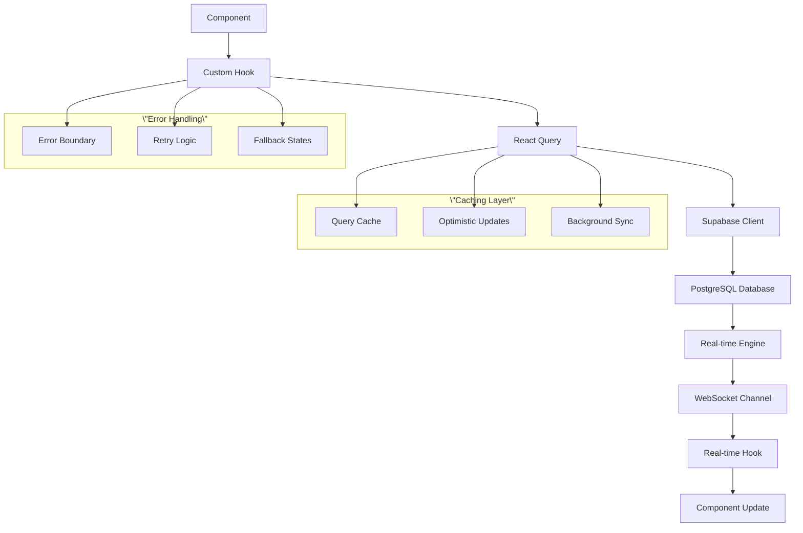

# 🔄 Data Flow & Access Patterns

## Overview

The Ruwād Platform implements **sophisticated data flow patterns** that ensure **consistent data access**, **optimal performance**, and **maintainable architecture** across all **195 components**. This document details the **unified data access patterns**, **caching strategies**, and **state management** implemented through the hook-based architecture.

## Data Flow Architecture

### 1. **Data Flow Overview**



### 2. **Data Access Patterns**

#### Unified Data Fetching Pattern
```typescript
// Standard data fetching pattern used across all components
export const useDataFetching = <T>(
  queryKey: QueryKey,
  queryFn: QueryFunction<T>,
  options?: UseQueryOptions<T>
) => {
  const { handleError } = createErrorHandler('DataFetching');
  
  const queryResult = useQuery({
    queryKey,
    queryFn,
    staleTime: 5 * 60 * 1000, // 5 minutes
    cacheTime: 10 * 60 * 1000, // 10 minutes
    retry: (failureCount, error) => {
      // Custom retry logic based on error type
      if (isAuthError(error)) return false;
      if (isNetworkError(error)) return failureCount < 3;
      return failureCount < 2;
    },
    onError: handleError,
    ...options
  });
  
  return {
    ...queryResult,
    // Enhanced error state
    hasError: !!queryResult.error,
    isStale: queryResult.isStale,
    // Simplified loading states
    isInitialLoading: queryResult.isLoading && queryResult.isFetching,
    isRefetching: !queryResult.isLoading && queryResult.isFetching
  };
};

// Example usage in challenge management
export const useChallengeManagement = () => {
  const { withLoading } = useUnifiedLoading();
  const queryClient = useQueryClient();
  
  // Fetch challenges with standard pattern
  const {
    data: challenges,
    loading,
    error,
    refetch
  } = useDataFetching(
    ['challenges'],
    async () => {
      const { data, error } = await supabase
        .from('challenges')
        .select(`
          *,
          challenge_tags (
            tag_id,
            tags (name_ar, name_en, color)
          ),
          challenge_participants (count)
        `)
        .order('created_at', { ascending: false });
      
      if (error) throw error;
      return data;
    }
  );
  
  // Create challenge with optimistic updates
  const createChallenge = withLoading(async (challengeData: CreateChallengeRequest) => {
    // Optimistic update
    const tempId = `temp-${Date.now()}`;
    const optimisticChallenge = {
      id: tempId,
      ...challengeData,
      created_at: new Date().toISOString(),
      status: 'draft' as const
    };
    
    queryClient.setQueryData(['challenges'], (old: Challenge[] = []) => [
      optimisticChallenge,
      ...old
    ]);
    
    try {
      const { data, error } = await supabase
        .from('challenges')
        .insert(challengeData)
        .select()
        .single();
      
      if (error) throw error;
      
      // Replace optimistic update with real data
      queryClient.setQueryData(['challenges'], (old: Challenge[] = []) =>
        old.map(challenge => 
          challenge.id === tempId ? data : challenge
        )
      );
      
      return data;
    } catch (error) {
      // Revert optimistic update on error
      queryClient.setQueryData(['challenges'], (old: Challenge[] = []) =>
        old.filter(challenge => challenge.id !== tempId)
      );
      throw error;
    }
  }, 'createChallenge');
  
  return {
    challenges,
    loading,
    error,
    createChallenge,
    refetch
  };
};
```

## Caching Strategies

### 1. **Intelligent Query Caching**

```typescript
// Centralized cache configuration
export const queryClientConfig = {
  defaultOptions: {
    queries: {
      // Cache configuration based on data volatility
      staleTime: (query: Query) => {
        const [entity, ...params] = query.queryKey;
        
        switch (entity) {
          case 'user-profile':
            return 10 * 60 * 1000; // 10 minutes (relatively stable)
          case 'challenges':
            return 5 * 60 * 1000;  // 5 minutes (moderate updates)
          case 'real-time-metrics':
            return 30 * 1000;      // 30 seconds (frequently changing)
          case 'system-config':
            return 60 * 60 * 1000; // 1 hour (rarely changes)
          default:
            return 5 * 60 * 1000;  // Default 5 minutes
        }
      },
      
      cacheTime: 15 * 60 * 1000, // Keep in cache for 15 minutes
      
      retry: (failureCount, error) => {
        // Smart retry based on error type
        if (error instanceof AuthError) return false;
        if (error instanceof ValidationError) return false;
        return failureCount < 3;
      },
      
      retryDelay: (attemptIndex) => Math.min(1000 * 2 ** attemptIndex, 30000)
    },
    
    mutations: {
      retry: (failureCount, error) => {
        // Generally don't retry mutations automatically
        if (error instanceof NetworkError) return failureCount < 2;
        return false;
      }
    }
  }
};

// Cache invalidation patterns
export const useCacheInvalidation = () => {
  const queryClient = useQueryClient();
  
  const invalidateRelatedQueries = useCallback(async (entity: string, entityId?: string) => {
    const invalidationMap: Record<string, string[]> = {
      'challenge': [
        'challenges',
        'challenge-participants',
        'challenge-submissions',
        'user-activity',
        'dashboard-metrics'
      ],
      'event': [
        'events',
        'event-registrations',
        'user-activity',
        'dashboard-metrics'
      ],
      'user': [
        'user-profile',
        'user-activity',
        'team-members',
        'dashboard-metrics'
      ]
    };
    
    const queriesToInvalidate = invalidationMap[entity] || [entity];
    
    await Promise.all(
      queriesToInvalidate.map(queryKey => 
        queryClient.invalidateQueries({ queryKey: [queryKey] })
      )
    );
    
    // Also invalidate specific entity queries if ID provided
    if (entityId) {
      await queryClient.invalidateQueries({ 
        queryKey: [entity, entityId] 
      });
    }
  }, [queryClient]);
  
  return { invalidateRelatedQueries };
};
```

### 2. **Background Synchronization**

```typescript
// Background sync for critical data
export const useBackgroundSync = () => {
  const queryClient = useQueryClient();
  const { isOnline } = useNetworkStatus();
  
  useEffect(() => {
    if (!isOnline) return;
    
    // Sync critical data every 5 minutes
    const syncInterval = setInterval(async () => {
      const criticalQueries = [
        'user-profile',
        'user-roles',
        'notifications',
        'system-announcements'
      ];
      
      await Promise.all(
        criticalQueries.map(queryKey =>
          queryClient.refetchQueries({ 
            queryKey: [queryKey],
            stale: true 
          })
        )
      );
    }, 5 * 60 * 1000);
    
    return () => clearInterval(syncInterval);
  }, [isOnline, queryClient]);
};

// Prefetching for better UX
export const usePrefetchingStrategy = () => {
  const queryClient = useQueryClient();
  const { user } = useAuth();
  
  const prefetchUserData = useCallback(async () => {
    if (!user) return;
    
    // Prefetch likely-to-be-needed data
    const prefetchQueries = [
      {
        queryKey: ['user-challenges', user.id],
        queryFn: () => getUserChallenges(user.id)
      },
      {
        queryKey: ['user-events', user.id],
        queryFn: () => getUserEvents(user.id)
      },
      {
        queryKey: ['user-bookmarks', user.id],
        queryFn: () => getUserBookmarks(user.id)
      }
    ];
    
    await Promise.all(
      prefetchQueries.map(({ queryKey, queryFn }) =>
        queryClient.prefetchQuery({ queryKey, queryFn })
      )
    );
  }, [user, queryClient]);
  
  // Prefetch on route changes
  const prefetchForRoute = useCallback(async (route: string) => {
    switch (route) {
      case '/dashboard':
        await queryClient.prefetchQuery({
          queryKey: ['dashboard-metrics'],
          queryFn: getDashboardMetrics
        });
        break;
      case '/challenges':
        await queryClient.prefetchQuery({
          queryKey: ['challenges'],
          queryFn: getChallenges
        });
        break;
      case '/events':
        await queryClient.prefetchQuery({
          queryKey: ['events'],
          queryFn: getEvents
        });
        break;
    }
  }, [queryClient]);
  
  return { prefetchUserData, prefetchForRoute };
};
```

## State Management Patterns

### 1. **Local vs Server State**

```typescript
// Clear separation between local and server state
export const useStateManagement = <T>(
  serverDataQuery: UseQueryResult<T>,
  initialLocalState: Partial<T> = {}
) => {
  // Server state (via React Query)
  const {
    data: serverData,
    loading: serverLoading,
    error: serverError
  } = serverDataQuery;
  
  // Local state (via React state)
  const [localState, setLocalState] = useState(initialLocalState);
  const [optimisticUpdates, setOptimisticUpdates] = useState<Partial<T>[]>([]);
  
  // Merged state combining server data with local changes
  const mergedState = useMemo(() => {
    if (!serverData) return localState;
    
    let merged = { ...serverData, ...localState };
    
    // Apply optimistic updates
    optimisticUpdates.forEach(update => {
      merged = { ...merged, ...update };
    });
    
    return merged;
  }, [serverData, localState, optimisticUpdates]);
  
  // Local state updaters
  const updateLocalState = useCallback((updates: Partial<T>) => {
    setLocalState(prev => ({ ...prev, ...updates }));
  }, []);
  
  const addOptimisticUpdate = useCallback((update: Partial<T>) => {
    const updateId = Date.now();
    setOptimisticUpdates(prev => [...prev, { ...update, _updateId: updateId }]);
    
    // Remove optimistic update after timeout
    setTimeout(() => {
      setOptimisticUpdates(prev => 
        prev.filter(u => u._updateId !== updateId)
      );
    }, 5000);
  }, []);
  
  const clearLocalState = useCallback(() => {
    setLocalState(initialLocalState);
    setOptimisticUpdates([]);
  }, [initialLocalState]);
  
  return {
    // Combined state
    data: mergedState,
    loading: serverLoading,
    error: serverError,
    
    // State management
    updateLocalState,
    addOptimisticUpdate,
    clearLocalState,
    
    // Debugging helpers
    serverData,
    localState,
    optimisticUpdates
  };
};
```

### 2. **Form State Integration**

```typescript
// Integrated form state with server data
export const useFormStateIntegration = <T extends FieldValues>(
  schema: z.ZodSchema<T>,
  serverData?: T,
  onSubmit?: (data: T) => Promise<void>
) => {
  const { withLoading } = useUnifiedLoading();
  const { handleError } = createErrorHandler('FormState');
  
  const form = useForm<T>({
    resolver: zodResolver(schema),
    defaultValues: serverData,
    mode: 'onBlur'
  });
  
  // Sync form with server data updates
  useEffect(() => {
    if (serverData) {
      form.reset(serverData);
    }
  }, [serverData, form]);
  
  // Auto-save functionality
  const [lastSavedData, setLastSavedData] = useState<T | null>(null);
  const autoSave = useDebouncedCallback(
    withLoading(async (data: T) => {
      if (!onSubmit || !form.formState.isValid) return;
      
      try {
        await onSubmit(data);
        setLastSavedData(data);
        toast.success('Auto-saved', { duration: 2000 });
      } catch (error) {
        console.warn('Auto-save failed:', error);
      }
    }, 'autoSave'),
    2000 // 2 second delay
  );
  
  // Watch for changes and auto-save
  const watchedData = form.watch();
  useEffect(() => {
    const hasChanges = !isEqual(watchedData, lastSavedData);
    if (hasChanges && form.formState.isValid) {
      autoSave(watchedData);
    }
  }, [watchedData, lastSavedData, autoSave, form.formState.isValid]);
  
  const handleSubmit = withLoading(async (data: T) => {
    try {
      if (onSubmit) {
        await onSubmit(data);
        setLastSavedData(data);
        toast.success('Saved successfully');
      }
    } catch (error) {
      handleError(error as Error);
    }
  }, 'formSubmit');
  
  return {
    form,
    handleSubmit: form.handleSubmit(handleSubmit),
    isSubmitting: useUnifiedLoading().isLoading('formSubmit'),
    hasUnsavedChanges: !isEqual(watchedData, lastSavedData),
    lastSavedData
  };
};
```

## Real-time Data Integration

### 1. **Real-time Cache Updates**

```typescript
// Integration between real-time updates and query cache
export const useRealTimeCacheSync = <T>(
  queryKey: QueryKey,
  channel: string,
  tableName: string
) => {
  const queryClient = useQueryClient();
  
  useEffect(() => {
    const subscription = supabase
      .channel(channel)
      .on(
        'postgres_changes',
        {
          event: '*',
          schema: 'public',
          table: tableName
        },
        (payload) => {
          const { eventType, new: newRecord, old: oldRecord } = payload;
          
          queryClient.setQueryData(queryKey, (oldData: T[] | undefined) => {
            if (!oldData) return oldData;
            
            switch (eventType) {
              case 'INSERT':
                return [newRecord as T, ...oldData];
                
              case 'UPDATE':
                return oldData.map(item => 
                  (item as any).id === newRecord.id ? newRecord as T : item
                );
                
              case 'DELETE':
                return oldData.filter(item => 
                  (item as any).id !== oldRecord.id
                );
                
              default:
                return oldData;
            }
          });
        }
      )
      .subscribe();
    
    return () => {
      supabase.removeChannel(subscription);
    };
  }, [queryKey, channel, tableName, queryClient]);
};

// Real-time aware data hook
export const useRealTimeData = <T>(
  queryKey: QueryKey,
  queryFn: QueryFunction<T[]>,
  realtimeConfig: {
    channel: string;
    table: string;
    filter?: string;
  }
) => {
  // Standard data fetching
  const queryResult = useDataFetching(queryKey, queryFn);
  
  // Real-time sync
  useRealTimeCacheSync(queryKey, realtimeConfig.channel, realtimeConfig.table);
  
  return queryResult;
};
```

### 2. **Conflict Resolution**

```typescript
// Handle conflicts between local changes and real-time updates
export const useConflictResolution = <T extends { id: string; updated_at: string }>(
  localChanges: Map<string, T>,
  onConflict?: (local: T, remote: T) => T
) => {
  const resolveConflict = useCallback((remoteData: T) => {
    const localData = localChanges.get(remoteData.id);
    
    if (!localData) return remoteData;
    
    // Compare timestamps
    const localTimestamp = new Date(localData.updated_at);
    const remoteTimestamp = new Date(remoteData.updated_at);
    
    if (localTimestamp > remoteTimestamp) {
      // Local changes are newer, keep them
      return localData;
    } else if (localTimestamp < remoteTimestamp) {
      // Remote changes are newer, use them
      return remoteData;
    } else {
      // Same timestamp, use conflict resolution strategy
      if (onConflict) {
        return onConflict(localData, remoteData);
      }
      
      // Default: merge objects with remote taking precedence
      return { ...localData, ...remoteData };
    }
  }, [localChanges, onConflict]);
  
  return { resolveConflict };
};
```

## Performance Optimization Patterns

### 1. **Selective Data Loading**

```typescript
// Load only necessary data based on component needs
export const useSelectiveDataLoading = <T>(
  baseQuery: UseQueryOptions<T>,
  selectors: {
    [key: string]: (data: T) => any;
  }
) => {
  const queryResult = useQuery(baseQuery);
  
  // Memoize selected data to prevent unnecessary re-renders
  const selectedData = useMemo(() => {
    if (!queryResult.data) return {};
    
    const result: Record<string, any> = {};
    Object.entries(selectors).forEach(([key, selector]) => {
      result[key] = selector(queryResult.data!);
    });
    
    return result;
  }, [queryResult.data, selectors]);
  
  return {
    ...queryResult,
    selectedData
  };
};

// Example usage for challenge list
export const useChallengeListData = () => {
  return useSelectiveDataLoading(
    {
      queryKey: ['challenges'],
      queryFn: getChallenges
    },
    {
      activeChallenges: (challenges) => 
        challenges.filter(c => c.status === 'active'),
      totalCount: (challenges) => challenges.length,
      categories: (challenges) => 
        [...new Set(challenges.map(c => c.challenge_type))]
    }
  );
};
```

### 2. **Pagination and Virtual Scrolling**

```typescript
// Infinite query pattern for large datasets
export const useInfiniteDataLoading = <T>(
  queryKey: QueryKey,
  queryFn: (pageParam?: any) => Promise<{ data: T[]; nextCursor?: any }>,
  options?: UseInfiniteQueryOptions<{ data: T[]; nextCursor?: any }>
) => {
  const {
    data,
    loading,
    error,
    fetchNextPage,
    hasNextPage,
    isFetchingNextPage
  } = useInfiniteQuery({
    queryKey,
    queryFn: ({ pageParam = 0 }) => queryFn(pageParam),
    getNextPageParam: (lastPage) => lastPage.nextCursor,
    ...options
  });
  
  // Flatten pages into single array
  const flatData = useMemo(() => {
    return data?.pages.flatMap(page => page.data) || [];
  }, [data]);
  
  return {
    data: flatData,
    loading,
    error,
    fetchNextPage,
    hasNextPage,
    isFetchingNextPage,
    totalCount: flatData.length
  };
};
```

## Error Recovery Patterns

### 1. **Graceful Degradation**

```typescript
// Fallback data patterns for resilient UX
export const useFallbackData = <T>(
  primaryQuery: UseQueryResult<T>,
  fallbackData?: T,
  fallbackQuery?: UseQueryOptions<T>
) => {
  const fallbackResult = useQuery({
    ...fallbackQuery,
    enabled: !!primaryQuery.error && !!fallbackQuery
  });
  
  const effectiveData = useMemo(() => {
    if (primaryQuery.data) return primaryQuery.data;
    if (fallbackResult.data) return fallbackResult.data;
    return fallbackData;
  }, [primaryQuery.data, fallbackResult.data, fallbackData]);
  
  const isUsingFallback = !primaryQuery.data && (!!fallbackResult.data || !!fallbackData);
  
  return {
    data: effectiveData,
    loading: primaryQuery.loading && (!isUsingFallback || fallbackResult.loading),
    error: primaryQuery.error && fallbackResult.error,
    isUsingFallback
  };
};
```

### 2. **Retry Strategies**

```typescript
// Smart retry with exponential backoff
export const useSmartRetry = () => {
  const retryWithBackoff = useCallback(async (
    operation: () => Promise<any>,
    maxRetries: number = 3,
    baseDelay: number = 1000
  ) => {
    let lastError: Error;
    
    for (let attempt = 0; attempt <= maxRetries; attempt++) {
      try {
        return await operation();
      } catch (error) {
        lastError = error as Error;
        
        // Don't retry certain types of errors
        if (isAuthError(error) || isValidationError(error)) {
          throw error;
        }
        
        // If this was the last attempt, throw the error
        if (attempt === maxRetries) {
          throw error;
        }
        
        // Wait before retrying with exponential backoff
        const delay = baseDelay * Math.pow(2, attempt);
        await new Promise(resolve => setTimeout(resolve, delay));
      }
    }
    
    throw lastError!;
  }, []);
  
  return { retryWithBackoff };
};
```

---

**Data Flow Status**: ✅ **OPTIMIZED & UNIFIED**  
**Caching Strategy**: Intelligent multi-level caching  
**State Management**: Unified local/server state patterns  
**Real-time Integration**: Seamless cache synchronization  
**Performance**: Optimized with selective loading & pagination  
**Error Recovery**: Graceful degradation & smart retry logic
