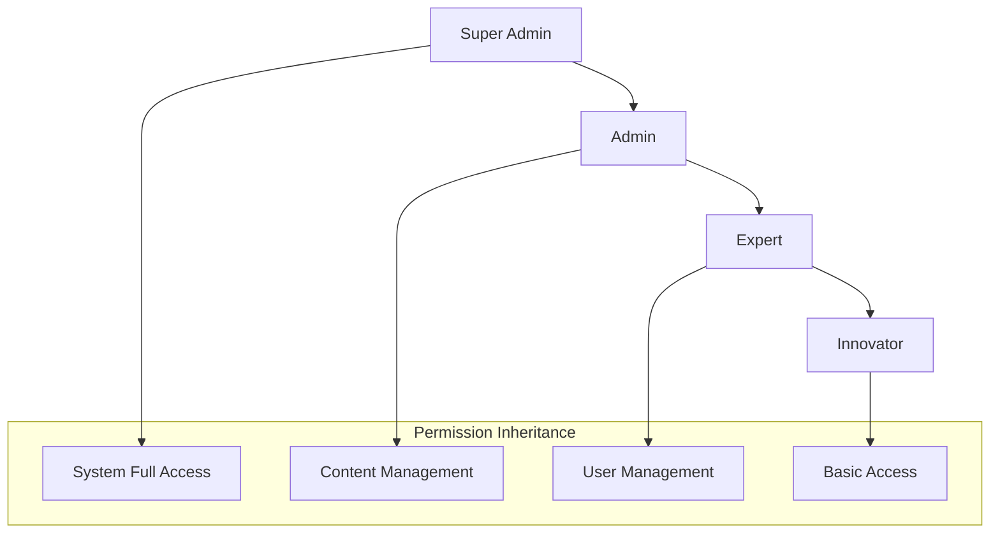

# 🔐 Access Control & Permission Systems

## Overview

The Ruwād Platform implements a **comprehensive access control system** with **role-based permissions**, **fine-grained access controls**, and **dynamic authorization** mechanisms. This system ensures secure access to resources based on user roles, organizational hierarchy, and contextual permissions.

## Access Control Architecture

### 1. **Role-Based Access Control (RBAC)**

#### Role Hierarchy


#### Role Definitions
```typescript
// Role hierarchy and permissions
export type AppRole = 'super_admin' | 'admin' | 'expert' | 'innovator';

export interface RoleDefinition {
  role: AppRole;
  level: number;
  permissions: string[];
  inheritsFrom?: AppRole[];
  description: string;
}

export const ROLE_DEFINITIONS: Record<AppRole, RoleDefinition> = {
  super_admin: {
    role: 'super_admin',
    level: 4,
    permissions: ['system.*'],
    description: 'Complete system access with administrative privileges'
  },
  
  admin: {
    role: 'admin', 
    level: 3,
    permissions: [
      'users.manage',
      'challenges.manage',
      'events.manage',
      'ideas.manage',
      'analytics.view',
      'system.configure',
      'reports.generate'
    ],
    inheritsFrom: ['expert'],
    description: 'Administrative access to platform management'
  },
  
  expert: {
    role: 'expert',
    level: 2,
    permissions: [
      'challenges.evaluate',
      'ideas.evaluate',
      'events.create',
      'events.moderate',
      'mentorship.provide',
      'content.moderate'
    ],
    inheritsFrom: ['innovator'],
    description: 'Expert evaluation and content moderation capabilities'
  },
  
  innovator: {
    role: 'innovator',
    level: 1,
    permissions: [
      'challenges.view',
      'challenges.participate',
      'ideas.create',
      'ideas.view',
      'events.view',
      'events.register',
      'profile.edit',
      'bookmarks.manage'
    ],
    description: 'Basic user access for platform participation'
  }
};
```

### 2. **Advanced Permission System**

#### Permission Structure
```typescript
// Hierarchical permission system
export interface Permission {
  id: string;
  resource: string;
  action: string;
  conditions?: PermissionCondition[];
  metadata?: Record<string, any>;
}

export interface PermissionCondition {
  type: 'time' | 'ip' | 'location' | 'context' | 'custom';
  operator: 'equals' | 'contains' | 'matches' | 'between';
  value: any;
}

// Permission checking with conditions
export const useAdvancedPermissions = () => {
  const { user } = useAuth();
  const { userRoles } = useRoleManagement();

  const hasPermissionWithConditions = useCallback(async (
    permission: string,
    context?: Record<string, any>
  ): Promise<boolean> => {
    try {
      // Get user's permissions
      const userPermissions = await getUserPermissions(user?.id);
      
      // Find matching permission
      const matchingPermission = userPermissions.find(p => 
        `${p.resource}.${p.action}` === permission || 
        p.resource === '*' || 
        permission.startsWith(p.resource.replace('*', ''))
      );

      if (!matchingPermission) return false;

      // Check conditions if any
      if (matchingPermission.conditions?.length) {
        return await evaluateConditions(matchingPermission.conditions, context);
      }

      return true;
    } catch (error) {
      console.error('Permission check failed:', error);
      return false;
    }
  }, [user?.id]);

  const evaluateConditions = async (
    conditions: PermissionCondition[],
    context?: Record<string, any>
  ): Promise<boolean> => {
    for (const condition of conditions) {
      const result = await evaluateCondition(condition, context);
      if (!result) return false;
    }
    return true;
  };

  const evaluateCondition = async (
    condition: PermissionCondition,
    context?: Record<string, any>
  ): Promise<boolean> => {
    switch (condition.type) {
      case 'time':
        return evaluateTimeCondition(condition);
      case 'ip':
        return evaluateIPCondition(condition);
      case 'context':
        return evaluateContextCondition(condition, context);
      default:
        return true;
    }
  };

  return {
    hasPermissionWithConditions,
    evaluateConditions
  };
};
```

### 3. **Context-Based Access Control**

#### Resource-Level Permissions
```typescript
// Resource-specific access control
export interface ResourceAccess {
  resourceId: string;
  resourceType: 'challenge' | 'idea' | 'event' | 'organization';
  userId: string;
  accessLevel: 'read' | 'write' | 'admin' | 'owner';
  grantedBy: string;
  grantedAt: string;
  expiresAt?: string;
  conditions?: AccessCondition[];
}

export const useResourceAccess = () => {
  const { user } = useAuth();
  const { hasRole } = useRoleManagement();

  const checkResourceAccess = useCallback(async (
    resourceId: string,
    resourceType: string,
    requiredLevel: 'read' | 'write' | 'admin' | 'owner'
  ): Promise<boolean> => {
    try {
      // Super admins have access to everything
      if (hasRole('super_admin')) return true;

      // Check direct resource access
      const { data: access } = await supabase
        .from('resource_access')
        .select('*')
        .eq('resource_id', resourceId)
        .eq('resource_type', resourceType)
        .eq('user_id', user?.id)
        .single();

      if (access) {
        return hasAccessLevel(access.access_level, requiredLevel);
      }

      // Check organization-level access
      const organizationAccess = await checkOrganizationAccess(
        resourceType,
        requiredLevel
      );

      return organizationAccess;
    } catch (error) {
      console.error('Resource access check failed:', error);
      return false;
    }
  }, [user?.id, hasRole]);

  const hasAccessLevel = (userLevel: string, requiredLevel: string): boolean => {
    const levels = ['read', 'write', 'admin', 'owner'];
    const userLevelIndex = levels.indexOf(userLevel);
    const requiredLevelIndex = levels.indexOf(requiredLevel);
    
    return userLevelIndex >= requiredLevelIndex;
  };

  const grantResourceAccess = async (
    resourceId: string,
    resourceType: string,
    targetUserId: string,
    accessLevel: string,
    expiresAt?: string
  ) => {
    // Check if current user can grant access
    const canGrant = await checkResourceAccess(resourceId, resourceType, 'admin');
    
    if (!canGrant) {
      throw new Error('Insufficient permissions to grant access');
    }

    const { data, error } = await supabase
      .from('resource_access')
      .upsert({
        resource_id: resourceId,
        resource_type: resourceType,
        user_id: targetUserId,
        access_level: accessLevel,
        granted_by: user?.id,
        granted_at: new Date().toISOString(),
        expires_at: expiresAt
      });

    if (error) throw error;
    return data;
  };

  return {
    checkResourceAccess,
    grantResourceAccess,
    hasAccessLevel
  };
};
```

### 4. **Dynamic Authorization Engine**

#### Policy-Based Access Control
```typescript
// Dynamic authorization policies
export interface AuthorizationPolicy {
  id: string;
  name: string;
  resource: string;
  conditions: PolicyCondition[];
  effect: 'allow' | 'deny';
  priority: number;
}

export interface PolicyCondition {
  field: string;
  operator: 'eq' | 'ne' | 'gt' | 'lt' | 'in' | 'contains';
  value: any;
  logicalOperator?: 'and' | 'or';
}

export const useAuthorizationEngine = () => {
  const { user } = useAuth();
  const [policies, setPolicies] = useState<AuthorizationPolicy[]>([]);

  const evaluateAccess = async (
    resource: string,
    action: string,
    context: Record<string, any>
  ): Promise<boolean> => {
    try {
      // Get applicable policies
      const applicablePolicies = policies.filter(p => 
        p.resource === resource || p.resource === '*'
      );

      // Sort by priority (higher priority first)
      applicablePolicies.sort((a, b) => b.priority - a.priority);

      // Evaluate policies in order
      for (const policy of applicablePolicies) {
        const matches = await evaluatePolicy(policy, context);
        
        if (matches) {
          return policy.effect === 'allow';
        }
      }

      // Default deny if no policies match
      return false;
    } catch (error) {
      console.error('Authorization evaluation failed:', error);
      return false;
    }
  };

  const evaluatePolicy = async (
    policy: AuthorizationPolicy,
    context: Record<string, any>
  ): Promise<boolean> => {
    let result = true;
    let currentLogicalOp: 'and' | 'or' = 'and';

    for (const condition of policy.conditions) {
      const conditionResult = evaluatePolicyCondition(condition, context);
      
      if (currentLogicalOp === 'and') {
        result = result && conditionResult;
      } else {
        result = result || conditionResult;
      }

      // Set logical operator for next condition
      if (condition.logicalOperator) {
        currentLogicalOp = condition.logicalOperator;
      }
    }

    return result;
  };

  const evaluatePolicyCondition = (
    condition: PolicyCondition,
    context: Record<string, any>
  ): boolean => {
    const fieldValue = getNestedValue(context, condition.field);
    
    switch (condition.operator) {
      case 'eq':
        return fieldValue === condition.value;
      case 'ne':
        return fieldValue !== condition.value;
      case 'gt':
        return fieldValue > condition.value;
      case 'lt':
        return fieldValue < condition.value;
      case 'in':
        return Array.isArray(condition.value) && 
               condition.value.includes(fieldValue);
      case 'contains':
        return String(fieldValue).includes(String(condition.value));
      default:
        return false;
    }
  };

  return {
    evaluateAccess,
    policies,
    setPolicies
  };
};
```

### 5. **Organization-Based Access Control**

#### Multi-Tenant Security
```typescript
// Organization-level access control
export interface OrganizationMembership {
  id: string;
  user_id: string;
  organization_id: string;
  role: 'owner' | 'admin' | 'member' | 'viewer';
  permissions: string[];
  joined_at: string;
  status: 'active' | 'inactive' | 'pending';
}

export const useOrganizationAccess = () => {
  const { user } = useAuth();

  const {
    data: memberships,
    loading
  } = useQuery({
    queryKey: ['organization-memberships', user?.id],
    queryFn: async () => {
      const { data, error } = await supabase
        .from('organization_memberships')
        .select(`
          *,
          organizations (
            id,
            name,
            slug,
            settings
          )
        `)
        .eq('user_id', user?.id)
        .eq('status', 'active');

      if (error) throw error;
      return data;
    },
    enabled: !!user?.id
  });

  const hasOrganizationRole = (orgId: string, role: string): boolean => {
    const membership = memberships?.find(m => m.organization_id === orgId);
    return membership?.role === role;
  };

  const hasOrganizationPermission = (orgId: string, permission: string): boolean => {
    const membership = memberships?.find(m => m.organization_id === orgId);
    
    if (!membership) return false;
    
    // Check explicit permissions
    if (membership.permissions?.includes(permission)) return true;
    
    // Check role-based permissions
    const rolePermissions = getOrganizationRolePermissions(membership.role);
    return rolePermissions.includes(permission);
  };

  const getAccessibleOrganizations = (): string[] => {
    return memberships?.map(m => m.organization_id) || [];
  };

  const switchOrganizationContext = (orgId: string) => {
    const membership = memberships?.find(m => m.organization_id === orgId);
    
    if (!membership) {
      throw new Error('No access to organization');
    }

    // Store current organization context
    localStorage.setItem('current_organization', orgId);
    
    // Trigger context refresh
    window.dispatchEvent(new Event('organizationContextChanged'));
  };

  return {
    memberships,
    loading,
    hasOrganizationRole,
    hasOrganizationPermission,
    getAccessibleOrganizations,
    switchOrganizationContext
  };
};
```

### 6. **Access Control Middleware**

#### Route Protection
```typescript
// Route-level access control
export const useRouteProtection = () => {
  const { hasPermission } = useRoleManagement();
  const { checkResourceAccess } = useResourceAccess();
  const { navigate } = useNavigationHandler();

  const protectRoute = async (
    requiredPermission: string,
    resourceId?: string,
    resourceType?: string
  ): Promise<boolean> => {
    try {
      // Check general permission
      const hasGeneralPermission = await hasPermission(requiredPermission);
      
      if (!hasGeneralPermission) {
        navigate('/unauthorized');
        return false;
      }

      // Check resource-specific access if provided
      if (resourceId && resourceType) {
        const hasResourceAccess = await checkResourceAccess(
          resourceId,
          resourceType,
          'read'
        );
        
        if (!hasResourceAccess) {
          navigate('/not-found');
          return false;
        }
      }

      return true;
    } catch (error) {
      console.error('Route protection failed:', error);
      navigate('/error');
      return false;
    }
  };

  return { protectRoute };
};

// HOC for protected routes
export const withAccessControl = <P extends object>(
  Component: React.ComponentType<P>,
  requiredPermission: string,
  resourceCheck?: (props: P) => { resourceId: string; resourceType: string }
) => {
  return (props: P) => {
    const { protectRoute } = useRouteProtection();
    const [isAuthorized, setIsAuthorized] = useState<boolean | null>(null);

    useEffect(() => {
      const checkAccess = async () => {
        let resourceId: string | undefined;
        let resourceType: string | undefined;

        if (resourceCheck) {
          const resource = resourceCheck(props);
          resourceId = resource.resourceId;
          resourceType = resource.resourceType;
        }

        const authorized = await protectRoute(
          requiredPermission,
          resourceId,
          resourceType
        );
        
        setIsAuthorized(authorized);
      };

      checkAccess();
    }, [requiredPermission, props]);

    if (isAuthorized === null) {
      return <div>Checking access...</div>;
    }

    return isAuthorized ? <Component {...props} /> : null;
  };
};
```

### 7. **Audit & Compliance**

#### Access Logging
```typescript
// Comprehensive access logging
export const useAccessLogging = () => {
  const { user } = useAuth();

  const logAccess = async (
    resource: string,
    action: string,
    result: 'granted' | 'denied',
    details?: Record<string, any>
  ) => {
    try {
      const accessLog = {
        user_id: user?.id,
        resource,
        action,
        result,
        timestamp: new Date().toISOString(),
        ip_address: await getUserIP(),
        user_agent: navigator.userAgent,
        session_id: getSessionId(),
        details
      };

      await supabase.from('access_logs').insert(accessLog);

      // Real-time monitoring for suspicious patterns
      if (result === 'denied') {
        await checkSuspiciousActivity(user?.id, resource, action);
      }
    } catch (error) {
      console.error('Access logging failed:', error);
    }
  };

  const checkSuspiciousActivity = async (
    userId: string | undefined,
    resource: string,
    action: string
  ) => {
    if (!userId) return;

    // Check for multiple denied attempts
    const { data: recentDenials } = await supabase
      .from('access_logs')
      .select('*')
      .eq('user_id', userId)
      .eq('result', 'denied')
      .gte('timestamp', new Date(Date.now() - 15 * 60 * 1000).toISOString());

    if (recentDenials && recentDenials.length > 5) {
      // Alert security team
      await supabase.from('security_alerts').insert({
        user_id: userId,
        alert_type: 'suspicious_access_pattern',
        severity: 'high',
        details: {
          resource,
          action,
          denial_count: recentDenials.length
        }
      });
    }
  };

  return { logAccess };
};
```

## Access Control Best Practices

### 1. **Principle of Least Privilege**
- Users receive minimum necessary permissions
- Regular access reviews and cleanup
- Time-limited elevated access
- Just-in-time permission elevation

### 2. **Defense in Depth**
- Multiple layers of access control
- Client and server-side validation
- Database-level security (RLS)
- Network-level restrictions

### 3. **Zero Trust Architecture**
- Verify every access request
- Continuous authentication monitoring
- Context-aware access decisions
- Regular permission re-validation

### 4. **Compliance & Auditing**
- Complete audit trails
- Access pattern analysis
- Automated compliance reporting
- Regular access reviews

---

**Access Control Status**: ✅ **Enterprise-Grade Implementation**  
**Last Review**: January 17, 2025  
**Next Audit**: April 17, 2025