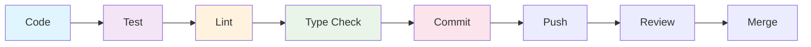

# 🔄 Development Workflow Guide

## Daily Development Process

### Morning Routine
1. **Pull Latest Changes**
   ```bash
   git pull origin main
   npm install  # If package.json changed
   ```

2. **Start Development Environment**
   ```bash
   npm run dev
   ```

3. **Check Build Health**
   ```bash
   npm run type-check
   npm run lint
   ```

### Feature Development

#### 1. Branch Creation
```bash
# Create feature branch
git checkout -b feature/component-name

# For bug fixes
git checkout -b fix/issue-description

# For documentation
git checkout -b docs/documentation-update
```

#### 2. Development Cycle


#### 3. Component Development Pattern
```typescript
// 1. Create component interface
interface ComponentProps {
  data: DataType[];
  onAction: (item: DataType) => void;
}

// 2. Implement with hook
export const Component = ({ data, onAction }: ComponentProps) => {
  const { items, loading, error, actions } = useComponentData();
  
  // Component implementation
};

// 3. Add tests
describe('Component', () => {
  it('should render correctly', () => {
    // Test implementation
  });
});

// 4. Update documentation
```

## Code Quality Gates

### Pre-Commit Checks
```bash
# Run all quality checks
npm run pre-commit

# Individual checks
npm run type-check     # TypeScript validation
npm run lint          # ESLint rules
npm run test          # Unit tests
npm run format        # Code formatting
```

### Build Verification
```bash
# Production build test
npm run build

# Bundle size analysis
npm run analyze

# Preview production build
npm run preview
```

## Git Workflow

### Commit Message Convention
```
type(scope): description

feat(auth): add user authentication hook
fix(dashboard): resolve loading state issue
docs(api): update endpoint documentation
style(ui): improve button component styling
refactor(hooks): consolidate data fetching patterns
test(utils): add validation utility tests
```

### Commit Types
- **feat**: New features
- **fix**: Bug fixes
- **docs**: Documentation updates
- **style**: Code formatting changes
- **refactor**: Code restructuring
- **test**: Adding or updating tests
- **chore**: Maintenance tasks

### Branch Protection
```bash
# Before pushing, ensure:
# 1. All tests pass
npm run test

# 2. Build succeeds
npm run build

# 3. No TypeScript errors
npm run type-check

# 4. ESLint compliance
npm run lint
```

## Component Development Workflow

### 1. Planning Phase
- **Requirements Analysis**: Understand component needs
- **Hook Identification**: Check existing hooks first
- **Interface Design**: Define TypeScript interfaces
- **Testing Strategy**: Plan test scenarios

### 2. Implementation Phase
```typescript
// Step 1: Interface definition
interface ComponentData {
  id: string;
  name: string;
  status: 'active' | 'inactive';
}

// Step 2: Hook integration
const useComponentLogic = () => {
  const { data, loading, error, actions } = useDataManagement();
  
  return {
    componentData: data,
    isLoading: loading,
    error,
    handleAction: actions.update
  };
};

// Step 3: Component implementation
export const Component = () => {
  const { componentData, isLoading, error, handleAction } = useComponentLogic();
  
  if (isLoading) return <LoadingSpinner />;
  if (error) return <ErrorMessage error={error} />;
  
  return (
    <div>
      {/* Component UI */}
    </div>
  );
};
```

### 3. Testing Phase
```typescript
// Unit tests
describe('Component', () => {
  it('displays loading state correctly', () => {
    // Test loading state
  });
  
  it('handles error states', () => {
    // Test error handling
  });
  
  it('renders data correctly', () => {
    // Test data rendering
  });
});

// Integration tests
describe('Component Integration', () => {
  it('integrates with hook correctly', () => {
    // Test hook integration
  });
});
```

## Hook Development Workflow

### 1. Hook Creation Template
```typescript
// File: src/hooks/useFeatureName.ts
import { useQuery, useMutation, useQueryClient } from '@tanstack/react-query';
import { createErrorHandler } from '@/utils/errorHandler';

interface FeatureData {
  id: string;
  // ... other properties
}

interface FeatureHook {
  data: FeatureData[];
  loading: boolean;
  error: Error | null;
  actions: {
    create: (data: Partial<FeatureData>) => Promise<void>;
    update: (id: string, data: Partial<FeatureData>) => Promise<void>;
    delete: (id: string) => Promise<void>;
  };
}

export const useFeatureName = (): FeatureHook => {
  const queryClient = useQueryClient();
  const errorHandler = createErrorHandler({
    component: 'useFeatureName',
    showToast: true
  });

  // Implementation
};
```

### 2. Hook Testing
```typescript
// File: src/hooks/__tests__/useFeatureName.test.ts
import { renderHook } from '@testing-library/react';
import { useFeatureName } from '../useFeatureName';

describe('useFeatureName', () => {
  it('should initialize with correct default state', () => {
    const { result } = renderHook(() => useFeatureName());
    
    expect(result.current.data).toEqual([]);
    expect(result.current.loading).toBe(false);
    expect(result.current.error).toBe(null);
  });
});
```

## Quality Assurance

### Code Review Checklist
- [ ] TypeScript interfaces defined
- [ ] Error handling implemented
- [ ] Loading states managed
- [ ] Tests written and passing
- [ ] Documentation updated
- [ ] Accessibility considered
- [ ] Performance optimized

### Performance Monitoring
```typescript
// Performance measurement
import { startTransition } from 'react';

// Wrap state updates
startTransition(() => {
  setData(newData);
});

// Bundle analysis
npm run analyze
```

### Accessibility Testing
```typescript
// Accessibility testing
import { axe, toHaveNoViolations } from 'jest-axe';

expect.extend(toHaveNoViolations);

test('should not have accessibility violations', async () => {
  const { container } = render(<Component />);
  const results = await axe(container);
  expect(results).toHaveNoViolations();
});
```

## Deployment Workflow

### Development Environment
```bash
# Local development
npm run dev

# Local with HTTPS
npm run dev:https

# Development build
npm run build:dev
```

### Staging Environment
```bash
# Staging build
npm run build:staging

# Deploy to staging
npm run deploy:staging
```

### Production Environment
```bash
# Production build
npm run build

# Production deployment
npm run deploy:production
```

## Monitoring and Debugging

### Development Debugging
```bash
# Debug mode
DEBUG=* npm run dev

# Network debugging
npm run dev:network

# Performance profiling
npm run dev:profile
```

### Error Tracking
```typescript
// Error boundary implementation
class ErrorBoundary extends React.Component {
  componentDidCatch(error: Error, errorInfo: ErrorInfo) {
    console.error('Error caught by boundary:', error, errorInfo);
    // Send to error tracking service
  }
}
```

### Performance Monitoring
```typescript
// Performance tracking
const performanceObserver = new PerformanceObserver((list) => {
  for (const entry of list.getEntries()) {
    console.log('Performance entry:', entry);
  }
});

performanceObserver.observe({ entryTypes: ['measure', 'navigation'] });
```

## Team Collaboration

### Communication
- **Daily Standups**: Progress updates and blockers
- **Code Reviews**: Peer review process
- **Documentation**: Keep docs updated
- **Knowledge Sharing**: Technical discussions

### Tools Integration
- **Git Hooks**: Automated quality checks
- **CI/CD Pipeline**: Automated testing and deployment
- **Monitoring**: Real-time system health
- **Error Tracking**: Production issue monitoring

---

**Workflow Efficiency**: ~5 minutes setup, continuous development  
**Quality Gates**: Automated and manual checks  
**Team Coordination**: Structured communication and reviews
