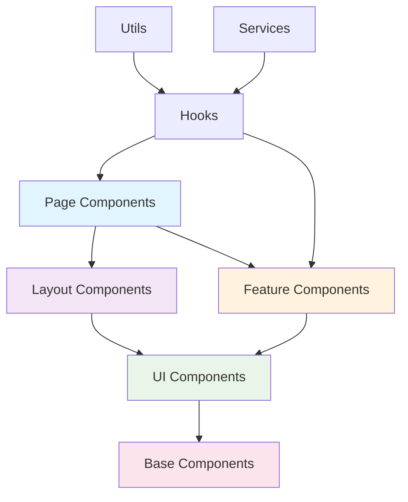

# 🧩 Component Development Guide

## Component Architecture

### Component Hierarchy


### Component Types

#### 1. Page Components
```typescript
// src/pages/UserDashboard.tsx
import { useUserDashboard } from '@/hooks/useUserDashboard';
import { DashboardLayout } from '@/components/layouts';
import { UserStats, RecentActivity } from '@/components/features';

export const UserDashboard = () => {
  const { stats, activities, loading, error } = useUserDashboard();

  if (loading) return <DashboardLayout><LoadingSpinner /></DashboardLayout>;
  if (error) return <DashboardLayout><ErrorMessage error={error} /></DashboardLayout>;

  return (
    <DashboardLayout>
      <UserStats data={stats} />
      <RecentActivity activities={activities} />
    </DashboardLayout>
  );
};
```

#### 2. Layout Components
```typescript
// src/components/layouts/DashboardLayout.tsx
interface DashboardLayoutProps {
  children: ReactNode;
  sidebar?: ReactNode;
  header?: ReactNode;
}

export const DashboardLayout = ({ 
  children, 
  sidebar, 
  header 
}: DashboardLayoutProps) => {
  return (
    <div className="dashboard-layout">
      {header && <header className="dashboard-header">{header}</header>}
      <div className="dashboard-content">
        {sidebar && <aside className="dashboard-sidebar">{sidebar}</aside>}
        <main className="dashboard-main">{children}</main>
      </div>
    </div>
  );
};
```

#### 3. Feature Components
```typescript
// src/components/features/UserStats/UserStats.tsx
import { memo } from 'react';
import { Card } from '@/components/ui/card';

interface UserStatsProps {
  data: {
    totalUsers: number;
    activeUsers: number;
    newUsers: number;
    retentionRate: number;
  };
}

export const UserStats = memo(({ data }: UserStatsProps) => {
  return (
    <div className="grid grid-cols-1 md:grid-cols-2 lg:grid-cols-4 gap-4">
      <Card>
        <h3>Total Users</h3>
        <p className="text-2xl font-bold">{data.totalUsers}</p>
      </Card>
      <Card>
        <h3>Active Users</h3>
        <p className="text-2xl font-bold">{data.activeUsers}</p>
      </Card>
      <Card>
        <h3>New Users</h3>
        <p className="text-2xl font-bold">{data.newUsers}</p>
      </Card>
      <Card>
        <h3>Retention Rate</h3>
        <p className="text-2xl font-bold">{data.retentionRate}%</p>
      </Card>
    </div>
  );
});

UserStats.displayName = 'UserStats';
```

#### 4. UI Components
```typescript
// src/components/ui/button/Button.tsx
import { memo, forwardRef } from 'react';
import { cva, type VariantProps } from 'class-variance-authority';
import { cn } from '@/utils/cn';

const buttonVariants = cva(
  "inline-flex items-center justify-center rounded-md text-sm font-medium transition-colors focus-visible:outline-none focus-visible:ring-2 focus-visible:ring-ring focus-visible:ring-offset-2 disabled:opacity-50 disabled:pointer-events-none ring-offset-background",
  {
    variants: {
      variant: {
        default: "bg-primary text-primary-foreground hover:bg-primary/90",
        destructive: "bg-destructive text-destructive-foreground hover:bg-destructive/90",
        outline: "border border-input hover:bg-accent hover:text-accent-foreground",
        secondary: "bg-secondary text-secondary-foreground hover:bg-secondary/80",
        ghost: "hover:bg-accent hover:text-accent-foreground",
        link: "underline-offset-4 hover:underline text-primary"
      },
      size: {
        default: "h-10 py-2 px-4",
        sm: "h-9 px-3 rounded-md",
        lg: "h-11 px-8 rounded-md",
        icon: "h-10 w-10"
      }
    },
    defaultVariants: {
      variant: "default",
      size: "default"
    }
  }
);

interface ButtonProps 
  extends React.ButtonHTMLAttributes<HTMLButtonElement>,
  VariantProps<typeof buttonVariants> {
  asChild?: boolean;
}

export const Button = memo(forwardRef<HTMLButtonElement, ButtonProps>(
  ({ className, variant, size, asChild = false, ...props }, ref) => {
    return (
      <button
        className={cn(buttonVariants({ variant, size, className }))}
        ref={ref}
        {...props}
      />
    );
  }
));

Button.displayName = 'Button';
```

## Component Development Process

### 1. Planning Phase
```typescript
// Define requirements
interface ComponentRequirements {
  purpose: string;
  data: DataType[];
  interactions: string[];
  states: string[];
  accessibility: string[];
}

// Example planning document
const userListRequirements: ComponentRequirements = {
  purpose: "Display and manage user list with filtering and actions",
  data: ["User[]", "FilterOptions", "SortOptions"],
  interactions: ["filter", "sort", "edit", "delete", "view"],
  states: ["loading", "error", "empty", "populated"],
  accessibility: ["keyboard navigation", "screen reader support", "ARIA labels"]
};
```

### 2. Interface Design
```typescript
// src/components/features/UserList/types.ts
export interface User {
  id: string;
  name: string;
  email: string;
  role: 'admin' | 'user' | 'moderator';
  status: 'active' | 'inactive';
  createdAt: Date;
}

export interface UserListProps {
  // Data props
  users?: User[];
  loading?: boolean;
  error?: Error | null;
  
  // Configuration props
  showFilters?: boolean;
  showActions?: boolean;
  pageSize?: number;
  
  // Event handlers
  onUserSelect?: (user: User) => void;
  onUserEdit?: (user: User) => void;
  onUserDelete?: (userId: string) => void;
  onFilterChange?: (filters: FilterOptions) => void;
  
  // Styling props
  className?: string;
  variant?: 'default' | 'compact' | 'detailed';
  
  // Accessibility props
  'aria-label'?: string;
  'data-testid'?: string;
}

export interface FilterOptions {
  role?: User['role'];
  status?: User['status'];
  searchTerm?: string;
}
```

### 3. Hook Integration
```typescript
// src/hooks/useUserList.ts
export const useUserList = () => {
  const { users, loading, error, actions } = useUserManagement();
  const [filters, setFilters] = useState<FilterOptions>({});
  const [sortBy, setSortBy] = useState<keyof User>('name');

  const filteredUsers = useMemo(() => {
    return users.filter(user => {
      if (filters.role && user.role !== filters.role) return false;
      if (filters.status && user.status !== filters.status) return false;
      if (filters.searchTerm) {
        const searchLower = filters.searchTerm.toLowerCase();
        return user.name.toLowerCase().includes(searchLower) ||
               user.email.toLowerCase().includes(searchLower);
      }
      return true;
    }).sort((a, b) => {
      return a[sortBy].localeCompare(b[sortBy]);
    });
  }, [users, filters, sortBy]);

  return {
    users: filteredUsers,
    loading,
    error,
    filters,
    sortBy,
    setFilters,
    setSortBy,
    actions
  };
};
```

### 4. Component Implementation
```typescript
// src/components/features/UserList/UserList.tsx
import { memo, useCallback } from 'react';
import { useUserList } from '@/hooks/useUserList';
import { Button } from '@/components/ui/button';
import { Input } from '@/components/ui/input';
import { Select } from '@/components/ui/select';
import { Table } from '@/components/ui/table';
import { LoadingSpinner } from '@/components/ui/loading-spinner';
import { ErrorMessage } from '@/components/ui/error-message';
import type { UserListProps } from './types';

export const UserList = memo(({
  showFilters = true,
  showActions = true,
  pageSize = 20,
  onUserSelect,
  onUserEdit,
  onUserDelete,
  className,
  variant = 'default',
  'aria-label': ariaLabel = 'User list',
  'data-testid': testId = 'user-list'
}: UserListProps) => {
  const {
    users,
    loading,
    error,
    filters,
    sortBy,
    setFilters,
    setSortBy,
    actions
  } = useUserList();

  const handleFilterChange = useCallback((key: keyof FilterOptions, value: string) => {
    setFilters(prev => ({ ...prev, [key]: value }));
  }, [setFilters]);

  const handleUserAction = useCallback(async (action: string, user: User) => {
    switch (action) {
      case 'edit':
        onUserEdit?.(user);
        break;
      case 'delete':
        if (window.confirm('Are you sure you want to delete this user?')) {
          await actions.deleteUser(user.id);
          onUserDelete?.(user.id);
        }
        break;
      default:
        onUserSelect?.(user);
    }
  }, [onUserEdit, onUserDelete, onUserSelect, actions]);

  if (loading) {
    return (
      <div className="flex justify-center p-8" data-testid={`${testId}-loading`}>
        <LoadingSpinner />
      </div>
    );
  }

  if (error) {
    return (
      <div className="p-8" data-testid={`${testId}-error`}>
        <ErrorMessage error={error} />
      </div>
    );
  }

  return (
    <div className={cn('user-list', className)} data-testid={testId}>
      {showFilters && (
        <div className="filters mb-4 grid grid-cols-1 md:grid-cols-3 gap-4">
          <Input
            placeholder="Search users..."
            value={filters.searchTerm || ''}
            onChange={(e) => handleFilterChange('searchTerm', e.target.value)}
          />
          <Select
            value={filters.role || ''}
            onValueChange={(value) => handleFilterChange('role', value)}
            placeholder="Filter by role"
          >
            <option value="">All roles</option>
            <option value="admin">Admin</option>
            <option value="user">User</option>
            <option value="moderator">Moderator</option>
          </Select>
          <Select
            value={filters.status || ''}
            onValueChange={(value) => handleFilterChange('status', value)}
            placeholder="Filter by status"
          >
            <option value="">All statuses</option>
            <option value="active">Active</option>
            <option value="inactive">Inactive</option>
          </Select>
        </div>
      )}

      <Table aria-label={ariaLabel}>
        <thead>
          <tr>
            <th>
              <Button
                variant="ghost"
                onClick={() => setSortBy('name')}
                className="font-semibold"
              >
                Name {sortBy === 'name' && '↑'}
              </Button>
            </th>
            <th>Email</th>
            <th>Role</th>
            <th>Status</th>
            {showActions && <th>Actions</th>}
          </tr>
        </thead>
        <tbody>
          {users.map((user) => (
            <tr key={user.id}>
              <td>{user.name}</td>
              <td>{user.email}</td>
              <td>
                <span className={`badge badge-${user.role}`}>
                  {user.role}
                </span>
              </td>
              <td>
                <span className={`status status-${user.status}`}>
                  {user.status}
                </span>
              </td>
              {showActions && (
                <td>
                  <div className="flex gap-2">
                    <Button
                      size="sm"
                      variant="outline"
                      onClick={() => handleUserAction('edit', user)}
                    >
                      Edit
                    </Button>
                    <Button
                      size="sm"
                      variant="destructive"
                      onClick={() => handleUserAction('delete', user)}
                    >
                      Delete
                    </Button>
                  </div>
                </td>
              )}
            </tr>
          ))}
        </tbody>
      </Table>

      {users.length === 0 && (
        <div className="text-center py-8 text-muted-foreground">
          No users found matching your criteria.
        </div>
      )}
    </div>
  );
});

UserList.displayName = 'UserList';
```

## Component Testing

### Unit Tests
```typescript
// src/components/features/UserList/UserList.test.tsx
import { render, screen, fireEvent, waitFor } from '@testing-library/react';
import { vi } from 'vitest';
import { UserList } from './UserList';
import type { User } from './types';

const mockUsers: User[] = [
  {
    id: '1',
    name: 'John Doe',
    email: 'john@example.com',
    role: 'admin',
    status: 'active',
    createdAt: new Date()
  },
  {
    id: '2',
    name: 'Jane Smith',
    email: 'jane@example.com',
    role: 'user',
    status: 'active',
    createdAt: new Date()
  }
];

// Mock the hook
vi.mock('@/hooks/useUserList', () => ({
  useUserList: () => ({
    users: mockUsers,
    loading: false,
    error: null,
    filters: {},
    sortBy: 'name',
    setFilters: vi.fn(),
    setSortBy: vi.fn(),
    actions: {
      deleteUser: vi.fn()
    }
  })
}));

describe('UserList', () => {
  describe('rendering', () => {
    it('should render user list with data', () => {
      render(<UserList />);
      
      expect(screen.getByText('John Doe')).toBeInTheDocument();
      expect(screen.getByText('Jane Smith')).toBeInTheDocument();
      expect(screen.getByText('john@example.com')).toBeInTheDocument();
    });

    it('should show loading state', () => {
      vi.mocked(useUserList).mockReturnValue({
        users: [],
        loading: true,
        error: null,
        // ... other properties
      });

      render(<UserList />);
      
      expect(screen.getByTestId('user-list-loading')).toBeInTheDocument();
    });

    it('should show error state', () => {
      const error = new Error('Failed to load users');
      
      vi.mocked(useUserList).mockReturnValue({
        users: [],
        loading: false,
        error,
        // ... other properties
      });

      render(<UserList />);
      
      expect(screen.getByTestId('user-list-error')).toBeInTheDocument();
    });
  });

  describe('interactions', () => {
    it('should handle filter changes', async () => {
      const mockSetFilters = vi.fn();
      
      vi.mocked(useUserList).mockReturnValue({
        users: mockUsers,
        loading: false,
        error: null,
        filters: {},
        sortBy: 'name',
        setFilters: mockSetFilters,
        setSortBy: vi.fn(),
        actions: { deleteUser: vi.fn() }
      });

      render(<UserList />);
      
      const searchInput = screen.getByPlaceholderText('Search users...');
      fireEvent.change(searchInput, { target: { value: 'John' } });
      
      await waitFor(() => {
        expect(mockSetFilters).toHaveBeenCalledWith(
          expect.any(Function)
        );
      });
    });

    it('should handle user deletion', async () => {
      const mockDeleteUser = vi.fn();
      const mockOnUserDelete = vi.fn();
      
      vi.mocked(useUserList).mockReturnValue({
        users: mockUsers,
        loading: false,
        error: null,
        filters: {},
        sortBy: 'name',
        setFilters: vi.fn(),
        setSortBy: vi.fn(),
        actions: { deleteUser: mockDeleteUser }
      });

      // Mock window.confirm
      window.confirm = vi.fn(() => true);

      render(<UserList onUserDelete={mockOnUserDelete} />);
      
      const deleteButton = screen.getAllByText('Delete')[0];
      fireEvent.click(deleteButton);
      
      await waitFor(() => {
        expect(mockDeleteUser).toHaveBeenCalledWith('1');
        expect(mockOnUserDelete).toHaveBeenCalledWith('1');
      });
    });
  });

  describe('accessibility', () => {
    it('should have proper ARIA labels', () => {
      render(<UserList aria-label="User management table" />);
      
      expect(screen.getByLabelText('User management table')).toBeInTheDocument();
    });

    it('should be keyboard navigable', () => {
      render(<UserList />);
      
      const firstButton = screen.getByRole('button', { name: /name/i });
      firstButton.focus();
      
      expect(document.activeElement).toBe(firstButton);
    });
  });
});
```

### Integration Tests
```typescript
// src/components/features/UserList/UserList.integration.test.tsx
import { render, screen, fireEvent, waitFor } from '@testing-library/react';
import { QueryClient, QueryClientProvider } from '@tanstack/react-query';
import { UserList } from './UserList';

const createTestQueryClient = () => new QueryClient({
  defaultOptions: {
    queries: { retry: false },
    mutations: { retry: false }
  }
});

const renderWithProviders = (component: React.ReactElement) => {
  const queryClient = createTestQueryClient();
  
  return render(
    <QueryClientProvider client={queryClient}>
      {component}
    </QueryClientProvider>
  );
};

describe('UserList Integration', () => {
  it('should integrate with real hooks and handle data flow', async () => {
    renderWithProviders(<UserList />);
    
    // Wait for data to load
    await waitFor(() => {
      expect(screen.queryByTestId('user-list-loading')).not.toBeInTheDocument();
    });
    
    // Verify data is displayed
    expect(screen.getByTestId('user-list')).toBeInTheDocument();
  });
});
```

## Performance Optimization

### Memoization Strategies
```typescript
// Strategic memoization
export const UserList = memo(({ 
  users, 
  onUserAction 
}: UserListProps) => {
  // Memoize expensive calculations
  const processedUsers = useMemo(() => {
    return users?.map(user => ({
      ...user,
      displayName: `${user.name} (${user.role})`,
      isActive: user.status === 'active'
    }));
  }, [users]);

  // Memoize event handlers
  const handleUserClick = useCallback((user: User) => {
    onUserAction?.(user);
  }, [onUserAction]);

  // Component render logic
});

// Prevent unnecessary re-renders
UserList.displayName = 'UserList';
```

### Virtualization for Large Lists
```typescript
// For large datasets
import { FixedSizeList as List } from 'react-window';

const VirtualizedUserList = ({ users }: { users: User[] }) => {
  const Row = ({ index, style }: { index: number; style: CSSProperties }) => (
    <div style={style}>
      <UserRow user={users[index]} />
    </div>
  );

  return (
    <List
      height={600}
      itemCount={users.length}
      itemSize={50}
      width="100%"
    >
      {Row}
    </List>
  );
};
```

## Best Practices

### Component Composition
```typescript
// ✅ Good: Composable components
<UserList>
  <UserList.Filters />
  <UserList.Table />
  <UserList.Pagination />
</UserList>

// ✅ Good: Render props pattern
<UserList>
  {({ users, loading }) => (
    <CustomUserDisplay users={users} loading={loading} />
  )}
</UserList>

// ✅ Good: Compound components
const UserManagement = {
  List: UserList,
  Form: UserForm,
  Details: UserDetails
};
```

### Error Boundaries
```typescript
// Component-level error boundary
class UserListErrorBoundary extends React.Component {
  constructor(props) {
    super(props);
    this.state = { hasError: false, error: null };
  }

  static getDerivedStateFromError(error) {
    return { hasError: true, error };
  }

  componentDidCatch(error, errorInfo) {
    console.error('UserList error:', error, errorInfo);
  }

  render() {
    if (this.state.hasError) {
      return <UserListErrorFallback error={this.state.error} />;
    }

    return this.props.children;
  }
}
```

### Accessibility Implementation
```typescript
// Comprehensive accessibility
export const AccessibleUserList = () => {
  return (
    <div role="region" aria-label="User management">
      <h2 id="user-list-title">Users</h2>
      
      <table 
        role="table" 
        aria-labelledby="user-list-title"
        aria-describedby="user-list-description"
      >
        <caption id="user-list-description">
          List of all users with their roles and status
        </caption>
        
        <thead>
          <tr role="row">
            <th 
              role="columnheader" 
              aria-sort={sortBy === 'name' ? 'ascending' : 'none'}
              tabIndex={0}
              onKeyDown={handleHeaderKeyDown}
            >
              Name
            </th>
          </tr>
        </thead>
        
        <tbody>
          {users.map((user, index) => (
            <tr 
              key={user.id}
              role="row"
              aria-rowindex={index + 1}
              tabIndex={0}
              onKeyDown={(e) => handleRowKeyDown(e, user)}
            >
              <td role="gridcell">{user.name}</td>
            </tr>
          ))}
        </tbody>
      </table>
    </div>
  );
};
```

---

**Component Development**: Comprehensive guide for building robust, accessible, and performant components  
**Testing Coverage**: Unit and integration testing strategies  
**Performance**: Optimization techniques and best practices
