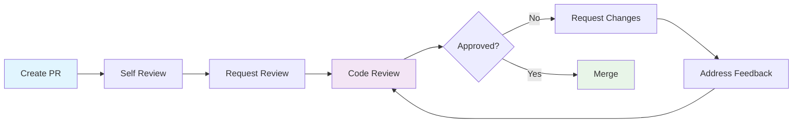

# 📝 Code Review Guide

## Overview
Comprehensive guide for conducting effective code reviews that maintain code quality, share knowledge, and ensure consistency across the Ruwād Platform.

## Code Review Philosophy

### Core Principles
1. **Constructive Feedback**: Focus on code improvement, not criticism
2. **Knowledge Sharing**: Use reviews as learning opportunities
3. **Quality Assurance**: Maintain high standards consistently
4. **Collaboration**: Foster team communication and alignment
5. **Efficiency**: Balance thoroughness with development velocity

### Review Goals
- **Functionality**: Code works as intended
- **Quality**: Follows best practices and standards
- **Maintainability**: Code is readable and well-structured
- **Performance**: Optimized for efficiency
- **Security**: No vulnerabilities introduced
- **Testing**: Adequate test coverage

## Review Process

### Pre-Review Checklist (Author)

#### Before Submitting
- [ ] All tests pass locally
- [ ] Code builds successfully
- [ ] TypeScript compilation succeeds
- [ ] ESLint rules pass
- [ ] Self-review completed
- [ ] Description includes context and changes
- [ ] Related documentation updated

```bash
# Pre-review validation script
npm run type-check
npm run lint
npm run test
npm run build
```

#### Pull Request Template
```markdown
## Description
Brief description of changes and motivation.

## Type of Change
- [ ] Bug fix (non-breaking change)
- [ ] New feature (non-breaking change)
- [ ] Breaking change (fix or feature causing existing functionality to change)
- [ ] Documentation update

## How Has This Been Tested?
- [ ] Unit tests
- [ ] Integration tests
- [ ] Manual testing
- [ ] Accessibility testing

## Checklist
- [ ] My code follows the project's coding standards
- [ ] I have performed a self-review of my code
- [ ] I have commented my code where necessary
- [ ] I have made corresponding changes to documentation
- [ ] My changes generate no new warnings
- [ ] I have added tests that prove my fix is effective or feature works
- [ ] New and existing unit tests pass locally

## Screenshots (if applicable)
Before/after screenshots for UI changes.

## Related Issues
Fixes #123
```

### Review Workflow



## Review Guidelines

### What to Look For

#### 1. Code Functionality
```typescript
// ❌ Problematic: No error handling
const fetchUserData = async (userId: string) => {
  const response = await fetch(`/api/users/${userId}`);
  const data = await response.json();
  return data;
};

// ✅ Better: Proper error handling
const fetchUserData = async (userId: string): Promise<User> => {
  try {
    const response = await fetch(`/api/users/${userId}`);
    
    if (!response.ok) {
      throw new Error(`Failed to fetch user: ${response.statusText}`);
    }
    
    const data = await response.json();
    return data;
  } catch (error) {
    console.error('Error fetching user data:', error);
    throw error;
  }
};
```

#### 2. TypeScript Usage
```typescript
// ❌ Problematic: Weak typing
const processUserData = (data: any) => {
  return data.users.map((user: any) => ({
    id: user.id,
    name: user.name
  }));
};

// ✅ Better: Strong typing
interface User {
  id: string;
  name: string;
  email: string;
}

interface UserResponse {
  users: User[];
  total: number;
}

const processUserData = (data: UserResponse): Pick<User, 'id' | 'name'>[] => {
  return data.users.map(user => ({
    id: user.id,
    name: user.name
  }));
};
```

#### 3. React Best Practices
```typescript
// ❌ Problematic: Missing dependencies, no cleanup
const UserProfile = ({ userId }: { userId: string }) => {
  const [user, setUser] = useState(null);
  
  useEffect(() => {
    fetchUser(userId).then(setUser);
  }, []); // Missing userId dependency
  
  return <div>{user?.name}</div>;
};

// ✅ Better: Proper dependencies and cleanup
const UserProfile = ({ userId }: { userId: string }) => {
  const [user, setUser] = useState<User | null>(null);
  const [loading, setLoading] = useState(true);
  const [error, setError] = useState<Error | null>(null);
  
  useEffect(() => {
    let cancelled = false;
    
    const loadUser = async () => {
      try {
        setLoading(true);
        setError(null);
        const userData = await fetchUser(userId);
        
        if (!cancelled) {
          setUser(userData);
        }
      } catch (err) {
        if (!cancelled) {
          setError(err as Error);
        }
      } finally {
        if (!cancelled) {
          setLoading(false);
        }
      }
    };
    
    loadUser();
    
    return () => {
      cancelled = true;
    };
  }, [userId]);
  
  if (loading) return <LoadingSpinner />;
  if (error) return <ErrorMessage error={error} />;
  if (!user) return <div>User not found</div>;
  
  return <div>{user.name}</div>;
};
```

#### 4. Performance Considerations
```typescript
// ❌ Problematic: Expensive computation on every render
const ExpensiveComponent = ({ items }: { items: Item[] }) => {
  const expensiveValue = items.reduce((sum, item) => {
    return sum + complexCalculation(item);
  }, 0);
  
  return <div>{expensiveValue}</div>;
};

// ✅ Better: Memoized computation
const ExpensiveComponent = ({ items }: { items: Item[] }) => {
  const expensiveValue = useMemo(() => {
    return items.reduce((sum, item) => {
      return sum + complexCalculation(item);
    }, 0);
  }, [items]);
  
  return <div>{expensiveValue}</div>;
};
```

#### 5. Security Concerns
```typescript
// ❌ Problematic: XSS vulnerability
const UserMessage = ({ message }: { message: string }) => {
  return <div dangerouslySetInnerHTML={{ __html: message }} />;
};

// ✅ Better: Safe content rendering
import DOMPurify from 'dompurify';

const UserMessage = ({ message }: { message: string }) => {
  const sanitizedMessage = DOMPurify.sanitize(message);
  return <div dangerouslySetInnerHTML={{ __html: sanitizedMessage }} />;
};
```

### Review Comments Guidelines

#### Constructive Feedback Examples

```typescript
// Instead of: "This is wrong"
// Write: "Consider using useMemo here to optimize performance when items array is large"

// Instead of: "Bad naming"
// Write: "Could we use a more descriptive name? Maybe 'handleUserSelection' instead of 'handle'?"

// Instead of: "This won't work"
// Write: "This might cause an infinite loop. Consider adding dependencies to the useEffect array"
```

#### Comment Categories
Use prefixes to categorize comments:

- **💡 Suggestion**: Optional improvements
- **❓ Question**: Need clarification
- **🔧 Fix**: Required changes
- **🎨 Style**: Code formatting/style
- **⚡ Performance**: Performance improvements
- **🔒 Security**: Security concerns
- **📚 Documentation**: Missing or unclear docs

### Approval Criteria

#### ✅ Ready to Approve
- [ ] Code functionality is correct
- [ ] All tests pass
- [ ] TypeScript types are proper
- [ ] Performance is acceptable
- [ ] Security considerations addressed
- [ ] Code is readable and maintainable
- [ ] Documentation is updated
- [ ] Follows project conventions

#### ❌ Needs Changes
- [ ] Functionality issues
- [ ] Test failures
- [ ] TypeScript errors
- [ ] Performance problems
- [ ] Security vulnerabilities
- [ ] Poor readability
- [ ] Missing documentation
- [ ] Style violations

## Reviewer Responsibilities

### Primary Reviewer
- **Thorough Review**: Check all aspects of the code
- **Testing**: Verify tests are adequate and passing
- **Architecture**: Ensure changes align with project architecture
- **Documentation**: Verify documentation is updated
- **Mentoring**: Provide educational feedback

### Secondary Reviewer
- **Fresh Perspective**: Look for issues primary reviewer might miss
- **Domain Expertise**: Focus on specific domain knowledge
- **User Experience**: Consider UX implications
- **Alternative Approaches**: Suggest different implementations

## Review Best Practices

### For Reviewers

#### Do's
- **Be Respectful**: Focus on code, not the person
- **Be Specific**: Provide clear, actionable feedback
- **Ask Questions**: Seek to understand the reasoning
- **Praise Good Work**: Acknowledge well-written code
- **Test Locally**: Check out and test complex changes
- **Consider Context**: Understand the bigger picture

#### Don'ts
- **Don't Nitpick**: Focus on significant issues
- **Don't Assume**: Ask for clarification when unsure
- **Don't Block**: Distinguish between blockers and suggestions
- **Don't Rewrite**: Suggest improvements, don't rewrite code
- **Don't Rush**: Take time for thorough review

### For Authors

#### Do's
- **Provide Context**: Explain the reasoning behind changes
- **Keep It Small**: Submit focused, manageable PRs
- **Self-Review**: Review your own code first
- **Respond Promptly**: Address feedback quickly
- **Ask Questions**: Clarify reviewer feedback
- **Learn**: Use feedback as learning opportunities

#### Don'ts
- **Don't Take It Personally**: Feedback is about code quality
- **Don't Ignore Feedback**: Address all reviewer comments
- **Don't Submit Too Early**: Ensure code is ready for review
- **Don't Mix Concerns**: Keep PRs focused on single changes

## Review Tools and Automation

### Automated Checks
```yaml
# GitHub Actions workflow
name: Code Review Checks
on: [pull_request]

jobs:
  quality:
    runs-on: ubuntu-latest
    steps:
      - uses: actions/checkout@v3
      - uses: actions/setup-node@v3
        with:
          node-version: '18'
      
      - name: Install dependencies
        run: npm ci
      
      - name: Type check
        run: npm run type-check
      
      - name: Lint
        run: npm run lint
      
      - name: Test
        run: npm run test:coverage
      
      - name: Build
        run: npm run build
```

### Review Templates
```markdown
## Review Checklist
- [ ] Functionality works as expected
- [ ] Code follows project standards
- [ ] Tests are comprehensive
- [ ] Performance is acceptable
- [ ] Security considerations addressed
- [ ] Documentation is updated
- [ ] Accessibility requirements met

## Feedback Summary
- **Strengths**: What was done well
- **Improvements**: Specific suggestions
- **Questions**: Areas needing clarification
- **Action Items**: Required changes
```

## Metrics and Improvement

### Review Metrics
- **Review Time**: Time from PR creation to approval
- **Feedback Quality**: Constructiveness of comments
- **Defect Escape Rate**: Issues found post-merge
- **Knowledge Transfer**: Learning opportunities created

### Continuous Improvement
```typescript
// Regular review retrospectives
interface ReviewMetrics {
  averageReviewTime: number;
  feedbackQuality: number;
  defectEscapeRate: number;
  teamSatisfaction: number;
}

const trackReviewMetrics = (metrics: ReviewMetrics) => {
  // Track and analyze review effectiveness
  return {
    ...metrics,
    trends: analyzeMetricsTrends(metrics),
    recommendations: generateImprovementSuggestions(metrics)
  };
};
```

## Common Review Scenarios

### New Feature Review
- Verify feature requirements are met
- Check integration with existing systems
- Validate user experience
- Ensure proper error handling
- Review test coverage

### Bug Fix Review
- Understand root cause
- Verify fix addresses the issue
- Check for regression risks
- Ensure proper testing
- Review impact on related features

### Refactoring Review
- Verify functionality is preserved
- Check performance implications
- Ensure backward compatibility
- Review test updates
- Validate improvement claims

---

**Review Goals**: Quality, Knowledge Sharing, Collaboration  
**Average Review Time**: <24 hours  
**Approval Criteria**: Functionality, Quality, Performance, Security