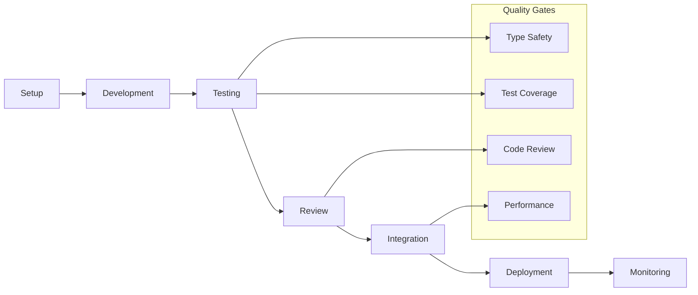

# 🛠️ Ruwād Platform Development Guide

## Overview
Comprehensive development guides for building, maintaining, and extending the Ruwād Innovation Platform.

## Development Documentation Structure

### 🚀 Getting Started
- [`01-SETUP-GUIDE.md`](./01-SETUP-GUIDE.md) - Environment setup and installation
- [`02-DEVELOPMENT-WORKFLOW.md`](./02-DEVELOPMENT-WORKFLOW.md) - Daily development practices
- [`03-PROJECT-STANDARDS.md`](./03-PROJECT-STANDARDS.md) - Coding standards and conventions

### 🏗️ Architecture & Patterns
- [`04-COMPONENT-DEVELOPMENT.md`](./04-COMPONENT-DEVELOPMENT.md) - Component creation guidelines
- [`05-HOOK-DEVELOPMENT.md`](./05-HOOK-DEVELOPMENT.md) - Custom hook development
- [`06-STATE-MANAGEMENT.md`](./06-STATE-MANAGEMENT.md) - State management patterns

### 🧪 Testing & Quality
- [`07-TESTING-GUIDE.md`](./07-TESTING-GUIDE.md) - Testing strategies and practices
- [`08-CODE-REVIEW.md`](./08-CODE-REVIEW.md) - Code review process
- [`09-DEBUGGING.md`](./09-DEBUGGING.md) - Debugging techniques and tools

### 🎨 UI/UX Development
- [`10-DESIGN-SYSTEM.md`](./10-DESIGN-SYSTEM.md) - Design system implementation
- [`11-RESPONSIVE-DESIGN.md`](./11-RESPONSIVE-DESIGN.md) - Mobile-first development
- [`12-ACCESSIBILITY.md`](./12-ACCESSIBILITY.md) - Accessibility guidelines

### 🔌 Integration & API
- [`13-SUPABASE-INTEGRATION.md`](./13-SUPABASE-INTEGRATION.md) - Backend integration patterns
- [`14-API-DEVELOPMENT.md`](./14-API-DEVELOPMENT.md) - API design and implementation
- [`15-REAL-TIME-FEATURES.md`](./15-REAL-TIME-FEATURES.md) - Real-time development

### 🚀 Deployment & Operations
- [`16-BUILD-OPTIMIZATION.md`](./16-BUILD-OPTIMIZATION.md) - Build and performance optimization
- [`17-DEPLOYMENT.md`](./17-DEPLOYMENT.md) - Deployment strategies
- [`18-MONITORING.md`](./18-MONITORING.md) - Production monitoring

### 🔧 Tools & Utilities
- [`19-DEVELOPMENT-TOOLS.md`](./19-DEVELOPMENT-TOOLS.md) - Development toolchain
- [`20-TROUBLESHOOTING.md`](./20-TROUBLESHOOTING.md) - Common issues and solutions
- [`21-PERFORMANCE.md`](./21-PERFORMANCE.md) - Performance optimization

## 🎯 Development Principles

### 1. **Hook-First Architecture**
- All components use custom hooks for data management
- Unified error handling and loading states
- Consistent patterns across the codebase

### 2. **Type Safety First**
- Complete TypeScript coverage
- Strict type checking enabled
- Interface-driven development

### 3. **Testing Excellence**
- Unit, integration, and accessibility testing
- Test-driven development practices
- Comprehensive coverage requirements

### 4. **Performance Optimization**
- Code splitting and lazy loading
- Efficient state management
- Optimized bundle sizes

### 5. **Developer Experience**
- Clear documentation and examples
- Consistent coding standards
- Automated quality checks

## 📊 Development Metrics

### Code Quality
- **TypeScript Coverage**: 100%
- **Test Coverage**: >80%
- **ESLint Compliance**: 100%
- **Build Success Rate**: 100%

### Development Efficiency
- **Component Reusability**: 90%+
- **Hook Standardization**: 100%
- **Error Handling**: Unified
- **Documentation**: Complete

## 🚀 Quick Start

1. **Environment Setup**: Follow [`01-SETUP-GUIDE.md`](./01-SETUP-GUIDE.md)
2. **Development Workflow**: Review [`02-DEVELOPMENT-WORKFLOW.md`](./02-DEVELOPMENT-WORKFLOW.md)
3. **Component Creation**: Study [`04-COMPONENT-DEVELOPMENT.md`](./04-COMPONENT-DEVELOPMENT.md)
4. **Testing Practices**: Implement [`07-TESTING-GUIDE.md`](./07-TESTING-GUIDE.md)

## 🔄 Development Lifecycle

## 🎭 Development Roles

### Frontend Developer
- Component development and testing
- UI/UX implementation
- Performance optimization

### Backend Developer
- Supabase integration
- API development
- Database design

### Full-Stack Developer
- End-to-end feature development
- System integration
- Architecture decisions

### DevOps Engineer
- Build optimization
- Deployment automation
- Monitoring setup

## 📚 Learning Resources

### Internal Documentation
- Architecture guides in `/docs/Architecture/`
- API documentation in `/docs/API/`
- UI components in `/docs/UI-Components/`

### External Resources
- React documentation and best practices
- TypeScript advanced patterns
- Supabase development guides

## 🤝 Contributing

1. Follow the coding standards in [`03-PROJECT-STANDARDS.md`](./03-PROJECT-STANDARDS.md)
2. Write comprehensive tests
3. Update documentation
4. Follow the code review process

---

**Last Updated**: January 17, 2025  
**Development Guide Version**: 1.0  
**Platform Status**: Production Ready