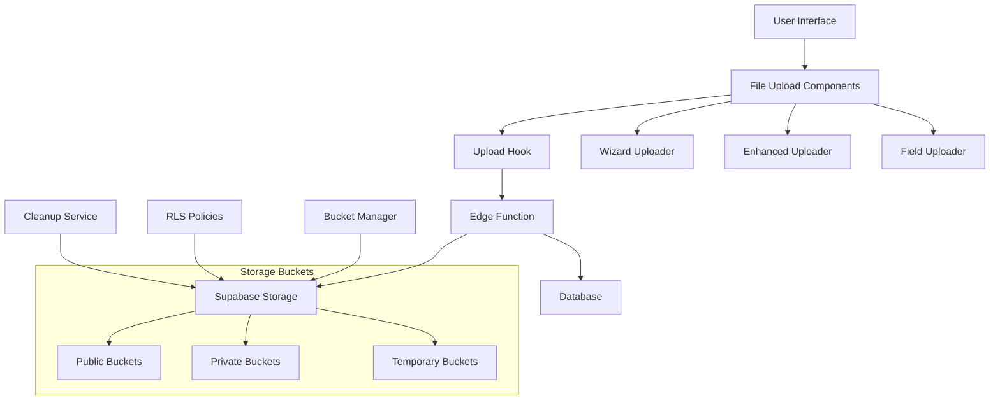

# File Uploader System Documentation

## Table of Contents
1. [Overview](#overview)
2. [Architecture](#architecture)
3. [Storage Buckets](#storage-buckets)
4. [Components](#components)
5. [Usage Guide](#usage-guide)
6. [Security & Permissions](#security--permissions)
7. [Configuration](#configuration)
8. [Best Practices](#best-practices)
9. [Troubleshooting](#troubleshooting)
10. [API Reference](#api-reference)

## Overview

The File Uploader System is a comprehensive solution for handling file uploads across the innovation platform. It provides secure, scalable, and user-friendly file management with support for:

- **Multiple upload types**: Images, documents, videos, audio files
- **Temporary uploads**: For wizard flows and multi-step forms
- **Automatic bucket management**: Dynamic bucket creation and organization
- **Security**: Row-Level Security (RLS) policies and role-based access
- **Validation**: File type, size, and custom validation
- **Progress tracking**: Real-time upload progress and status
- **Preview capabilities**: Built-in file preview and download

## Architecture

### System Components



### File Flow

1. **Upload Initiation**: User selects files through UI components
2. **Validation**: Client-side validation (type, size, count)
3. **Temporary Storage**: Files uploaded to temporary bucket
4. **Processing**: Edge function handles secure upload
5. **Bucket Assignment**: Files moved to appropriate bucket
6. **Database Update**: File metadata stored in database
7. **Cleanup**: Temporary files automatically cleaned up

## Storage Buckets

### Bucket Structure

The system uses a comprehensive bucket structure organized by entity type, file type, and access level:

```
{entity-type}-{file-type}-{access-level}
```

### Public Buckets (Publicly Accessible)

| Bucket Name | Purpose | File Types | Max Size | Access |
|-------------|---------|------------|----------|---------|
| `user-avatars-public` | User profile avatars | Images | 2MB | Owner can upload, Everyone can view |
| `ideas-images-public` | Idea showcase images | Images | 5MB | Authenticated users can upload |
| `challenges-images-public` | Challenge banners | Images | 5MB | Team members can upload |
| `opportunities-images-public` | Opportunity images | Images | 5MB | Team members can upload |
| `campaigns-images-public` | Campaign materials | Images | 10MB | Team members can upload |
| `campaigns-materials-public` | Campaign resources | PDF, Images, Videos | 100MB | Team members can upload |
| `events-images-public` | Event photos | Images | 10MB | Team members can upload |
| `events-resources-public` | Event materials | PDF, Images, Videos, PPT | 200MB | Team members can upload |
| `departments-logos-public` | Department branding | Images, SVG | 3MB | Admins only |
| `sectors-images-public` | Sector icons | Images, SVG | 5MB | Admins only |
| `deputies-images-public` | Deputy photos | Images | 5MB | Admins only |
| `partners-logos-public` | Partner logos | Images, SVG | 3MB | Team members can upload |
| `system-assets-public` | System assets | Images, Videos | 50MB | Admins only |

### Private Buckets (Restricted Access)

| Bucket Name | Purpose | File Types | Max Size | Access |
|-------------|---------|------------|----------|---------|
| `user-documents-private` | User certifications | PDF, DOC | 10MB | Owner only |
| `ideas-documents-private` | Idea business plans | PDF, DOC, TXT | 20MB | Owner + Team members |
| `ideas-attachments-private` | Idea prototypes | All types | 50MB | Owner + Team members |
| `challenges-documents-private` | Challenge briefs | PDF, DOC | 20MB | Team members only |
| `challenges-attachments-private` | Challenge resources | All types | 100MB | Team members only |
| `opportunities-attachments-private` | Application materials | PDF, DOC | 20MB | Team members only |
| `opportunities-documents-private` | Terms & contracts | PDF, DOC | 50MB | Team members only |
| `campaigns-documents-private` | Campaign strategy | PDF, DOC | 50MB | Team members only |
| `events-recordings-private` | Event recordings | Video, Audio | 500MB | Participants + Team |
| `departments-documents-private` | Internal documents | PDF, DOC | 50MB | Admins only |
| `sectors-documents-private` | Sector strategies | PDF, DOC | 100MB | Admins only |
| `partners-documents-private` | Partnership docs | PDF, DOC | 50MB | Team members only |
| `partners-contracts-private` | Legal contracts | PDF, DOC | 20MB | Admins only |
| `evaluation-documents-private` | Evaluation reports | PDF, DOC, XLS | 50MB | Team members only |
| `evaluation-templates-private` | Evaluation templates | PDF, DOC | 10MB | Team members only |
| `feedback-attachments-private` | Feedback materials | PDF, Images, Videos | 25MB | Owner + Team |
| `submissions-files-private` | Submission portfolios | All types | 100MB | Owner + Team |
| `temp-uploads-private` | Temporary files | All types | 200MB | Owner only (7-day cleanup) |
| `notifications-attachments-private` | Notification files | PDF, Images | 10MB | Recipient + Admins |

## Components

### 1. FileUploader (Base Component)

The foundational upload component with drag-and-drop support.

```tsx
import { FileUploader } from '@/components/ui/file-uploader'

<FileUploader
  config={UPLOAD_CONFIGS.USER_AVATARS}
  onUploadComplete={(files) => console.log('Uploaded:', files)}
  showPreview={true}
  multiple={false}
/>
```

### 2. FileUploadField (Form Integration)

Form-integrated uploader with validation and labels.

```tsx
import { FileUploadField } from '@/components/ui/file-upload-field'

<FileUploadField
  config={UPLOAD_CONFIGS.OPPORTUNITY_IMAGES}
  label="Opportunity Image"
  description="Upload a banner image for your opportunity"
  required={true}
  onValueChange={(files) => setValue('image', files)}
  error={errors.image?.message}
/>
```

### 3. WizardFileUploader (Temporary Uploads)

For multi-step forms with temporary upload handling.

```tsx
import { WizardFileUploader } from '@/components/ui/wizard-file-uploader'

const uploaderRef = useRef<WizardFileUploaderRef>(null)

<WizardFileUploader
  ref={uploaderRef}
  config={createWizardUploadConfig(UPLOAD_CONFIGS.IDEA_DOCUMENTS)}
  label="Supporting Documents"
  onFilesChange={(files) => setTempFiles(files)}
/>

// On form submit:
const finalFiles = await uploaderRef.current?.commitFiles(entityId)
```

### 4. EnhancedFileUploader (Advanced Features)

Feature-rich uploader with progress tracking and advanced validation.

```tsx
import { EnhancedFileUploader } from '@/components/ui/enhanced-file-uploader'

<EnhancedFileUploader
  config={UPLOAD_CONFIGS.EVENT_RESOURCES}
  label="Event Resources"
  showPreview={true}
  showMetadata={true}
  customValidation={(file) => ({
    valid: file.name.length <= 100,
    error: 'Filename too long'
  })}
  onUploadProgress={(progress) => setProgress(progress)}
  onValueChange={(files) => setUploadedFiles(files)}
/>
```

## Usage Guide

### Basic File Upload

```tsx
import { FileUploadField } from '@/components/ui/file-upload-field'
import { UPLOAD_CONFIGS } from '@/utils/fileUploadConfigs'

function BasicUploadExample() {
  const [files, setFiles] = useState<UploadedFile[]>([])

  return (
    <FileUploadField
      config={UPLOAD_CONFIGS.USER_AVATARS}
      label="Profile Picture"
      description="Upload your profile picture (max 2MB)"
      onValueChange={setFiles}
      showPreview={true}
    />
  )
}
```

### Wizard Flow with Temporary Upload

```tsx
import { WizardFileUploader, WizardFileUploaderRef } from '@/components/ui/wizard-file-uploader'
import { createWizardUploadConfig } from '@/utils/fileUploadConfigs'

function WizardExample() {
  const uploaderRef = useRef<WizardFileUploaderRef>(null)
  const [tempFiles, setTempFiles] = useState<UploadedFile[]>([])

  const handleSubmit = async (data: FormData) => {
    try {
      // Create the entity first
      const { data: entity } = await supabase
        .from('opportunities')
        .insert(data)
        .select()
        .single()

      // Commit temporary files to final location
      const finalFiles = await uploaderRef.current?.commitFiles({
        ...UPLOAD_CONFIGS.OPPORTUNITY_IMAGES,
        entityId: entity.id,
        tableName: 'opportunities',
        columnName: 'image_url'
      })

      console.log('Final files:', finalFiles)
    } catch (error) {
      console.error('Submit error:', error)
    }
  }

  return (
    <form onSubmit={handleSubmit}>
      <WizardFileUploader
        ref={uploaderRef}
        config={createWizardUploadConfig(
          UPLOAD_CONFIGS.OPPORTUNITY_IMAGES,
          'opportunities',
          'image_url'
        )}
        label="Opportunity Image"
        onFilesChange={setTempFiles}
      />
      
      <button type="submit">Create Opportunity</button>
    </form>
  )
}
```

### Custom Validation

```tsx
import { EnhancedFileUploader } from '@/components/ui/enhanced-file-uploader'

function CustomValidationExample() {
  const customValidation = (file: File) => {
    // Check if image dimensions are appropriate
    if (file.type.startsWith('image/')) {
      return new Promise((resolve) => {
        const img = new Image()
        img.onload = () => {
          const valid = img.width >= 1200 && img.height >= 600
          resolve({
            valid,
            error: valid ? undefined : 'Image must be at least 1200x600 pixels'
          })
        }
        img.src = URL.createObjectURL(file)
      })
    }
    
    return { valid: true }
  }

  return (
    <EnhancedFileUploader
      config={UPLOAD_CONFIGS.CAMPAIGN_IMAGES}
      customValidation={customValidation}
      onFileValidationError={(file, error) => {
        console.error(`Validation failed for ${file.name}:`, error)
      }}
    />
  )
}
```

### Programmatic File Management

```tsx
import { useFileUploader } from '@/hooks/useFileUploader'

function ProgrammaticExample() {
  const { uploadFiles, commitTemporaryFiles, cleanupTemporaryFiles } = useFileUploader()
  
  const handleFileUpload = async (files: File[]) => {
    // Upload to temporary storage
    const result = await uploadFiles(files, {
      ...UPLOAD_CONFIGS.IDEA_DOCUMENTS,
      isTemporary: true,
      tempSessionId: 'session-123'
    })
    
    if (result.success) {
      // Later, commit to final location
      const committed = await commitTemporaryFiles(result.files!, {
        ...UPLOAD_CONFIGS.IDEA_DOCUMENTS,
        entityId: 'idea-456',
        tableName: 'ideas',
        columnName: 'document_urls'
      })
      
      console.log('Committed files:', committed.files)
    }
  }
  
  // Cleanup if needed
  const cleanup = () => {
    cleanupTemporaryFiles('session-123')
  }
  
  return (
    <div>
      <input
        type="file"
        multiple
        onChange={(e) => {
          const files = Array.from(e.target.files || [])
          handleFileUpload(files)
        }}
      />
      <button onClick={cleanup}>Cleanup Temp Files</button>
    </div>
  )
}
```

## Security & Permissions

### Row-Level Security (RLS) Policies

The system implements comprehensive RLS policies to ensure secure access:

#### Public Bucket Policies
- **SELECT**: Everyone can view public files
- **INSERT/UPDATE/DELETE**: Role-based restrictions (team members, admins)

#### Private Bucket Policies
- **User documents**: Owner only
- **Ideas**: Owner + team members + admins
- **Team resources**: Team members + admins only
- **Admin resources**: Admins only
- **Event recordings**: Participants + team members + admins

#### Special Access Rules
- **Event recordings**: Only participants of the specific event can access
- **Temporary files**: Only the owner can access, automatic 7-day cleanup
- **Notifications**: Only recipient and admins can access

### Permission Levels

1. **Owner**: Can manage their own files
2. **Team Member**: Can manage team-related resources
3. **Admin**: Can manage all system resources
4. **Participant**: Can access event-specific resources
5. **Public**: Can view public resources only

## Configuration

### Upload Configurations

All upload configurations are centralized in `src/utils/fileUploadConfigs.ts`:

```typescript
export const UPLOAD_CONFIGS = {
  USER_AVATARS: {
    uploadType: 'user-avatars',
    maxFiles: 1,
    maxSizeBytes: 2 * 1024 * 1024, // 2MB
    allowedTypes: ['image/jpeg', 'image/png', 'image/webp'],
    acceptString: 'image/jpeg,image/png,image/webp'
  },
  // ... more configurations
}
```

### Creating Custom Configurations

```typescript
// For immediate uploads
const customConfig = createUploadConfig(
  UPLOAD_CONFIGS.CHALLENGE_DOCUMENTS,
  'challenge-123',
  'challenges',
  'document_urls'
)

// For wizard flows
const wizardConfig = createWizardUploadConfig(
  UPLOAD_CONFIGS.OPPORTUNITY_IMAGES,
  'opportunities',
  'image_url'
)

// For temporary uploads only
const tempConfig = createTemporaryUploadConfig(
  UPLOAD_CONFIGS.IDEA_ATTACHMENTS,
  'temp-session-456'
)
```

### Environment Variables

The system uses these Supabase environment variables:
- `SUPABASE_URL`: Your Supabase project URL
- `SUPABASE_ANON_KEY`: Public anon key
- `SUPABASE_SERVICE_ROLE_KEY`: Service role key (edge functions only)

## Best Practices

### 1. Use Appropriate Upload Types

```tsx
// ✅ Good: Use specific upload type for the context
<FileUploadField config={UPLOAD_CONFIGS.USER_AVATARS} />

// ❌ Bad: Generic configuration
<FileUploadField config={{uploadType: 'generic'}} />
```

### 2. Implement Proper Validation

```tsx
// ✅ Good: Client and server-side validation
const customValidation = (file: File) => ({
  valid: file.size <= 5 * 1024 * 1024,
  error: 'File too large'
})

// ❌ Bad: No validation
<FileUploader config={config} />
```

### 3. Handle Temporary Files in Wizards

```tsx
// ✅ Good: Use WizardFileUploader for multi-step forms
const uploaderRef = useRef<WizardFileUploaderRef>(null)
const finalFiles = await uploaderRef.current?.commitFiles(entityId)

// ❌ Bad: Immediate upload in wizards
<FileUploader config={immediateConfig} />
```

### 4. Provide User Feedback

```tsx
// ✅ Good: Show upload progress and status
<EnhancedFileUploader
  onUploadProgress={(progress) => setProgress(progress)}
  onUploadComplete={(files) => {
    toast({ title: 'Upload successful!' })
  }}
/>

// ❌ Bad: No feedback to user
<FileUploader config={config} />
```

### 5. Clean Up Resources

```tsx
// ✅ Good: Cleanup on component unmount
useEffect(() => {
  return () => {
    uploaderRef.current?.clearFiles()
  }
}, [])

// ❌ Bad: No cleanup
```

### 6. Use Semantic File Naming

```tsx
// ✅ Good: Descriptive labels and descriptions
<FileUploadField
  label="Business Plan Document"
  description="Upload your detailed business plan (PDF only, max 10MB)"
  config={UPLOAD_CONFIGS.IDEA_DOCUMENTS}
/>

// ❌ Bad: Generic labels
<FileUploadField label="File" config={config} />
```

## Troubleshooting

### Common Issues

#### 1. "Bucket not found" Error
**Cause**: Bucket doesn't exist or incorrect bucket name
**Solution**: Ensure bucket is created in Supabase or check configuration

```typescript
// Check if bucket exists
const { data: bucket } = await supabase.storage.getBucket('bucket-name')
```

#### 2. "Access denied" Error
**Cause**: User doesn't have permission for the bucket
**Solution**: Check RLS policies and user roles

```typescript
// Verify user role
const hasPermission = await supabase.rpc('has_role', {
  _user_id: user.id,
  _role: 'admin'
})
```

#### 3. File Upload Fails Silently
**Cause**: Client-side validation or network issues
**Solution**: Check browser console and network tab

```typescript
// Enable debug logging
const { uploadFiles } = useFileUploader()
try {
  await uploadFiles(files, config)
} catch (error) {
  console.error('Upload failed:', error)
}
```

#### 4. Temporary Files Not Cleaned Up
**Cause**: Cleanup function not called or user doesn't have permissions
**Solution**: Implement proper cleanup and check permissions

```typescript
// Manual cleanup
await supabase.functions.invoke('cleanup-temp-files', {
  body: { tempSessionId: 'session-id' }
})
```

#### 5. File Size/Type Validation Issues
**Cause**: Mismatched client and server validation
**Solution**: Ensure consistent validation rules

```typescript
// Check file validation
const validation = validateFileForBucket('bucket-name', file)
if (!validation.valid) {
  console.error('Validation failed:', validation.error)
}
```

### Debug Mode

Enable debug mode for detailed logging:

```typescript
// Add to your component
const DEBUG = process.env.NODE_ENV === 'development'

if (DEBUG) {
  console.log('Upload config:', config)
  console.log('Selected files:', files)
  console.log('Validation result:', validation)
}
```

### Performance Optimization

1. **Lazy load components** for better initial page load
2. **Implement file chunking** for large files
3. **Use image compression** for image uploads
4. **Implement retry logic** for failed uploads
5. **Cache upload configurations** to avoid repeated API calls

## API Reference

### Components

#### FileUploader
Basic file upload component with drag-and-drop support.

**Props:**
- `config: FileUploadConfig` - Upload configuration
- `onUploadComplete?: (files: UploadedFile[]) => void` - Upload completion callback
- `showPreview?: boolean` - Show file preview (default: true)
- `multiple?: boolean` - Allow multiple files (default: false)
- `disabled?: boolean` - Disable the uploader (default: false)

#### FileUploadField
Form-integrated file uploader with validation and labels.

**Props:** (extends FileUploader)
- `label?: string` - Field label
- `description?: string` - Help text
- `required?: boolean` - Required field indicator
- `error?: string` - Error message
- `value?: UploadedFile[]` - Controlled value
- `onValueChange?: (files: UploadedFile[]) => void` - Value change callback

#### WizardFileUploader
Temporary upload handler for multi-step forms.

**Props:** (extends FileUploadField)
- `config: Omit<FileUploadConfig, 'isTemporary' | 'tempSessionId'>` - Base config

**Ref Methods:**
- `commitFiles(entityId: string): Promise<UploadedFile[]>` - Commit temp files
- `clearFiles(): void` - Clear all files
- `getFiles(): UploadedFile[]` - Get current files

#### EnhancedFileUploader
Advanced uploader with progress tracking and custom validation.

**Props:** (extends FileUploadField)
- `onUploadProgress?: (progress: number) => void` - Progress callback
- `showMetadata?: boolean` - Show file metadata
- `customValidation?: (file: File) => ValidationResult` - Custom validation
- `onFileValidationError?: (file: File, error: string) => void` - Validation error callback

### Hooks

#### useFileUploader
Core hook for file upload operations.

**Returns:**
- `uploadFiles(files: File[], config: FileUploadConfig): Promise<FileUploadResult>`
- `commitTemporaryFiles(files: UploadedFile[], config: FinalConfig): Promise<FileUploadResult>`
- `cleanupTemporaryFiles(sessionId: string): Promise<void>`
- `getFileUrl(path: string): string`
- `isUploading: boolean`

### Types

```typescript
interface FileUploadConfig {
  uploadType: string
  maxFiles?: number
  maxSizeBytes?: number
  allowedTypes?: string[]
  acceptString?: string
  entityId?: string
  tableName?: string
  columnName?: string
  isTemporary?: boolean
  tempSessionId?: string
}

interface UploadedFile {
  url: string
  path: string
  name: string
  size: number
}

interface FileUploadResult {
  success: boolean
  files?: UploadedFile[]
  errors?: FileUploadError[]
}
```

### Edge Functions

#### secure-upload
Handles secure file uploads with validation and bucket management.

**Endpoint:** `POST /secure-upload`

**Form Data:**
- `files: File[]` - Files to upload
- `uploadType: string` - Upload type identifier
- `entityType?: string` - Entity type for organization
- `entityId?: string` - Entity ID for final storage
- `tableName?: string` - Database table to update
- `columnName?: string` - Database column to update
- `isTemporary?: boolean` - Temporary upload flag
- `tempSessionId?: string` - Temporary session ID
- `maxFiles?: number` - Maximum file count

**Response:**
```json
{
  "success": true,
  "files": [
    {
      "url": "https://...",
      "path": "/bucket/path/file.jpg",
      "name": "file.jpg",
      "size": 1024
    }
  ]
}
```

#### cleanup-temp-files
Cleans up temporary files for a session.

**Endpoint:** `POST /cleanup-temp-files`

**Body:**
```json
{
  "tempSessionId": "session-id",
  "buckets": ["bucket1", "bucket2"] // optional
}
```

**Response:**
```json
{
  "success": true,
  "cleanedFiles": 5,
  "message": "Cleaned 5 temporary files"
}
```

### Utilities

#### File Validation
```typescript
// Validate file against bucket configuration
const validation = validateFileForBucket(bucketName, file)

// Get appropriate bucket for upload type
const bucketName = getBucketForUploadType(uploadType)

// Generate structured file path
const path = generateFilePath(bucket, entityType, entityId, fileName, isTemp)
```

#### Configuration Helpers
```typescript
// Create upload configuration
const config = createUploadConfig(baseConfig, entityId, tableName, columnName)

// Create wizard configuration
const wizardConfig = createWizardUploadConfig(baseConfig, tableName, columnName)

// Create temporary configuration
const tempConfig = createTemporaryUploadConfig(baseConfig, sessionId)
```

---

This documentation covers the complete file uploader system. For additional support or feature requests, please refer to the project repository or contact the development team.