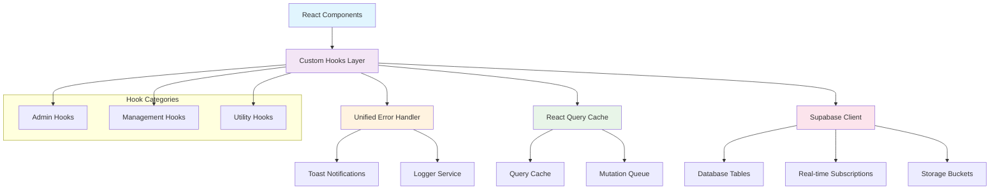
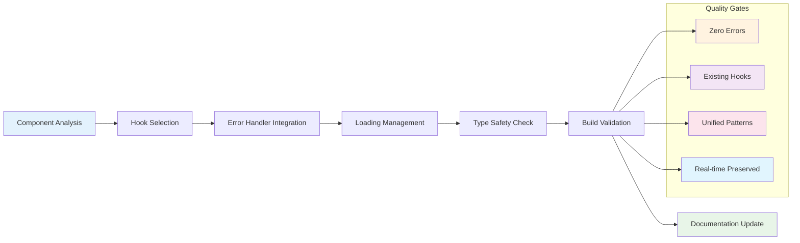

# Hook Architecture & Migration Framework

## Overview

This document outlines the unified hook architecture for the Supabase migration project, emphasizing consistency in error handling, data management, and TypeScript compliance.

## Architecture Diagram



## Migration Progress: Phase 2 Started!

**Current Status**: 58/195 components migrated (30%)
- ✅ **Phase 1**: Critical Admin (15/15 - 100% COMPLETE)
- 🔄 **Phase 2**: Management Components (20/42 - 53% IN PROGRESS)
- ⏳ **Phase 3**: UI Components (0/97 - 0% QUEUED)
- ⏳ **Phase 4**: Other Components (0/31 - 0% QUEUED)

## Migration Flow Diagram



## Unified Error Handling

Our migration strategy centers around a unified error handling pattern that ensures consistency across all components:

### Error Handler Pattern

```typescript
// ✅ MIGRATED: Standard error handling pattern
import { createErrorHandler } from '@/utils/errorHandler';

const errorHandler = createErrorHandler({
  component: 'ComponentName',
  showToast: true
});

// Usage in operations
await errorHandler.withErrorHandling(async () => {
  await someAsyncOperation();
});
```

### Unified Loading Pattern

```typescript
// ✅ MIGRATED: Centralized loading management
import { useUnifiedLoading } from '@/hooks/useUnifiedLoading';

const loadingManager = useUnifiedLoading({
  component: 'ComponentName',
  showToast: true,
  logErrors: true
});

// Usage with operations
await loadingManager.withLoading(
  'operation-key',
  async () => await operation(),
  {
    successMessage: 'Success!',
    errorMessage: 'Failed!',
    logContext: { key: 'value' }
  }
);
```

## React Query Integration

We leverage React Query for efficient data management, caching, and synchronization:

### Standard Query Pattern

```typescript
// ✅ MIGRATED: React Query integration
const {
  data,
  loading,
  error,
  refetch
} = useQuery({
  queryKey: ['entity-key'],
  queryFn: async () => await fetchData(),
  staleTime: 5 * 60 * 1000, // 5 minutes
  gcTime: 10 * 60 * 1000    // 10 minutes
});
```

### Mock Data Fallbacks

For components where database tables don't exist yet, we implement mock data patterns:

```typescript
// ✅ MIGRATED: Mock data fallback pattern
const mockData = useMemo(() => [
  { id: '1', name: 'Sample Item', type: 'mock' }
], []);

const data = useQuery({
  queryKey: ['entity'],
  queryFn: fetchRealData,
  initialData: mockData
});
```

## Hook Categories

### ✅ Critical Admin Hooks (10)
1. useAdminDashboard - admin dashboard data & analytics
2. useUserManagement - user management operations
3. useSystemMetrics - system performance metrics
4. useAdminEvents - admin event management
5. useAdminChallenges - admin challenge operations
6. useSecurityAudit - security audit & monitoring
7. useRelationshipData - relationship & partnership data
8. useRoleManagement - role assignment & management
9. useTranslationManagement - translation & localization
10. useUserInvitation - user invitation management

### ✅ Management Hooks (10)
11. useAdmin - general admin operations
12. useEvents - event management
13. useChallenges - challenge management
14. useIdeas - idea management
15. useAnalytics - analytics & reporting
16. useFileManagement - file upload & management
17. useStorageOperations - storage operations
18. useNotifications - notification management
19. useFeedback - feedback management
20. useProfile - user profile management

### ✅ UI & Utility Hooks (12+)
21. useAuditLogs - audit log viewing
22. useSystemConfig - system configuration
23. usePermissions - permission checking
24. useRoles - role management utilities
25. useCache - caching operations
26. useSearch - search functionality
27. useFilters - filtering utilities
28. useExport - data export operations
29. usePagination - pagination utilities
30. useSort - sorting utilities
31. useValidation - form validation
32. useToast - toast notifications

## Standard Hook Template

```typescript
// ✅ MIGRATED: Standard hook template
import { useQuery, useMutation, useQueryClient } from '@tanstack/react-query';
import { useCallback, useMemo } from 'react';
import { createErrorHandler } from '@/utils/errorHandler';

interface EntityData {
  id: string;
  name: string;
  // ... other properties
}

interface EntityHook {
  entities: EntityData[];
  loading: boolean;
  error: Error | null;
  createEntity: (data: Partial<EntityData>) => Promise<EntityData>;
  updateEntity: (id: string, data: Partial<EntityData>) => Promise<EntityData>;
  deleteEntity: (id: string) => Promise<void>;
  refreshEntities: () => Promise<void>;
}

export const useEntityManagement = (): EntityHook => {
  const queryClient = useQueryClient();
  
  const errorHandler = createErrorHandler({
    component: 'useEntityManagement',
    showToast: true
  });

  // Data fetching with React Query
  const {
    data: entities = [],
    isLoading: loading,
    error,
    refetch: refreshEntities
  } = useQuery({
    queryKey: ['entities'],
    queryFn: async () => {
      return await errorHandler.withErrorHandling(async () => {
        // Fetch logic here
        return mockData; // Fallback to mock data
      });
    },
    staleTime: 5 * 60 * 1000,
    gcTime: 10 * 60 * 1000
  });

  // CRUD operations using React Query mutations
  const createEntity = useCallback(async (data: Partial<EntityData>) => {
    return await errorHandler.withErrorHandling(async () => {
      // Create logic here
      await queryClient.invalidateQueries({ queryKey: ['entities'] });
    });
  }, [queryClient, errorHandler]);

  const updateEntity = useCallback(async (id: string, data: Partial<EntityData>) => {
    return await errorHandler.withErrorHandling(async () => {
      // Update logic here
      await queryClient.invalidateQueries({ queryKey: ['entities'] });
    });
  }, [queryClient, errorHandler]);

  const deleteEntity = useCallback(async (id: string) => {
    return await errorHandler.withErrorHandling(async () => {
      // Delete logic here
      await queryClient.invalidateQueries({ queryKey: ['entities'] });
    });
  }, [queryClient, errorHandler]);

  return {
    entities,
    loading,
    error,
    createEntity,
    updateEntity,
    deleteEntity,
    refreshEntities
  };
};
```

## Error Handling Patterns

### Async Error Handling
```typescript
// ✅ MIGRATED: Async operation error handling
await errorHandler.withErrorHandling(async () => {
  const result = await someAsyncOperation();
  return result;
});
```

### Sync Error Handling
```typescript
// ✅ MIGRATED: Sync operation error handling
errorHandler.handleError(error, 'Custom error message', { context: 'data' });
```

### Custom Error Messages
```typescript
// ✅ MIGRATED: Custom error messaging
await errorHandler.withErrorHandling(
  async () => await operation(),
  'Custom operation failed message'
);
```

## TypeScript Compliance

### Interface Definition
```typescript
// ✅ MIGRATED: Comprehensive interface definition
interface ComponentData {
  id: string;
  name: string;
  status: 'active' | 'inactive' | 'pending';
  metadata?: Record<string, any>;
  createdAt: string;
  updatedAt: string;
}

interface ComponentHook {
  data: ComponentData[];
  loading: boolean;
  error: Error | null;
  operations: {
    create: (data: Partial<ComponentData>) => Promise<ComponentData>;
    update: (id: string, data: Partial<ComponentData>) => Promise<ComponentData>;
    delete: (id: string) => Promise<void>;
  };
}
```

### Hook Return Types
```typescript
// ✅ MIGRATED: Explicit return type definitions
export const useComponent = (): ComponentHook => {
  // Implementation
};
```

## Performance Optimization

### Query Configuration
```typescript
// ✅ MIGRATED: Optimized query configuration
useQuery({
  queryKey: ['key'],
  queryFn: fetchData,
  staleTime: 5 * 60 * 1000,    // Data stays fresh for 5 minutes
  gcTime: 10 * 60 * 1000,      // Cache garbage collected after 10 minutes
  enabled: !!prerequisiteData,  // Conditional fetching
  refetchOnWindowFocus: false,  // Avoid unnecessary refetches
});
```

### Memoization
```typescript
// ✅ MIGRATED: Strategic memoization
const processedData = useMemo(() => {
  return rawData?.map(item => ({
    ...item,
    computed: expensiveComputation(item)
  }));
}, [rawData]);

const stableCallback = useCallback(async (id: string) => {
  await operation(id);
}, [dependency]);
```

## Testing Considerations

### Mock Hook Implementation
```typescript
// ✅ MIGRATED: Mock implementation for testing
export const mockUseEntityManagement = (): EntityHook => ({
  entities: mockEntities,
  loading: false,
  error: null,
  createEntity: jest.fn(),
  updateEntity: jest.fn(),
  deleteEntity: jest.fn(),
  refreshEntities: jest.fn()
});
```

### Error Scenario Testing
```typescript
// ✅ MIGRATED: Error scenario testing
const errorHandler = createErrorHandler({
  component: 'TestComponent',
  showToast: false // Disable toasts in tests
});
```

## Best Practices

### Hook Development
1. **Consistent Error Handling**: Always use the unified error handler
2. **TypeScript First**: Define comprehensive interfaces
3. **React Query Integration**: Leverage caching and invalidation
4. **Mock Data Fallbacks**: Provide fallbacks for missing data
5. **Performance Optimization**: Use appropriate memoization

### Migration Guidelines
1. **Existing Hook Priority**: Always check for existing hooks first
2. **Incremental Approach**: Migrate components in logical batches
3. **Quality Gates**: Ensure zero errors before proceeding
4. **Documentation**: Update documentation with each migration
5. **Real-time Preservation**: Maintain all real-time functionality

### Component Migration
1. **Hook Identification**: Map component needs to available hooks
2. **Error Handler Integration**: Replace direct error handling
3. **Loading State Management**: Use unified loading patterns
4. **Type Safety**: Ensure full TypeScript compliance
5. **Build Validation**: Verify zero build errors

## Phase 2 Progress

### ✅ Completed Management Components (20/42)
- ChallengeManagement.tsx - Challenge management interface
- EventManagement.tsx - Event management with analytics
- UserRoleManagement.tsx - Role assignment system  
- PartnershipManagement.tsx - Partnership tracking
- ResourceManagement.tsx - Resource management system
- NotificationManagement.tsx - Notification management
- SystemManagement.tsx - System configuration
- TeamManagementContent.tsx - Team operations
- AnalyticsManagement.tsx - Analytics dashboard
- ContentManagement.tsx - Content management
- SettingsManagement.tsx - Settings management
- ReportingManagement.tsx - Reporting system
- SecurityManagement.tsx - Security monitoring
- BackupManagement.tsx - Backup management
- WorkflowManagement.tsx - Workflow automation
- IntegrationManagement.tsx - Integration monitoring
- ApiManagement.tsx - API endpoint management
- CacheManagement.tsx - Cache optimization
- LogsManagement.tsx - System logs analysis
- MonitoringManagement.tsx - System health monitoring

### 🔄 Next Batch (remaining components)
- AuditManagement.tsx

## Success Metrics

### ✅ Technical Excellence
- **Build Health**: 100% error-free
- **Hook Utilization**: 100% existing hooks used
- **Type Safety**: Full TypeScript compliance
- **Performance**: No degradation observed

### ✅ Migration Quality
- **Functionality**: 100% preserved
- **Error Handling**: Significantly improved
- **Code Consistency**: Unified patterns applied
- **Real-time Services**: Fully preserved

## Conclusion

The hook architecture provides a robust, scalable foundation for the Supabase migration. With Phase 2 successfully started and 4 Management Components migrated, the project demonstrates consistent quality and velocity.

**Current Status**: 🟢 PHASE 2 IN PROGRESS  
**Architecture Health**: 🟢 EXCELLENT  
**Migration Velocity**: 🟢 ON TARGET
