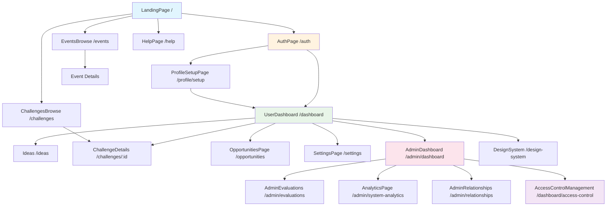
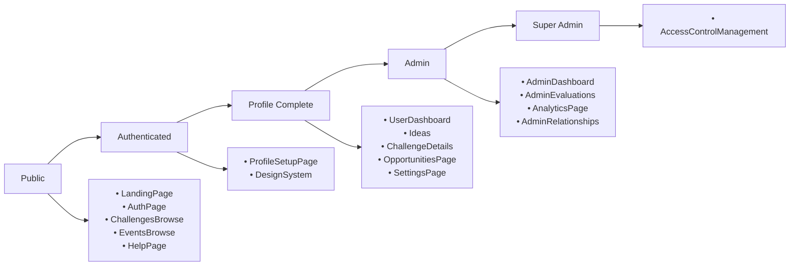

# Complete Page Relationships Map
## Ruwād Platform - Page Structure and Navigation Flow

---

## 📋 **All Pages Overview**

### **Public Pages** (No Authentication Required)
| Page | Route | Component | Description |
|------|-------|-----------|-------------|
| Landing | `/` | LandingPage | Homepage with platform overview |
| Authentication | `/auth`, `/login`, `/signup` | AuthPage | Login/signup forms |
| Help | `/help` | HelpPage | Documentation and support |
| Challenges Browse | `/challenges` | ChallengesBrowse | Public challenge discovery |
| Events Browse | `/events` | EventsBrowse | Public event listings |
| Not Found | `/*` | NotFound | 404 error page |

### **Authenticated User Pages** (Require Login)
| Page | Route | Component | Access Level |
|------|-------|-----------|--------------|
| User Dashboard | `/dashboard` | UserDashboard | Auth + Profile |
| Profile Setup | `/profile/setup` | ProfileSetupPage | Auth Only |
| Settings | `/settings` | SettingsPage | Auth + Profile |
| Ideas | `/ideas` | Ideas | Auth + Profile |
| Challenge Details | `/challenges/:id` | ChallengeDetails | Auth + Profile |
| Opportunities | `/opportunities` | OpportunitiesPage | Auth + Profile |

### **Admin Pages** (Require Admin Role)
| Page | Route | Component | Role Required |
|------|-------|-----------|---------------|
| Admin Dashboard | `/admin/dashboard` | AdminDashboard | admin/super_admin |
| Admin Evaluations | `/admin/evaluations` | AdminEvaluations | admin/super_admin |
| Admin Analytics | `/admin/system-analytics` | AnalyticsPage | admin/super_admin |
| Admin Relationships | `/admin/relationships` | AdminRelationships | admin/super_admin |

### **Super Admin Pages** (Require Super Admin Role)
| Page | Route | Component | Role Required |
|------|-------|-----------|---------------|
| Access Control | `/dashboard/access-control` | AccessControlManagement | super_admin |

### **Special Pages**
| Page | Route | Component | Access Level |
|------|-------|-----------|--------------|
| Design System | `/design-system` | DesignSystem | Auth Required |

---

## 🔗 **Page Relationship Matrix**

### **Navigation Flow Map**

### **Access Control Hierarchy**

---

## 🌊 **User Journey Flows**

### **New User Journey**
1. **LandingPage** `/` → Overview and call-to-action
2. **AuthPage** `/auth` → Registration/login
3. **ProfileSetupPage** `/profile/setup` → Complete profile
4. **UserDashboard** `/dashboard` → Main workspace

### **Returning User Journey**
1. **AuthPage** `/auth` → Quick login
2. **UserDashboard** `/dashboard` → Direct access to workspace

### **Admin User Journey**
1. **UserDashboard** `/dashboard` → Regular user features
2. **AdminDashboard** `/admin/dashboard` → Admin controls
3. **AdminEvaluations** `/admin/evaluations` → Content management
4. **AnalyticsPage** `/admin/system-analytics` → System insights

### **Super Admin Journey**
1. **AdminDashboard** `/admin/dashboard` → Admin overview
2. **AccessControlManagement** `/dashboard/access-control` → System administration

---

## 📱 **Navigation Patterns**

### **Public Navigation**
- **Header Menu**: Home, Challenges, Events, Help, Login
- **Footer Links**: About, Contact, Terms, Privacy

### **Authenticated Navigation** (AppShell)
- **Sidebar Menu**: 
  - Dashboard
  - Ideas
  - Challenges
  - Opportunities
  - Settings
- **Header Actions**: Profile, Notifications, Logout

### **Admin Navigation** (Extended AppShell)
- **Additional Sidebar Items**:
  - Admin Dashboard
  - Evaluations
  - Analytics
  - Relationships
- **Super Admin Only**:
  - Access Control

---

## 🔐 **Route Protection Summary**

| Protection Level | Pages Count | Requirements |
|------------------|-------------|--------------|
| **Public** | 6 | None |
| **Auth Required** | 2 | Authentication |
| **Auth + Profile** | 6 | Authentication + Complete Profile |
| **Admin** | 4 | Authentication + Profile + Admin Role |
| **Super Admin** | 1 | Authentication + Profile + Super Admin Role |

---

## 📊 **Page Categories**

### **Content Discovery** (Public)
- LandingPage
- ChallengesBrowse
- EventsBrowse
- HelpPage

### **Authentication Flow**
- AuthPage
- ProfileSetupPage

### **User Workspace**
- UserDashboard
- Ideas
- ChallengeDetails
- OpportunitiesPage
- SettingsPage

### **Administration**
- AdminDashboard
- AdminEvaluations
- AnalyticsPage
- AdminRelationships
- AccessControlManagement

### **Development/Special**
- DesignSystem
- NotFound

---

## 🚪 **Entry Points**

### **Primary Entry Points**
1. **`/`** - Main landing page (public)
2. **`/auth`** - Authentication portal
3. **`/dashboard`** - User workspace (authenticated)
4. **`/admin/dashboard`** - Admin control center

### **Deep Link Entry Points**
- **`/challenges`** - Public challenge discovery
- **`/events`** - Public event browsing
- **`/challenges/:id`** - Direct challenge access
- **`/help`** - Support and documentation

---

## 🔄 **Inter-Page Relationships**

### **Bidirectional Relationships**
- UserDashboard ↔ Ideas
- UserDashboard ↔ ChallengeDetails
- UserDashboard ↔ OpportunitiesPage
- UserDashboard ↔ SettingsPage
- AdminDashboard ↔ AdminEvaluations
- AdminDashboard ↔ AnalyticsPage

### **One-Way Relationships**
- LandingPage → AuthPage
- AuthPage → ProfileSetupPage
- ProfileSetupPage → UserDashboard
- ChallengesBrowse → ChallengeDetails
- AdminDashboard → AccessControlManagement (super admin only)

### **Context-Dependent Access**
- All authenticated pages accessible from UserDashboard
- Admin pages accessible from AdminDashboard (role-based)
- Public pages accessible from any authenticated page via navigation

---

## 📈 **Missing Connections & Potential Additions**

### **Current Gaps in Route Definitions**
- **Admin Pages Missing from Routes**:
  - `/admin/users` → Need AdminUsers component
  - `/admin/challenges` → Need AdminChallenges component
  - `/admin/campaigns` → Need AdminCampaigns component
  - `/admin/partners` → Need AdminPartners component
  - `/admin/sectors` → Need AdminSectors component
  - `/admin/events` → Need AdminEvents component
  - `/admin/ideas` → Need AdminIdeas component
  - `/admin/teams` → Need AdminTeams component
  - `/admin/storage` → Need AdminStorage component

### **Suggested Improvements**
1. **Add breadcrumb navigation** for deep pages
2. **Implement back navigation** for better UX
3. **Add search functionality** across pages
4. **Create page transition animations**
5. **Implement progressive disclosure** for complex workflows

---

*Last Updated: Current Session*
*Status: Complete mapping of existing routes and components*