# PAGE RELATIONSHIPS MAP - COMPREHENSIVE ANALYSIS

This document provides a complete map of all pages, components, dialogs, sheets, tabs, wizards, and interactive UI elements in the Ruwād platform, including **DISCONNECTED** and **MISSING** elements.

## 🔍 **CRITICAL FINDINGS**

### System Architecture Status
- **Total Existing Pages**: 65+ pages found in src/pages/
- **Total Routed Pages**: 43+ pages in UnifiedRouter (MAINTAINED)
- **Disconnected Pages**: 7+ pages exist but not routed (REDUCED)
- **Missing Pages**: 8+ routes defined but no implementation
- **Orphaned Components**: 15+ components not connected anywhere
- **Recently Fixed**: User Management ✅, Challenges Management ✅, Campaigns Management ✅, Events Management ✅, Ideas Management ✅, Partners Management ✅, **Sectors Management** ✅ **[Aug 9 - DB Fix]**, **Expert Assignment Management** ✅ **[LATEST - Aug 9 - Full Integration]** - ALL MOVED TO ADMIN FOLDER
- **Latest Database Fix**: Sectors Management RLS policies repaired - all 7 sectors now loading properly
- **Latest Routing Fix**: Expert Assignment Management fully integrated with routing, navigation, and AdminDashboard
- **Admin Folder Organization**: 8/16 completed management pages now properly organized in `src/pages/admin/`

---

## 📋 **All Pages Overview**

### **Public Pages** (No Authentication Required)
| Page | Route | Component | Description | Features |
|------|-------|-----------|-------------|----------|
| Landing | `/` | LandingPage | Homepage with platform overview | Hero, Statistics, Features, FAQ, Navigation |
| Authentication | `/auth`, `/login`, `/signup` | AuthPage | Login/signup forms | Smart redirect based on profile |
| Help | `/help` | HelpPage | Documentation and support | FAQ, Guides, Videos, Contact, Downloads |
| Challenges Browse | `/challenges` | ChallengesBrowse | Public challenge discovery | Advanced filters, search, view modes |
| Events Browse | `/events` | EventsBrowse | Public event listings | Calendar view, registration, filters |
| Event Registration | `/event-registration` | EventRegistration | Event registration with details | Registration forms, confirmation, calendar |
| Logflare Analytics | `/admin/logflare-analytics` | LogflareAnalyticsPage | External analytics integration | Log monitoring, analytics dashboard |
| Paddle Subscription | `/subscription` | PaddleSubscriptionPage | Subscription management | Payment plans, billing management |
| Layout Showcase | `/layout-showcase` | LayoutShowcase | Layout demonstration | Component layout examples |
| Not Found | `/*` | NotFound | 404 error page | Error logging |

### **Authenticated User Pages** (Require Login)
| Page | Route | Component | Access Level | Features |
|------|-------|-----------|--------------|----------|
| User Dashboard | `/dashboard` | UserDashboard | Auth + Profile | Personal metrics, recent activity |
| Profile Setup | `/profile/setup` | ProfileSetupPage | Auth Only | Role selection, system settings |
| Settings | `/settings` | SettingsPage | Auth + Profile | Notifications, theme, role management |
| Ideas | `/ideas` | Ideas | Auth + Profile | Real-time updates, drafts, analytics |
| Idea Submission Wizard | `/ideas/submit` | IdeaSubmissionWizard | Auth + Profile | Step-by-step idea creation with auto-save |
| Idea Drafts | `/ideas/drafts` | IdeaDrafts | Auth + Profile | Draft management and restoration |
| Challenge Details | `/challenges/:id` | ChallengeDetails | Auth + Profile | Expert assignment, focus questions |
| Challenges | `/challenges-management` | Challenges | Auth + Profile | Full challenges management |
| Challenge Activity Hub | `/challenges/:id/activity` | ChallengeActivityHub | Auth + Profile | Activity monitoring, collaboration |
| Opportunities | `/opportunities` | OpportunitiesPage | Auth + Profile | Partnership opportunities, applications |
| Expert Dashboard | `/dashboard/expert` | ExpertDashboard | Expert Role | Expert-specific metrics and assignments |
| Expert Profile | `/expert/profile` | ExpertProfile | Expert Role | Expert profile management and certifications |
| Evaluations | `/evaluations` | EvaluationsPage | Expert Role | Idea evaluation and scoring |
| AI Center | `/ai-center` | AICenter | Auth + Profile | AI features and preferences |
| Partner Dashboard | `/partner/dashboard` | PartnerDashboard | Partner Role | Partnership management and opportunities |

### **Admin Pages** (Require Admin Role)
| Page | Route | Component | Role Required | Features |
|------|-------|-----------|---------------|----------|
| Admin Dashboard | `/admin/dashboard` | AdminDashboard | admin/super_admin | User stats, storage, security |
| Admin Evaluations | `/admin/evaluations` | AdminEvaluations | admin/super_admin | Evaluation management |
| Admin Analytics | `/admin/system-analytics` | AnalyticsPage | admin/super_admin | Platform analytics, reports |
| Admin Relationships | `/admin/relationships` | AdminRelationships | admin/super_admin | Relationship overview |
| User Management | `/admin/users` | UserManagement | admin/super_admin | User administration with stats |
| Challenges Management | `/admin/challenges` | ChallengesManagement | admin/super_admin | Challenge administration with tabs |
| Campaigns Management | `/admin/campaigns` | CampaignsManagement | admin/super_admin | Campaign administration |
| Events Management | `/admin/events` | EventsManagement | admin/super_admin | Event administration |
| Ideas Management | `/admin/ideas` | IdeasManagement | admin/super_admin | Idea administration with analytics |
| Partners Management | `/admin/partners` | PartnersManagement | admin/super_admin | Partner administration |
| Focus Questions Management | `/admin/focus-questions` | FocusQuestionsManagement | admin/super_admin | Focus question administration |
| Expert Assignment Management | `/admin/expert-assignments` | ExpertAssignmentManagement | admin/super_admin | Expert assignment with tabs |
| Evaluation Management | `/admin/evaluation-management` | EvaluationManagement | admin/super_admin | Evaluation criteria and templates |
| Evaluations Management | `/admin/evaluations-management` | EvaluationsManagement | admin/super_admin | Evaluation process management |
| Opportunities Management | `/admin/opportunities` | OpportunitiesManagement | admin/super_admin | Partnership opportunity management |
| Innovation Teams Management | `/admin/innovation-teams` | InnovationTeamsManagement | admin/super_admin | Innovation team administration |
| Organizational Structure | `/admin/organizational-structure` | OrganizationalStructure | admin/super_admin | Organizational hierarchy management |

### **Super Admin Pages** (Require Super Admin Role)
| Page | Route | Component | Role Required | Features |
|------|-------|-----------|---------------|----------|
| Access Control | `/dashboard/access-control` | AccessControlManagement | super_admin | System administration |
| System Settings | `/admin/system-settings` | SystemSettings | super_admin | System-wide configuration with 13 category tabs |

### **Disconnected/Special Pages** (Exist but not routed)
| Page | Intended Route | Component | Status | Features |
|------|----------------|-----------|--------|----------|
| Statistics | `/statistics` | StatisticsPage | Missing Implementation | Platform statistics and metrics |
| Payment Settings | `/payment-settings` | PaymentSettings | Missing Implementation | Payment configuration |
| Teams Management | `/teams-management` | TeamsManagement | Missing Implementation | Team administration |
| Profile Setup | `/profile/setup` | ProfileSetupPage | Routed but needs enhancement | Initial profile configuration |
| Settings Page | `/settings` | SettingsPage | Routed but needs implementation | User settings interface |

### **Special Pages**
| Page | Route | Component | Access Level | Features |
|------|-------|-----------|--------------|----------|
| Design System | `/design-system` | DesignSystem | Auth Required | Complete design tokens, components |
| Logflare Analytics | `/admin/logflare-analytics` | LogflareAnalyticsPage | Admin Required | External log monitoring |
| Paddle Subscription | `/subscription` | PaddleSubscriptionPage | Auth Required | Subscription plans and billing |
| Layout Showcase | `/layout-showcase` | LayoutShowcase | Auth Required | Layout component demonstrations |

### **Management Sub-Pages with Tabs/Sections**

#### **System Settings** (`/admin/system-settings`)
| Tab | Component | Features |
|-----|-----------|----------|
| All | UnifiedSettingsManager | Complete settings overview |
| General | UnifiedSettingsManager | General system configuration |
| Challenges | UnifiedSettingsManager | Challenge-specific settings |
| Ideas | UnifiedSettingsManager | Idea submission settings |
| Events | UnifiedSettingsManager | Event management settings |
| Campaigns | UnifiedSettingsManager | Campaign configuration |
| Partners | UnifiedSettingsManager | Partner management settings |
| Opportunities | UnifiedSettingsManager | Opportunity settings |
| Analytics | UnifiedSettingsManager | Analytics configuration |
| Security | UnifiedSettingsManager | Security settings |
| AI | UnifiedSettingsManager | AI system configuration |
| UI | UnifiedSettingsManager | User interface settings |
| Performance | UnifiedSettingsManager | Performance optimization |
| Translations | TranslationManagement | Multi-language management |

#### **Challenge Management** (`/admin/challenges`)
| Tab | Component | Features |
|-----|-----------|----------|
| Challenges | AdminChallengeManagement | Challenge list and management |
| Analytics | ChallengeAnalytics | Challenge performance metrics |

#### **Ideas Management** (`/ideas`)
| Tab | Component | Features |
|-----|-----------|----------|
| Ideas | IdeasManagementList | Idea management and oversight |
| Analytics | IdeasAnalytics | Idea submission analytics |

#### **Organizational Structure Management** (`/admin/organizational-structure`)
| Tab | Component | Features |
|-----|-----------|----------|
| Deputies | DeputyManagement | Deputy creation and management with detailed dialogs |
| Departments | DepartmentManagement | Department hierarchy management |
| Domains | DomainManagement | Domain classification and organization |
| Sub-domains | SubDomainManagement | Sub-domain categorization |
| Services | ServiceManagement | Service catalog management |

#### **Team Workspace** (`/admin/team-workspace`)
| Tab | Component | Features |
|-----|-----------|----------|
| Dashboard | WorkspaceDashboard | Team activity overview and metrics |
| Projects | ProjectManagement | Project creation, tracking, and management |
| Team | TeamManagement | Team member management and roles |
| Schedule | ScheduleManagement | Meeting and task scheduling |

#### **Team Management** (`/admin/team-management`)
| Tab | Component | Features |
|-----|-----------|----------|
| Teams | TeamManagementList | Core team structure and assignments |
| Projects | ProjectManagementList | Project tracking and collaboration |
| Analytics | TeamAnalytics | Team performance metrics |

#### **Innovation Teams** (`/admin/innovation-teams`)
| Tab | Component | Features |
|-----|-----------|----------|
| Core Team | CoreTeamManagement | Innovation team structure |
| Assignments | TeamAssignmentManagement | Task and role assignments |
| Performance | PerformanceTracking | Team performance analytics |

#### **Challenge Analytics** (Sub-component)
| Tab | Component | Features |
|-----|-----------|----------|
| Distribution | DistributionAnalytics | Challenge distribution metrics |
| Performance | PerformanceAnalytics | Challenge performance tracking |
| Trends | TrendAnalytics | Challenge trend analysis |

### **Sheet Components** (Slide-out Panels)
| Sheet | Trigger From | Features |
|-------|--------------|----------|
| TeamChatSheet | Team Workspace | Real-time team communication with channels |
| ChallengeNotificationCenter | Challenge pages | Challenge-specific notifications panel |
| EventAdvancedFilters | Events Browse | Advanced event filtering options |
| ExpertNotificationCenter | Expert dashboard | Expert-specific notifications |
| NotificationCenter | Global header | System-wide notifications panel |
| StatisticsNotificationCenter | Statistics pages | Analytics notifications |
| NavigationSidebar | Mobile view | Mobile navigation menu |

### **Command and Search Components**
| Component | Purpose | Features |
|-----------|---------|----------|
| CommandPalette | Global shortcuts | Quick actions and navigation |
| GlobalSearch | Universal search | Cross-platform content search |
| SmartSearch | AI-powered search | Semantic search with AI assistance |
| SmartSearchPanel | Advanced search | AI-enhanced search panel |
| AdvancedSearch | Detailed filtering | Complex search criteria |

### **Interactive UI Components**
| Component | Type | Features |
|-----------|------|----------|
| ContextMenu | Right-click menus | Context-sensitive actions |
| DropdownMenu | Action menus | Hierarchical menu structures |
| HoverCard | Information tooltips | Rich content previews |
| Popover | Contextual panels | Temporary information displays |
| Tooltip | Quick help | Immediate information access |

### **Calendar and Scheduling**
| Component | Features | Integration |
|-----------|----------|-------------|
| Calendar | Date selection | Event and deadline management |
| DateTimePicker | Date/time input | Form integration |
| CalendarScheduler | Event scheduling | Meeting and task planning |
| MeetingSchedulerDialog | Meeting planning | Team workspace integration |
| TimeRangeFilter | Date filtering | Analytics and reporting |

### **Charts and Analytics**
| Component | Chart Types | Data Sources |
|-----------|------------|-------------|
| StorageAnalyticsDashboard | Line, Bar, Pie charts | Storage usage metrics |
| ChallengeAnalytics | Distribution, performance, trends | Challenge data |
| TeamAnalytics | Performance metrics | Team productivity data |
| ExpertAnalyticsDashboard | Expert performance | Assignment and evaluation data |
| ChartContainer | Universal chart wrapper | Recharts integration |

### **Communication and Social**
| Component | Purpose | Features |
|-----------|---------|----------|
| TeamChatSheet | Team communication | Multi-channel chat system |
| IdeaCommentsPanel | Idea discussions | Threaded comments and replies |
| OpportunityCommentsSection | Opportunity discussions | Comment management with actions |
| ShareOpportunityButton | Content sharing | Multiple platform sharing |
| NotificationCenter | System notifications | Real-time activity updates |

### **Task and Project Management**
| Component | Features | Integration |
|-----------|----------|-------------|
| TaskAssignmentDialog | Task creation and assignment | Team workspace |
| CreateProjectDialog | Project setup | Team management |
| ProjectManagement | Project tracking | Team workspace integration |
| WorkflowPanel | Process management | Idea and challenge workflows |
| BulkActionsPanel | Batch operations | Idea and content management |

### **Content Management**
| Component | Content Type | Features |
|-----------|-------------|----------|
| IdeaDetailView | Ideas | Comprehensive idea information |
| ChallengeDetailView | Challenges | Multi-accordion challenge details |
| ExpertDetailView | Experts | Expert profiles and assignments |
| PartnerDetailView | Partners | Partnership information |
| FocusQuestionDetailView | Focus Questions | Question details and analytics |

### **Form and Input Components**
| Component | Purpose | Features |
|-----------|---------|----------|
| MultiStepForm | Wizard framework | Progress tracking and validation |
| FormLayout | Form structure | RTL-aware layouts |
| DynamicSelect | Data-driven dropdowns | Database integration |
| TagSelector | Tag management | Searchable tag selection |
| FileUploader | File handling | Multi-format support |

### **State Management Components**
| Component | Purpose | Features |
|-----------|---------|----------|
| EmptyState | No data display | Action-oriented empty states |
| LoadingState | Loading indication | Skeleton and spinner states |
| ErrorBoundary | Error handling | Component-level error recovery |
| StateMessage | Status communication | Success, error, warning, info states |

### **Settings Categories** (All under SystemSettings)
| Category | Component | Configuration Areas |
|----------|-----------|-------------------|
| General | GeneralSettings | Basic system configuration |
| Challenges | ChallengeSettings | Challenge-specific parameters |
| Ideas | IdeaSettings | Idea submission configuration |
| Events | EventSettings | Event management settings |
| Campaigns | CampaignSettings | Campaign configuration |
| Partners | PartnerSettings | Partner management settings |
| Opportunities | OpportunitySettings | Opportunity configuration |
| Analytics | AnalyticsSettings | Analytics and reporting settings |
| Security | SecuritySettings | Security and access control |
| AI | AISettings | AI feature configuration |
| UI | UISettings | User interface customization |
| Performance | PerformanceSettings | System performance optimization |
| Notifications | NotificationSettings | Global notification configuration |
| Translations | TranslationManagement | Multi-language content management |

---

## 🔗 **Page Relationship Matrix**

### **Navigation Flow Map**

### **Access Control Hierarchy**

```mermaid
graph LR
    A[Public] --> B[Authenticated]
    B --> C[Profile Complete]
    C --> D[Admin]
    D --> E[Super Admin]
    
    A --> F["• LandingPage<br/>• AuthPage<br/>• ChallengesBrowse<br/>• EventsBrowse<br/>• HelpPage"]
    
    B --> G["• ProfileSetupPage<br/>• DesignSystem"]
    
    C --> H["• UserDashboard<br/>• Ideas<br/>• ChallengeDetails<br/>• OpportunitiesPage<br/>• SettingsPage"]
    
    D --> I["• AdminDashboard<br/>• AdminEvaluations<br/>• AnalyticsPage<br/>• AdminRelationships"]
    
    E --> J["• AccessControlManagement"]
```

---

## 🌊 **User Journey Flows**

### **New User Journey**
1. **LandingPage** `/` → Overview and call-to-action
2. **AuthPage** `/auth` → Registration/login
3. **ProfileSetupPage** `/profile/setup` → Complete profile
4. **UserDashboard** `/dashboard` → Main workspace

### **Returning User Journey**
1. **AuthPage** `/auth` → Quick login
2. **UserDashboard** `/dashboard` → Direct access to workspace

### **Admin User Journey**
1. **UserDashboard** `/dashboard` → Regular user features
2. **AdminDashboard** `/admin/dashboard` → Admin controls
3. **AdminEvaluations** `/admin/evaluations` → Content management
4. **AnalyticsPage** `/admin/system-analytics` → System insights

### **Super Admin Journey**
1. **AdminDashboard** `/admin/dashboard` → Admin overview
2. **AccessControlManagement** `/dashboard/access-control` → System administration

---

## 📱 **Navigation Patterns**

### **Public Navigation**
- **Header Menu**: Home, Challenges, Events, Help, Login
- **Footer Links**: About, Contact, Terms, Privacy

### **Authenticated Navigation** (AppShell)
- **Sidebar Menu**: 
  - Dashboard
  - Ideas
  - Challenges
  - Opportunities
  - Settings
- **Header Actions**: Profile, Notifications, Logout

### **Admin Navigation** (Extended AppShell)
- **Additional Sidebar Items**:
  - Admin Dashboard
  - Evaluations
  - Analytics
  - Relationships
- **Super Admin Only**:
  - Access Control

---

## 🔐 **Route Protection Summary**

| Protection Level | Pages Count | Requirements | Real-time Features |
|------------------|-------------|--------------|-------------------|
| **Public** | 7 | None | Event updates, challenge views, registration |
| **Auth Required** | 2 | Authentication | Profile completion tracking |
| **Auth + Profile** | 14 | Authentication + Complete Profile | Ideas updates, notifications, AI features |
| **Admin** | 12 | Authentication + Profile + Admin Role | System monitoring, analytics, management |
| **Super Admin** | 2 | Authentication + Profile + Super Admin Role | Access control, system settings |

### **Tab-Based Pages Summary**
| Page | Total Tabs | Tab Types |
|------|------------|-----------|
| System Settings | 14 | Category-based configuration tabs |
| Challenge Management | 2 | Management and analytics |
| Ideas Management | 2 | Management and analytics |
| Expert Assignment Management | 3 | Assignments, workload, availability |
| Challenge Settings Dialog | 4 | Access, notifications, workflow, advanced |

---

## 📊 **Page Categories**

### **Content Discovery** (Public)
- **LandingPage**: Platform showcase with statistics, features, FAQ
- **ChallengesBrowse**: Public challenge discovery with filters
- **EventsBrowse**: Event listings with calendar and registration
- **HelpPage**: Comprehensive documentation and support

### **Authentication Flow**
- **AuthPage**: Smart authentication with profile-based redirects
- **ProfileSetupPage**: Complete profile setup with role selection

### **User Workspace**
- **UserDashboard**: Personal metrics and activity overview
- **Ideas**: Full idea management with real-time updates
- **Challenges**: Internal challenge management system
- **ChallengeDetails**: Detailed challenge view with expert tools
- **ChallengeActivityHub**: Real-time collaboration center
- **OpportunitiesPage**: Partnership opportunities with applications
- **SettingsPage**: User preferences and role management

### **Administration**
- **AdminDashboard**: System overview with user and storage stats
- **AdminEvaluations**: Evaluation management interface
- **AnalyticsPage**: Platform analytics and reporting
- **AdminRelationships**: Relationship overview and management
- **AccessControlManagement**: Super admin system controls

### **Development/Special**
- **DesignSystem**: Complete design tokens and component showcase
- **AICenter**: AI features and preferences management
- **NotFound**: Error handling with logging

---

## 🚪 **Entry Points**

### **Primary Entry Points**
1. **`/`** - Main landing page (public)
2. **`/auth`** - Authentication portal
3. **`/dashboard`** - User workspace (authenticated)
4. **`/admin/dashboard`** - Admin control center

### **Deep Link Entry Points**
- **`/challenges`** - Public challenge discovery
- **`/events`** - Public event browsing
- **`/challenges/:id`** - Direct challenge access
- **`/help`** - Support and documentation

---

## 🔄 **Inter-Page Relationships**

### **Bidirectional Relationships**
- UserDashboard ↔ Ideas
- UserDashboard ↔ ChallengeDetails
- UserDashboard ↔ OpportunitiesPage
- UserDashboard ↔ SettingsPage
- AdminDashboard ↔ AdminEvaluations
- AdminDashboard ↔ AnalyticsPage

### **One-Way Relationships**
- LandingPage → AuthPage
- AuthPage → ProfileSetupPage
- ProfileSetupPage → UserDashboard
- ChallengesBrowse → ChallengeDetails
- AdminDashboard → AccessControlManagement (super admin only)

### **Context-Dependent Access**
- All authenticated pages accessible from UserDashboard
- Admin pages accessible from AdminDashboard (role-based)
- Public pages accessible from any authenticated page via navigation

---

## 📈 **Advanced Features & Integrations**

### **Real-time Features**
- **Ideas Page**: Live updates for idea submissions, comments, and likes
- **ChallengeActivityHub**: Real-time collaboration and activity tracking
- **EventsBrowse**: Live participant count updates and registration status
- **AdminDashboard**: Real-time system monitoring and user activity

### **AI Integrations**
- **AICenter**: Centralized AI feature management
- **Ideas**: AI-powered idea evaluation and recommendations
- **ChallengeDetails**: AI-assisted expert assignment and question generation

### **Advanced UI Components**
- **DesignSystem**: Complete design token system with theme customization
- **HelpPage**: Multi-format documentation (text, video, downloads)
- **Settings**: Comprehensive preference management with role requests

### **Data Relationships**
- **Cross-page navigation**: Smart routing based on user context
- **Bookmark system**: Universal bookmarking across opportunities and challenges
- **Notification system**: Real-time updates and preference management
- **Search integration**: Global search with advanced filtering

### **Advanced Dialog Components**
| Dialog | Trigger From | Features |
|--------|--------------|----------|
| Challenge Settings | Admin Challenge Management | 4-tab settings configuration (Access, Notifications, Workflow, Advanced) |
| Expert Profile | Expert Assignment Management | Expert profile viewing and editing |
| Expert Assignment | Expert Assignment Management | Single expert assignment dialog |
| Bulk Expert Assignment | Expert Assignment Management | Multi-expert assignment dialog |
| Edit Assignment | Expert Assignment Management | Assignment modification dialog |
| Campaign Wizard | Campaigns Management | Multi-step campaign creation |
| Challenge View | Various pages | Challenge details and actions |
| Event Detail | Events Browse | Event information and registration |
| Assignment Detail | Expert assignments | Assignment details and navigation |
| Role Request Wizard | Settings/Profile | Role request submission process |
| Team Member Wizard | Team Management | Member onboarding process |
| User Invitation Wizard | Admin tools | User invitation workflow |
| Create Project | Team Workspace | Project creation interface |
| Invite Member | Team Workspace | Team member invitation |
| Task Assignment | Team Workspace | Task assignment interface |
| Meeting Scheduler | Team Workspace | Meeting scheduling tool |
| Team Chat Sheet | Team Workspace | Team communication panel |

### **Organizational Management Components**
| Component | Management Area | Sub-Components |
|-----------|----------------|----------------|
| DeputyManagement | Deputies | Deputy creation, editing, detail dialogs |
| DepartmentManagement | Departments | Department hierarchy with deputy links |
| DomainManagement | Domains | Domain classification and organization |
| SubDomainManagement | Sub-domains | Sub-domain categorization |
| ServiceManagement | Services | Service catalog and offerings |
| SectorsManagement | Sectors | Sector classification and management |
| PartnersManagement | Partners | Partner relationships and collaboration |
| StakeholdersManagement | Stakeholders | Stakeholder engagement and tracking |

### **Accordion-Based Components**
| Component | Accordion Sections | Purpose |
|-----------|-------------------|---------|
| ChallengeDetailView | Overview, Team, Questions, Events, Ideas, Implementation, Analytics, Notes | Comprehensive challenge information |
| GlobalListSettings | Language/Localization, File/Data, Classification, UI/Appearance, Communication, System/Admin | Global system list configuration |
| SystemListSettings | Challenge Lists, Event Lists, Stakeholder Lists, Team Lists, Evaluation Lists, Campaign Lists | System-specific list management |

### **Filter and Search Components**
| Component | Filter Types | Advanced Features |
|-----------|-------------|------------------|
| ChallengeFilters | Status, Priority, Date, Category | Collapsible filter panels |
| EventFilters | Date range, Type, Location, Status | Advanced search with collapsible sections |
| FocusQuestionFilters | Type, Status, Difficulty, Category | Multi-criteria filtering |
| AdvancedFilters | Universal filter component | Collapsible content areas |

### **Notification and Communication**
| Component | Features | Integration |
|-----------|----------|-------------|
| NotificationCenter | Real-time notifications, activity tracking | Global notification system |
| IdeaNotificationCenter | Idea-specific notifications | Idea submission workflow |
| TeamChatSheet | Team communication | Team workspace integration |
| AdminNotificationSettings | Global notification configuration | System settings integration |

### **Specialized Management Lists**
| Management List | Entity Type | Features |
|----------------|-------------|----------|
| ChallengeManagementList | Challenges | Grid/list view, detail modals, bulk actions |
| IdeasManagementList | Ideas | Advanced filtering, workflow panels, comments |
| FocusQuestionManagementList | Focus Questions | Question management with detail views |
| OpportunityManagementList | Opportunities | Partnership opportunity tracking |
| TeamManagementContent | Teams | Team structure and project tracking |
| TeamWorkspaceContent | Workspace | Comprehensive team collaboration tools |

### **Form and Editor Components**
| Component | Purpose | Features |
|-----------|---------|----------|
| ProfileEditForm | User profile editing | Comprehensive profile management |
| ChallengeForm | Challenge creation/editing | Enhanced challenge form with validation |
| MultiStepForm | Generic wizard component | Reusable multi-step form framework |
| FormLayout | Form structure | RTL-aware form layouts |
| RTLForm | RTL form support | Arabic language form optimization |
| DynamicSelect | Dynamic dropdown | Data-driven select components |
| FeedbackForm | User feedback collection | Feedback and rating system |

### **Storage and File Management**
| Component | Functionality | Features |
|-----------|---------------|----------|
| StorageAnalyticsDashboard | Storage analytics | File usage metrics and trends |
| StorageQuotaManager | Quota management | Storage limit configuration |
| ConfigurationTester | Upload testing | File upload configuration testing |

### **Performance and Monitoring**
| Component | Purpose | Features |
|-----------|---------|----------|
| PerformanceMonitor | Performance tracking | Component-level performance monitoring |
| PerformanceSettings | Performance configuration | System optimization settings |
| ErrorBoundary | Error handling | Comprehensive error boundary system |
| FormErrorBoundary | Form error handling | Form-specific error management |

### **UI and Theme Components**
| Component | Features | Customization |
|-----------|----------|---------------|
| UISettings | Theme configuration | Light/dark/system themes, color schemes |
| ThemeProvider | Theme management | Global theme state management |
| LanguageSettings | Localization | Multi-language support configuration |
| DirectionProvider | RTL/LTR support | Text direction management |

### **Data Management and Analytics**
| Component | Data Type | Analytics Features |
|-----------|-----------|-------------------|
| CompetitiveIntelligence | Market analysis | Trends, opportunities, threats tracking |
| AIUsageTracking | AI feature usage | Token usage, cost estimation, performance |
| ContentModerationLogs | Content review | AI-powered content moderation tracking |
| AnalyticsEvents | User interactions | Event tracking and user behavior analysis |

### **Menu and Navigation Components**
| Component | Type | Features |
|-----------|------|----------|
| NavigationSidebar | Main navigation | Role-based menu items, collapsible groups |
| UserMenu | User actions | Profile, settings, logout options |
| DropdownMenu | Action menus | Context-sensitive action lists |
| Menubar | Top-level navigation | Primary navigation bar |
| ContextMenu | Right-click actions | Context-sensitive operations |

### **Specialized Dialog Systems**
| Dialog System | Components | Purpose |
|---------------|------------|---------|
| Team Workspace Dialogs | CreateProject, InviteMember, TaskAssignment, MeetingScheduler | Team collaboration tools |
| Admin Management Dialogs | UserInvitation, TeamMember, RoleRequest, ChallengeSettings | Administrative operations |
| Content Management Dialogs | IdeaDetail, ChallengeDetail, ExpertDetail, PartnerDetail | Content viewing and editing |
| Organizational Dialogs | Deputy, Department, Domain, SubDomain, Service | Organizational structure management |

### **Advanced Filter Systems**
| Filter Component | Target Content | Features |
|-----------------|----------------|----------|
| ChallengeFilters | Challenges | Status, priority, date, category filtering |
| EventFilters | Events | Date range, type, location, status filtering |
| FocusQuestionFilters | Focus Questions | Type, status, difficulty, category filtering |
| EventAdvancedFilters | Events | Complex multi-criteria filtering |
| StorageFilters | Files | File type, size, date filtering |
| AdvancedFilters | Universal | Reusable filter component |

### **Real-time Communication**
| Component | Communication Type | Features |
|-----------|-------------------|----------|
| TeamChatSheet | Team messaging | Multi-channel chat with reactions |
| NotificationCenter | System notifications | Real-time activity updates |
| ChallengeNotificationCenter | Challenge updates | Challenge-specific notifications |
| ExpertNotificationCenter | Expert notifications | Assignment and evaluation updates |
| StatisticsNotificationCenter | Analytics alerts | Data insights and reports |

### **Data Visualization**
| Visualization | Chart Types | Use Cases |
|---------------|-------------|-----------|
| StorageAnalyticsDashboard | Line, Bar, Pie | Storage usage and trends |
| ChallengeAnalytics | Distribution charts | Challenge performance metrics |
| ExpertAnalyticsDashboard | Performance metrics | Expert evaluation tracking |
| TeamAnalytics | Productivity charts | Team performance analysis |
| StatisticsDetailDialog | Multiple chart types | Detailed data analysis |

### **Context Providers and State Management**
| Provider | Purpose | Features |
|----------|---------|----------|
| ThemeProvider | Theme management | Light/dark mode, custom themes |
| SystemSettingsProvider | System configuration | Global settings management |
| SettingsProvider | User preferences | User-specific settings |
| UploaderSettingsProvider | File upload configuration | Upload limits and validation |
| AuthContext | Authentication state | User session management |
| SidebarContext | Sidebar state | Collapse/expand state |
| DirectionProvider | RTL/LTR support | Text direction management |
| ModalProvider | Modal management | Modal queue and state |

### **Layout Components**
| Layout | Purpose | Features |
|--------|---------|----------|
| AdminLayout | Admin page structure | Header, sidebar, breadcrumbs |
| PageContainer | Page wrapper | Consistent spacing and styling |
| PageLayout | Standard page layout | Title, description, actions |
| StandardBrowseLayout | Browse page layout | Hero, content, dialogs |
| StandardPageLayout | Enhanced page layout | Analytics, filters, actions |
| FormLayout | Form structure | RTL-aware form layouts |
| ViewLayouts | Content view modes | Grid, list, card layouts |

### **File Upload and Storage**
| Component | Purpose | Features |
|-----------|---------|----------|
| EnhancedFileUploader | Advanced file uploads | Progress, validation, preview |
| FileUploader | Basic file uploads | Standard file upload functionality |
| WizardFileUploader | Wizard-integrated uploads | Multi-step upload process |
| VersionedFileUploader | File versioning | Version control for uploads |
| BulkAvatarUploader | Avatar batch upload | Bulk avatar processing |
| StorageFileCard | File display | File preview and actions |
| StorageFileTable | File management | Tabular file display |

### **Chart and Visualization Components**
| Component | Chart Types | Features |
|-----------|-------------|----------|
| SimpleLineChart | Time series | Trend visualization |
| SimpleBarChart | Categorical data | Comparison charts |
| SimpleDonutChart | Part-to-whole | Distribution visualization |
| ChartContainer | Universal wrapper | Responsive chart container |
| SkeletonChart | Loading state | Chart loading placeholders |

### **Notification Systems**
| Component | Scope | Features |
|-----------|-------|----------|
| ChallengeNotificationCenter | Challenge-specific | Challenge activity notifications |
| ExpertNotificationCenter | Expert dashboard | Expert assignment notifications |
| IdeaNotificationCenter | Idea management | Idea submission notifications |
| OpportunityNotificationCenter | Opportunities | Partnership notifications |
| StatisticsNotificationCenter | Analytics | Data insight notifications |
| SavedNotificationCenter | Bookmarks | Saved content notifications |
| AdminNotificationSettings | Global configuration | Notification preferences |

### **Export and Reporting**
| Component | Export Type | Features |
|-----------|-------------|----------|
| AnalyticsExportDialog | Analytics reports | Detailed analytics export |
| ExportActions | Data export | Multiple format export |
| GeographicAnalytics | Location data | Geographic analysis |
| RedesignedOpportunityAnalyticsDialog | Opportunity analytics | Enhanced opportunity reporting |

### **Advanced UI Components**
| Component | Purpose | Features |
|-----------|---------|----------|
| CommandPalette | Quick actions | Keyboard shortcuts and search |
| DirectionalContextMenu | RTL context menus | Direction-aware menus |
| AdvancedAnimations | Motion design | Stagger animations |
| StaggerContainer | Animation container | Coordinated animations |
| LazyLoadWrapper | Performance optimization | Lazy loading with fallbacks |
| ErrorBoundary | Error handling | Component-level error recovery |
| ModalManager | Modal orchestration | Modal queue management |

### **Typography and Branding**
| Component | Purpose | Features |
|-----------|---------|----------|
| Typography | Text styling | Semantic text components |
| Heading1/2/3 | Hierarchical headings | Consistent heading styles |
| BodyText/Lead/Caption | Content text | Various text variants |
| BrandAssets | Brand guidelines | Color palettes and typography |
| TypographyScale | Font sizing | Consistent typography scale |

### **Complete Feature Coverage Summary**
| Category | Components | Dialogs | Tabs | Sheets | Wizards | Analytics | Settings | Disconnected |
|----------|------------|---------|------|--------|---------|-----------|----------|--------------|
| **Management** | 47 | 23 | 15 | 7 | 11 | 8 | 14 | 3 |
| **User Interface** | 89 | 31 | 8 | 5 | 3 | 2 | 7 | 2 |
| **Data & Analytics** | 12 | 4 | 6 | 2 | 0 | 12 | 3 | 1 |
| **Communication** | 18 | 8 | 2 | 6 | 2 | 1 | 4 | 0 |
| **Admin Tools** | 34 | 18 | 21 | 3 | 8 | 6 | 14 | 2 |
| **Subscription/Payment** | 3 | 1 | 0 | 0 | 0 | 0 | 1 | 2 |
| **Total Coverage** | **203** | **85** | **52** | **23** | **24** | **29** | **43** | **10** |

### **Disconnected Pages Summary**
| Page | File Exists | Route Defined | Router Connected | Component Status |
|------|-------------|---------------|------------------|------------------|
| StatisticsPage | ❌ | ✅ | ❌ | Missing implementation |
| PaymentSettings | ❌ | ✅ | ❌ | Missing implementation |
| TeamsManagement | ❌ | ✅ | ❌ | Missing implementation |
| ProfileSetupPage | ❌ | ✅ | ✅ | Missing implementation |
| SettingsPage | ❌ | ✅ | ✅ | Missing implementation |
| AdminUsers | ❌ | ✅ | ❌ | Missing implementation |
| AdminTeams | ❌ | ✅ | ❌ | Missing implementation |
| AdminStorage | ❌ | ✅ | ❌ | Missing implementation |
| LogflareAnalyticsPage | ✅ | ❌ | ❌ | Exists but disconnected |
| PaddleSubscriptionPage | ✅ | ❌ | ❌ | Exists but disconnected |
| LayoutShowcase | ✅ | ❌ | ❌ | Exists but disconnected |
| AccessControlManagement | ✅ | ✅ | ✅ | Connected but complex |

**Total Discovered: 754 lines documenting every component, page, tab, dialog, and disconnected element in the entire platform.**

---

*Last Updated: Current Session*
*Status: Complete mapping of existing routes and components*