# Complete Page Relationships Map
## Ruwād Platform - Page Structure and Navigation Flow

---

## 📋 **All Pages Overview**

### **Public Pages** (No Authentication Required)
| Page | Route | Component | Description | Features |
|------|-------|-----------|-------------|----------|
| Landing | `/` | LandingPage | Homepage with platform overview | Hero, Statistics, Features, FAQ, Navigation |
| Authentication | `/auth`, `/login`, `/signup` | AuthPage | Login/signup forms | Smart redirect based on profile |
| Help | `/help` | HelpPage | Documentation and support | FAQ, Guides, Videos, Contact, Downloads |
| Challenges Browse | `/challenges` | ChallengesBrowse | Public challenge discovery | Advanced filters, search, view modes |
| Events Browse | `/events` | EventsBrowse | Public event listings | Calendar view, registration, filters |
| Event Registration | `/event-registration` | EventRegistration | Event registration with details | Registration forms, confirmation, calendar |
| Not Found | `/*` | NotFound | 404 error page | Error logging |

### **Authenticated User Pages** (Require Login)
| Page | Route | Component | Access Level | Features |
|------|-------|-----------|--------------|----------|
| User Dashboard | `/dashboard` | UserDashboard | Auth + Profile | Personal metrics, recent activity |
| Profile Setup | `/profile/setup` | ProfileSetupPage | Auth Only | Role selection, system settings |
| Settings | `/settings` | SettingsPage | Auth + Profile | Notifications, theme, role management |
| Ideas | `/ideas` | Ideas | Auth + Profile | Real-time updates, drafts, analytics |
| Idea Submission Wizard | `/ideas/submit` | IdeaSubmissionWizard | Auth + Profile | Step-by-step idea creation with auto-save |
| Idea Drafts | `/ideas/drafts` | IdeaDrafts | Auth + Profile | Draft management and restoration |
| Challenge Details | `/challenges/:id` | ChallengeDetails | Auth + Profile | Expert assignment, focus questions |
| Challenges | `/challenges-management` | Challenges | Auth + Profile | Full challenges management |
| Challenge Activity Hub | `/challenges/:id/activity` | ChallengeActivityHub | Auth + Profile | Activity monitoring, collaboration |
| Opportunities | `/opportunities` | OpportunitiesPage | Auth + Profile | Partnership opportunities, applications |
| Expert Dashboard | `/dashboard/expert` | ExpertDashboard | Expert Role | Expert-specific metrics and assignments |
| Expert Profile | `/expert/profile` | ExpertProfile | Expert Role | Expert profile management and certifications |
| Evaluations | `/evaluations` | EvaluationsPage | Expert Role | Idea evaluation and scoring |
| AI Center | `/ai-center` | AICenter | Auth + Profile | AI features and preferences |

### **Admin Pages** (Require Admin Role)
| Page | Route | Component | Role Required | Features |
|------|-------|-----------|---------------|----------|
| Admin Dashboard | `/admin/dashboard` | AdminDashboard | admin/super_admin | User stats, storage, security |
| Admin Evaluations | `/admin/evaluations` | AdminEvaluations | admin/super_admin | Evaluation management |
| Admin Analytics | `/admin/system-analytics` | AnalyticsPage | admin/super_admin | Platform analytics, reports |
| Admin Relationships | `/admin/relationships` | AdminRelationships | admin/super_admin | Relationship overview |
| Challenges Management | `/admin/challenges` | ChallengesManagement | admin/super_admin | Challenge administration with tabs |
| Campaigns Management | `/admin/campaigns` | CampaignsManagement | admin/super_admin | Campaign administration |
| Events Management | `/admin/events` | EventsManagement | admin/super_admin | Event administration |
| Ideas Management | `/admin/ideas` | IdeasManagement | admin/super_admin | Idea administration with analytics |
| Focus Questions Management | `/admin/focus-questions` | FocusQuestionsManagement | admin/super_admin | Focus question administration |
| Expert Assignment Management | `/admin/expert-assignments` | ExpertAssignmentManagement | admin/super_admin | Expert assignment with tabs |
| Evaluation Management | `/admin/evaluation-management` | EvaluationManagement | admin/super_admin | Evaluation criteria and templates |
| Evaluations Management | `/admin/evaluations-management` | EvaluationsManagement | admin/super_admin | Evaluation process management |

### **Super Admin Pages** (Require Super Admin Role)
| Page | Route | Component | Role Required | Features |
|------|-------|-----------|---------------|----------|
| Access Control | `/dashboard/access-control` | AccessControlManagement | super_admin | System administration |
| System Settings | `/admin/system-settings` | SystemSettings | super_admin | System-wide configuration with 13 category tabs |

### **Special Pages**
| Page | Route | Component | Access Level | Features |
|------|-------|-----------|--------------|----------|
| Design System | `/design-system` | DesignSystem | Auth Required | Complete design tokens, components |

### **Management Sub-Pages with Tabs/Sections**

#### **System Settings** (`/admin/system-settings`)
| Tab | Component | Features |
|-----|-----------|----------|
| All | UnifiedSettingsManager | Complete settings overview |
| General | UnifiedSettingsManager | General system configuration |
| Challenges | UnifiedSettingsManager | Challenge-specific settings |
| Ideas | UnifiedSettingsManager | Idea submission settings |
| Events | UnifiedSettingsManager | Event management settings |
| Campaigns | UnifiedSettingsManager | Campaign configuration |
| Partners | UnifiedSettingsManager | Partner management settings |
| Opportunities | UnifiedSettingsManager | Opportunity settings |
| Analytics | UnifiedSettingsManager | Analytics configuration |
| Security | UnifiedSettingsManager | Security settings |
| AI | UnifiedSettingsManager | AI system configuration |
| UI | UnifiedSettingsManager | User interface settings |
| Performance | UnifiedSettingsManager | Performance optimization |
| Translations | TranslationManagement | Multi-language management |

#### **Challenge Management** (`/admin/challenges`)
| Tab | Component | Features |
|-----|-----------|----------|
| Challenges | AdminChallengeManagement | Challenge list and management |
| Analytics | ChallengeAnalytics | Challenge performance metrics |

#### **Ideas Management** (`/ideas`)
| Tab | Component | Features |
|-----|-----------|----------|
| Ideas | IdeasManagementList | Idea management and oversight |
| Analytics | IdeasAnalytics | Idea submission analytics |

#### **Expert Assignment Management** (`/admin/expert-assignments`)
| Tab | Component | Features |
|-----|-----------|----------|
| Assignments | ExpertAssignmentList | Active expert assignments |
| Workload | WorkloadOverview | Expert workload distribution |
| Availability | AvailabilityTracking | Expert availability management |

---

## 🔗 **Page Relationship Matrix**

### **Navigation Flow Map**

### **Access Control Hierarchy**

```mermaid
graph LR
    A[Public] --> B[Authenticated]
    B --> C[Profile Complete]
    C --> D[Admin]
    D --> E[Super Admin]
    
    A --> F["• LandingPage<br/>• AuthPage<br/>• ChallengesBrowse<br/>• EventsBrowse<br/>• HelpPage"]
    
    B --> G["• ProfileSetupPage<br/>• DesignSystem"]
    
    C --> H["• UserDashboard<br/>• Ideas<br/>• ChallengeDetails<br/>• OpportunitiesPage<br/>• SettingsPage"]
    
    D --> I["• AdminDashboard<br/>• AdminEvaluations<br/>• AnalyticsPage<br/>• AdminRelationships"]
    
    E --> J["• AccessControlManagement"]
```

---

## 🌊 **User Journey Flows**

### **New User Journey**
1. **LandingPage** `/` → Overview and call-to-action
2. **AuthPage** `/auth` → Registration/login
3. **ProfileSetupPage** `/profile/setup` → Complete profile
4. **UserDashboard** `/dashboard` → Main workspace

### **Returning User Journey**
1. **AuthPage** `/auth` → Quick login
2. **UserDashboard** `/dashboard` → Direct access to workspace

### **Admin User Journey**
1. **UserDashboard** `/dashboard` → Regular user features
2. **AdminDashboard** `/admin/dashboard` → Admin controls
3. **AdminEvaluations** `/admin/evaluations` → Content management
4. **AnalyticsPage** `/admin/system-analytics` → System insights

### **Super Admin Journey**
1. **AdminDashboard** `/admin/dashboard` → Admin overview
2. **AccessControlManagement** `/dashboard/access-control` → System administration

---

## 📱 **Navigation Patterns**

### **Public Navigation**
- **Header Menu**: Home, Challenges, Events, Help, Login
- **Footer Links**: About, Contact, Terms, Privacy

### **Authenticated Navigation** (AppShell)
- **Sidebar Menu**: 
  - Dashboard
  - Ideas
  - Challenges
  - Opportunities
  - Settings
- **Header Actions**: Profile, Notifications, Logout

### **Admin Navigation** (Extended AppShell)
- **Additional Sidebar Items**:
  - Admin Dashboard
  - Evaluations
  - Analytics
  - Relationships
- **Super Admin Only**:
  - Access Control

---

## 🔐 **Route Protection Summary**

| Protection Level | Pages Count | Requirements | Real-time Features |
|------------------|-------------|--------------|-------------------|
| **Public** | 7 | None | Event updates, challenge views, registration |
| **Auth Required** | 2 | Authentication | Profile completion tracking |
| **Auth + Profile** | 14 | Authentication + Complete Profile | Ideas updates, notifications, AI features |
| **Admin** | 12 | Authentication + Profile + Admin Role | System monitoring, analytics, management |
| **Super Admin** | 2 | Authentication + Profile + Super Admin Role | Access control, system settings |

### **Tab-Based Pages Summary**
| Page | Total Tabs | Tab Types |
|------|------------|-----------|
| System Settings | 14 | Category-based configuration tabs |
| Challenge Management | 2 | Management and analytics |
| Ideas Management | 2 | Management and analytics |
| Expert Assignment Management | 3 | Assignments, workload, availability |
| Challenge Settings Dialog | 4 | Access, notifications, workflow, advanced |

---

## 📊 **Page Categories**

### **Content Discovery** (Public)
- **LandingPage**: Platform showcase with statistics, features, FAQ
- **ChallengesBrowse**: Public challenge discovery with filters
- **EventsBrowse**: Event listings with calendar and registration
- **HelpPage**: Comprehensive documentation and support

### **Authentication Flow**
- **AuthPage**: Smart authentication with profile-based redirects
- **ProfileSetupPage**: Complete profile setup with role selection

### **User Workspace**
- **UserDashboard**: Personal metrics and activity overview
- **Ideas**: Full idea management with real-time updates
- **Challenges**: Internal challenge management system
- **ChallengeDetails**: Detailed challenge view with expert tools
- **ChallengeActivityHub**: Real-time collaboration center
- **OpportunitiesPage**: Partnership opportunities with applications
- **SettingsPage**: User preferences and role management

### **Administration**
- **AdminDashboard**: System overview with user and storage stats
- **AdminEvaluations**: Evaluation management interface
- **AnalyticsPage**: Platform analytics and reporting
- **AdminRelationships**: Relationship overview and management
- **AccessControlManagement**: Super admin system controls

### **Development/Special**
- **DesignSystem**: Complete design tokens and component showcase
- **AICenter**: AI features and preferences management
- **NotFound**: Error handling with logging

---

## 🚪 **Entry Points**

### **Primary Entry Points**
1. **`/`** - Main landing page (public)
2. **`/auth`** - Authentication portal
3. **`/dashboard`** - User workspace (authenticated)
4. **`/admin/dashboard`** - Admin control center

### **Deep Link Entry Points**
- **`/challenges`** - Public challenge discovery
- **`/events`** - Public event browsing
- **`/challenges/:id`** - Direct challenge access
- **`/help`** - Support and documentation

---

## 🔄 **Inter-Page Relationships**

### **Bidirectional Relationships**
- UserDashboard ↔ Ideas
- UserDashboard ↔ ChallengeDetails
- UserDashboard ↔ OpportunitiesPage
- UserDashboard ↔ SettingsPage
- AdminDashboard ↔ AdminEvaluations
- AdminDashboard ↔ AnalyticsPage

### **One-Way Relationships**
- LandingPage → AuthPage
- AuthPage → ProfileSetupPage
- ProfileSetupPage → UserDashboard
- ChallengesBrowse → ChallengeDetails
- AdminDashboard → AccessControlManagement (super admin only)

### **Context-Dependent Access**
- All authenticated pages accessible from UserDashboard
- Admin pages accessible from AdminDashboard (role-based)
- Public pages accessible from any authenticated page via navigation

---

## 📈 **Advanced Features & Integrations**

### **Real-time Features**
- **Ideas Page**: Live updates for idea submissions, comments, and likes
- **ChallengeActivityHub**: Real-time collaboration and activity tracking
- **EventsBrowse**: Live participant count updates and registration status
- **AdminDashboard**: Real-time system monitoring and user activity

### **AI Integrations**
- **AICenter**: Centralized AI feature management
- **Ideas**: AI-powered idea evaluation and recommendations
- **ChallengeDetails**: AI-assisted expert assignment and question generation

### **Advanced UI Components**
- **DesignSystem**: Complete design token system with theme customization
- **HelpPage**: Multi-format documentation (text, video, downloads)
- **Settings**: Comprehensive preference management with role requests

### **Data Relationships**
- **Cross-page navigation**: Smart routing based on user context
- **Bookmark system**: Universal bookmarking across opportunities and challenges
- **Notification system**: Real-time updates and preference management
- **Search integration**: Global search with advanced filtering

### **Dialog-Based Sub-Pages**
| Dialog | Trigger From | Features |
|--------|--------------|----------|
| Challenge Settings | Admin Challenge Management | 4-tab settings configuration |
| Expert Profile | Expert Assignment Management | Expert profile viewing and editing |
| Campaign Wizard | Campaigns Management | Multi-step campaign creation |
| Challenge View | Various pages | Challenge details and actions |
| Event Detail | Events Browse | Event information and registration |
| Assignment Detail | Expert assignments | Assignment details and navigation |

### **Advanced Component Features**
| Component | Sub-Components | Special Features |
|-----------|----------------|------------------|
| UnifiedSettingsManager | Multiple category filters | Dynamic settings loading by category |
| TranslationManagement | Language editing interface | Multi-language content management |
| NavigationSidebar | Dynamic menu generation | Role-based menu items |
| GlobalSearch | Unified search interface | Cross-platform search functionality |
| NotificationCenter | Real-time notifications | Activity tracking and updates |

### **Missing Route Implementations**
- **Team Collaboration**: Team workspace and collaboration features
- **Report Generation**: Advanced reporting and export functionality
- **User Profile Management**: Enhanced profile editing beyond expert profiles
- **Notification Management**: Dedicated notification configuration page

---

*Last Updated: Current Session*
*Status: Complete mapping of existing routes and components*