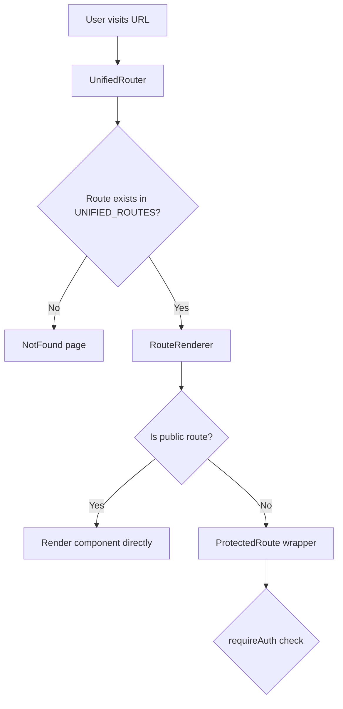
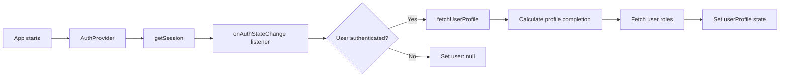
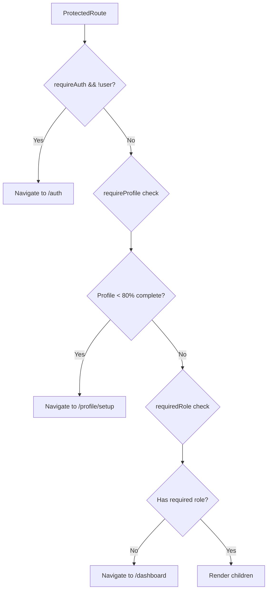

# Complete Routing & Authentication Flow Analysis

## 🚀 Application Entry Point
**File**: `src/App.tsx`
```
App → Providers Stack → UnifiedRouter
```

## 🗺️ Route Flow Architecture

### 1. **UnifiedRouter** (`src/routing/UnifiedRouter.tsx`)


### 2. **Route Categories**
- **Public Routes**: `/, /auth, /help, /challenges, /events`
- **Authenticated Routes**: `/dashboard, /ideas, /settings, /opportunities`
- **Admin Routes**: `/admin/*` (requires admin/super_admin role)
- **Super Admin Routes**: `/dashboard/access-control`

## 🔐 Authentication Flow

### 1. **AuthContext** (`src/contexts/AuthContext.tsx`)


### 2. **Profile Completion Calculation**
- **Edge Function**: `calculate-profile-completion`
- **Required fields**: name, phone, department, position, bio, language
- **Threshold**: 80% completion required for full access

### 3. **Role Management**
- **Roles**: super_admin, admin, team_member, expert, innovator, partner, stakeholder
- **Storage**: `user_roles` table with active status and expiration
- **Priority**: super_admin > admin > team_member > expert > partner > stakeholder > innovator

## 🛡️ Protected Route Logic

### **ProtectedRoute** (`src/components/auth/ProtectedRoute.tsx`)


### **Role-Based Access Control**
```typescript
// Single role check
requiredRole: 'admin'

// Multiple role check (ANY of these roles)
requiredRole: ['admin', 'super_admin']
```

## 📍 Current Route: /signup

### Flow for /signup:
1. **Route**: Maps to `/auth` (ALL_ROUTES.AUTH)
2. **Component**: `AuthPage`
3. **Logic**:
   ```typescript
   // AuthPage checks if user is already authenticated
   if (user && !loading && userProfile) {
     const redirectPath = userProfile.profile_completion_percentage >= 80 
       ? "/dashboard" 
       : "/profile/setup";
     return <Navigate to={redirectPath} replace />;
   }
   
   // If not authenticated, render Auth component
   return <Auth />;
   ```

## 🔄 Authentication State Changes

### **Sign Up Flow**:
1. User submits signup form → `AuthContext.signUp()`
2. Supabase auth creates user → Email verification sent
3. User clicks verification link → Auth state changes
4. `onAuthStateChange` triggers → `fetchUserProfile()`
5. Profile completion calculated → Redirect based on completion

### **Sign In Flow**:
1. User submits login → `AuthContext.signIn()`
2. Supabase validates credentials → Session created
3. Auth state changes → Profile fetched
4. **AuthPage redirect logic**:
   - Profile ≥ 80% → `/dashboard`
   - Profile < 80% → `/profile/setup`

### **Role-Based Redirection**:
- **Regular users**: `/dashboard` → UserDashboard (shows role-appropriate content)
- **Admins**: Can access both `/dashboard` and `/admin/*` routes
- **Insufficient role**: Redirected to `/dashboard` with error toast

## 🚨 Critical Auth Issues & Solutions

### 1. **Supabase URL Configuration**
**Issue**: Users getting "requested path is invalid" or localhost redirects
**Solution**: Set in Supabase Dashboard → Authentication → URL Configuration:
- **Site URL**: Current preview/deployed URL
- **Redirect URLs**: Add all valid domains

### 2. **Route Conflicts** (FIXED)
- ❌ **Previous**: Duplicate `/dashboard` routes in `AUTHENTICATED_ROUTES` and `DASHBOARD_ROUTES`
- ✅ **Fixed**: Removed duplicate from `DASHBOARD_ROUTES`

### 3. **Role Access Logic** (FIXED)
- ❌ **Previous**: Only checked first role in array
- ✅ **Fixed**: Properly handles multiple roles with `Array.isArray()` check

## 📊 Route Access Matrix

| Route | Public | Auth Required | Profile Required | Role Required |
|-------|--------|---------------|------------------|---------------|
| `/` | ✅ | ❌ | ❌ | None |
| `/auth` | ✅ | ❌ | ❌ | None |
| `/dashboard` | ❌ | ✅ | ✅ | None |
| `/admin/dashboard` | ❌ | ✅ | ✅ | admin, super_admin |
| `/dashboard/access-control` | ❌ | ✅ | ✅ | super_admin |
| `/opportunities` | ❌ | ✅ | ✅ | None |

## 🔧 Edge Functions Integration

**Configured Functions**:
- `calculate-profile-completion` (JWT required)
- `elevate-user-privileges` (Public)
- Various analytics and AI functions

**Auth Integration**: Functions use JWT tokens for user identification and role validation.

This unified system provides secure, role-based routing with proper authentication flows and profile completion requirements.