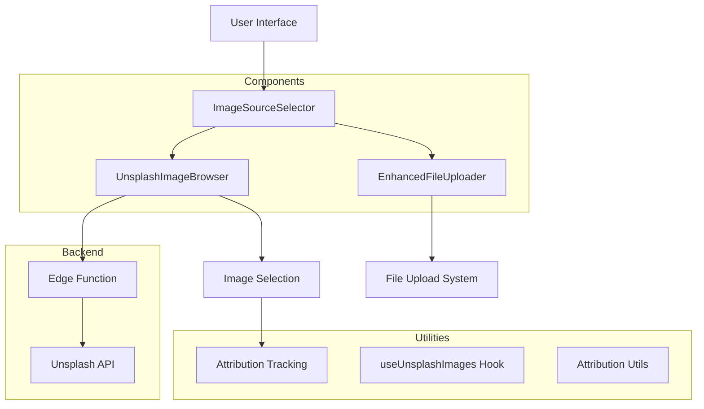

# Unsplash Image Browser System Documentation

## Table of Contents
1. [Overview](#overview)
2. [Architecture](#architecture)
3. [Setup & Configuration](#setup--configuration)
4. [Components Reference](#components-reference)
5. [Hooks & Utilities](#hooks--utilities)
6. [Usage Examples](#usage-examples)
7. [API Reference](#api-reference)
8. [Integration Guide](#integration-guide)
9. [Attribution & Legal](#attribution--legal)
10. [Best Practices](#best-practices)
11. [Troubleshooting](#troubleshooting)

## Overview

The Unsplash Image Browser System provides users with access to millions of high-quality, professional stock photos from Unsplash directly within your application. This system eliminates the need for users to upload images for many use cases, saving storage space and providing instant access to beautiful, professional content.

### Key Features

- **🖼️ Extensive Library**: Access to millions of professional photos
- **🔍 Smart Search**: Advanced search with keywords and filters
- **📱 Responsive Design**: Works seamlessly on all device sizes
- **⚡ Fast Performance**: Optimized loading with infinite scroll
- **📋 Legal Compliance**: Automatic attribution handling
- **🔄 Dual Mode**: Browse stock images OR upload custom files
- **🎨 Multiple Views**: Grid and list view modes
- **🏷️ Quick Categories**: Pre-defined business and technology tags
- **💾 Storage Efficient**: No storage space used for stock images
- **🔒 Secure**: Server-side API key handling

## Architecture

### System Overview



### Component Hierarchy

```
ImageSourceSelector
├── Tabs (Browse Stock Images | Upload Files)
├── UnsplashImageBrowser
│   ├── SearchForm
│   ├── FilterControls
│   ├── QuickTags
│   ├── ImageGrid
│   │   └── ImageCard[]
│   ├── LoadMore
│   └── ImagePreviewDialog
└── EnhancedFileUploader
```

### Data Flow

1. **User Interaction**: User searches for images or selects categories
2. **API Request**: Frontend sends request to edge function
3. **Secure Proxy**: Edge function calls Unsplash API with stored credentials
4. **Data Processing**: Images are enhanced with attribution metadata
5. **UI Update**: Results are displayed in responsive grid/list
6. **Selection**: User selects image, attribution is automatically tracked
7. **Integration**: Selected image URL is passed to parent component

## Setup & Configuration

### Prerequisites

- Supabase project with Edge Functions enabled
- Unsplash Developer Account
- Unsplash API Access Key

### 1. Unsplash API Setup

1. **Create Unsplash Account**
   - Visit [Unsplash Developers](https://unsplash.com/developers)
   - Create a developer account
   - Create a new application

2. **Get API Credentials**
   ```
   Application ID: 786036
   Access Key: K6Mg0p8iyedkohVPdszXkx-u8ppH15O7tTvnw-642Ug
   Secret Key: YihSoK7o8GooBHqVa_lv_FMIHP27UqS5bNCzdfIJYnM
   ```

3. **Add to Supabase Secrets**
   - Go to Supabase Dashboard → Project Settings → Edge Functions
   - Add secret: `UNSPLASH_ACCESS_KEY` with your Access Key

### 2. Edge Function Configuration

The system includes a secure edge function at `supabase/functions/unsplash-images/index.ts` that:
- Handles all Unsplash API communication
- Protects your API credentials
- Processes and enhances image data
- Provides rate limiting and error handling

**Configuration in `supabase/config.toml`:**
```toml
[functions.unsplash-images]
verify_jwt = false  # Public endpoint for ease of use
```

### 3. Component Installation

All components are ready to use:
- `UnsplashImageBrowser` - Main browsing interface
- `ImageSourceSelector` - Combined upload/browse interface
- `OpportunityImageSelector` - Pre-configured for opportunities
- `useUnsplashImages` - Hook for custom implementations

## Components Reference

### UnsplashImageBrowser

The main component for browsing and selecting Unsplash images.

```tsx
interface UnsplashImageBrowserProps {
  onImageSelect: (image: UnsplashImage) => void
  selectedImages?: UnsplashImage[]
  maxSelection?: number
  className?: string
}
```

**Features:**
- Search with keyword filtering
- Orientation filters (landscape, portrait, square)
- Grid/List view toggle
- Infinite scroll loading
- Quick category tags
- Image preview modal
- Attribution display

**Usage:**
```tsx
<UnsplashImageBrowser
  onImageSelect={(image) => handleImageSelection(image)}
  maxSelection={1}
  className="h-96"
/>
```

### ImageSourceSelector

A tabbed interface combining Unsplash browsing with file upload capabilities.

```tsx
interface ImageSourceSelectorProps {
  config: FileUploadConfig
  onFileUpload?: (files: UploadedFile[]) => void
  onUnsplashSelect?: (image: UnsplashImage) => void
  triggerButtonText?: string
  dialogTitle?: string
  allowMultiple?: boolean
  className?: string
}
```

**Features:**
- Dual-mode interface (Browse/Upload)
- Consistent file handling
- Configurable button text
- Modal dialog interface
- Integration with existing upload system

**Usage:**
```tsx
<ImageSourceSelector
  config={uploadConfig}
  onFileUpload={(files) => handleFileUpload(files)}
  onUnsplashSelect={(image) => handleUnsplashSelection(image)}
  triggerButtonText="Add Image"
  dialogTitle="Select Image Source"
/>
```

### OpportunityImageSelector

Pre-configured component for opportunity image selection.

```tsx
interface OpportunityImageSelectorProps {
  opportunityId?: string
  onFileUpload?: (files: UploadedFile[]) => void
  onUnsplashSelect?: (image: UnsplashImage) => void
  disabled?: boolean
  className?: string
}
```

**Usage:**
```tsx
<OpportunityImageSelector
  opportunityId="opportunity-123"
  onFileUpload={(files) => handleFiles(files)}
  onUnsplashSelect={(image) => handleImage(image)}
/>
```

## Hooks & Utilities

### useUnsplashImages Hook

Custom hook providing Unsplash functionality.

```tsx
const {
  searchImages,
  downloadImage,
  getImageAttribution,
  getAttributionHtml,
  saveImageToSupabase,
  loading
} = useUnsplashImages()
```

**Methods:**

#### searchImages
```tsx
searchImages(
  query: string,
  page?: number,
  perPage?: number,
  orientation?: 'landscape' | 'portrait' | 'squarish'
): Promise<UnsplashSearchResult | null>
```

#### downloadImage
```tsx
downloadImage(imageId: string): Promise<string | null>
```

#### getImageAttribution
```tsx
getImageAttribution(image: UnsplashImage): string
// Returns: "Photo by John Doe on Unsplash"
```

#### getAttributionHtml
```tsx
getAttributionHtml(image: UnsplashImage): string
// Returns: 'Photo by <a href="...">John Doe</a> on <a href="...">Unsplash</a>'
```

#### saveImageToSupabase
```tsx
saveImageToSupabase(
  image: UnsplashImage,
  bucket: string,
  path: string
): Promise<string | null>
```

## Usage Examples

### 1. Basic Image Browser

```tsx
import { UnsplashImageBrowser } from '@/components/ui/unsplash-image-browser'

function MyImageBrowser() {
  const handleImageSelect = (image: UnsplashImage) => {
    console.log('Selected:', image.urls.regular)
    console.log('Attribution:', image.attribution)
  }

  return (
    <UnsplashImageBrowser
      onImageSelect={handleImageSelect}
      maxSelection={1}
    />
  )
}
```

### 2. Dual Source Selector

```tsx
import { ImageSourceSelector } from '@/components/ui/image-source-selector'
import { UPLOAD_CONFIGS } from '@/utils/uploadConfigs'

function MyImageSelector() {
  const handleFileUpload = (files: UploadedFile[]) => {
    console.log('Uploaded files:', files)
  }

  const handleUnsplashSelect = (image: UnsplashImage) => {
    console.log('Selected Unsplash image:', image.urls.regular)
    // Save image URL to your database
    saveImageUrl(image.urls.regular, image.attribution)
  }

  return (
    <ImageSourceSelector
      config={UPLOAD_CONFIGS.OPPORTUNITY_IMAGES}
      onFileUpload={handleFileUpload}
      onUnsplashSelect={handleUnsplashSelect}
      triggerButtonText="Choose Image"
    />
  )
}
```

### 3. Custom Hook Usage

```tsx
import { useUnsplashImages } from '@/hooks/useUnsplashImages'

function CustomImageSearch() {
  const { searchImages, loading } = useUnsplashImages()
  const [images, setImages] = useState<UnsplashImage[]>([])

  const handleSearch = async (query: string) => {
    const result = await searchImages(query, 1, 12)
    if (result) {
      setImages(result.results)
    }
  }

  return (
    <div>
      <SearchInput onSearch={handleSearch} />
      {loading && <Spinner />}
      <ImageGrid images={images} />
    </div>
  )
}
```

### 4. Saving to Database

```tsx
function SaveImageExample() {
  const handleUnsplashSelect = async (image: UnsplashImage) => {
    // Option 1: Save URL directly
    const { error } = await supabase
      .from('opportunities')
      .update({
        image_url: image.urls.regular,
        image_attribution: image.attribution
      })
      .eq('id', opportunityId)

    // Option 2: Download and save to Supabase Storage
    const { saveImageToSupabase } = useUnsplashImages()
    const savedUrl = await saveImageToSupabase(
      image,
      'opportunity-images',
      `opportunities/${opportunityId}`
    )
    
    if (savedUrl) {
      await supabase
        .from('opportunities')
        .update({ image_url: savedUrl })
        .eq('id', opportunityId)
    }
  }

  return (
    <ImageSourceSelector
      config={config}
      onUnsplashSelect={handleUnsplashSelect}
    />
  )
}
```

## API Reference

### Edge Function Endpoints

#### Search Images
```http
POST /functions/v1/unsplash-images
Content-Type: application/json

{
  "action": "search",
  "query": "business technology",
  "page": "1",
  "per_page": "20",
  "orientation": "landscape"
}
```

**Response:**
```json
{
  "success": true,
  "data": {
    "total": 10000,
    "total_pages": 500,
    "results": [
      {
        "id": "photo-id",
        "urls": {
          "raw": "https://...",
          "full": "https://...",
          "regular": "https://...",
          "small": "https://...",
          "thumb": "https://..."
        },
        "alt_description": "People working with laptops",
        "user": {
          "name": "John Doe",
          "username": "johndoe"
        },
        "width": 5000,
        "height": 3333,
        "attribution": {
          "photographer": "John Doe",
          "photographer_username": "johndoe",
          "source": "Unsplash",
          "source_url": "https://unsplash.com/photos/photo-id",
          "photographer_url": "https://unsplash.com/@johndoe"
        }
      }
    ]
  }
}
```

#### Download Image
```http
POST /functions/v1/unsplash-images
Content-Type: application/json

{
  "action": "download",
  "id": "photo-id"
}
```

**Response:**
```json
{
  "success": true,
  "download_url": "https://unsplash.com/photos/photo-id/download?ixid=..."
}
```

### UnsplashImage Interface

```typescript
interface UnsplashImage {
  id: string
  urls: {
    raw: string      // Original full resolution
    full: string     // Full resolution (max 6000px)
    regular: string  // Regular size (1080px)
    small: string    // Small size (400px)
    thumb: string    // Thumbnail (200px)
  }
  alt_description: string | null
  description: string | null
  user: {
    name: string
    username: string
    profile_image: {
      small: string
    }
  }
  width: number
  height: number
  color: string      // Dominant color hex
  likes: number
  attribution: {
    photographer: string
    photographer_username: string
    source: string
    source_url: string
    photographer_url: string
  }
}
```

## Integration Guide

### With Existing Upload System

The system integrates seamlessly with your existing file upload infrastructure:

```tsx
// Before: File upload only
<EnhancedFileUploader
  config={uploadConfig}
  onUploadComplete={handleFiles}
/>

// After: File upload + Unsplash
<ImageSourceSelector
  config={uploadConfig}
  onFileUpload={handleFiles}
  onUnsplashSelect={handleUnsplashImage}
/>
```

### With Form Systems

```tsx
import { Controller } from 'react-hook-form'

<Controller
  name="image"
  control={control}
  render={({ field }) => (
    <ImageSourceSelector
      config={uploadConfig}
      onFileUpload={(files) => field.onChange(files[0])}
      onUnsplashSelect={(image) => field.onChange({
        url: image.urls.regular,
        attribution: image.attribution
      })}
    />
  )}
/>
```

### Database Schema Integration

```sql
-- Add attribution columns to existing tables
ALTER TABLE opportunities 
ADD COLUMN image_attribution JSONB,
ADD COLUMN image_source VARCHAR(50) DEFAULT 'upload';

-- Store Unsplash images
UPDATE opportunities 
SET 
  image_url = 'https://images.unsplash.com/photo-123',
  image_attribution = '{
    "photographer": "John Doe",
    "source": "Unsplash",
    "source_url": "https://unsplash.com/photos/123"
  }',
  image_source = 'unsplash'
WHERE id = 'opportunity-id';
```

### Custom Components

Create specialized selectors for different entities:

```tsx
// ChallengeImageSelector.tsx
export function ChallengeImageSelector(props: ChallengeImageProps) {
  const { getUploadConfig } = useUploaderSettings()
  const config = getUploadConfig('CHALLENGE_IMAGES')
  
  return (
    <ImageSourceSelector
      config={config}
      triggerButtonText="Add Challenge Banner"
      dialogTitle="Select Challenge Image"
      {...props}
    />
  )
}

// CampaignImageSelector.tsx
export function CampaignImageSelector(props: CampaignImageProps) {
  const config = getUploadConfig('CAMPAIGN_IMAGES')
  
  return (
    <ImageSourceSelector
      config={config}
      allowMultiple={true}
      triggerButtonText="Add Campaign Materials"
      {...props}
    />
  )
}
```

## Attribution & Legal

### Legal Requirements

Unsplash images are free to use under the [Unsplash License](https://unsplash.com/license), but **attribution is required**:

1. **Credit the photographer**
2. **Credit Unsplash**
3. **Provide clickable links when possible**

### Automatic Attribution

The system automatically handles attribution:

```tsx
// Attribution is automatically included
const image: UnsplashImage = {
  // ... image data
  attribution: {
    photographer: "John Doe",
    photographer_username: "johndoe",
    source: "Unsplash",
    source_url: "https://unsplash.com/photos/abc123",
    photographer_url: "https://unsplash.com/@johndoe"
  }
}
```

### Displaying Attribution

```tsx
function ImageWithAttribution({ image }: { image: UnsplashImage }) {
  return (
    <div>
      
      <p className="text-xs text-muted-foreground">
        Photo by{' '}
        <a href={image.attribution.photographer_url} target="_blank">
          {image.attribution.photographer}
        </a>{' '}
        on{' '}
        <a href={image.attribution.source_url} target="_blank">
          Unsplash
        </a>
      </p>
    </div>
  )
}
```

### Attribution Storage

Store attribution in your database:

```typescript
interface ImageRecord {
  id: string
  url: string
  source: 'upload' | 'unsplash'
  attribution?: {
    photographer: string
    source: string
    source_url: string
    photographer_url: string
  }
}
```

## Best Practices

### 1. Image Selection

```tsx
// ✅ Good: Use appropriate image sizes
const getImageUrl = (image: UnsplashImage, size: 'thumb' | 'small' | 'regular') => {
  return image.urls[size]
}

// ✅ Good: Provide meaningful alt text


// ❌ Avoid: Using full resolution for thumbnails

```

### 2. Performance Optimization

```tsx
// ✅ Good: Lazy loading


// ✅ Good: Responsive images
<picture>
  <source media="(min-width: 1024px)" srcSet={image.urls.regular} />
  <source media="(min-width: 640px)" srcSet={image.urls.small} />
  
</picture>
```

### 3. Search Optimization

```tsx
// ✅ Good: Specific search terms
searchImages("business team collaboration remote work")

// ✅ Good: Category-based searches
const categories = {
  business: "office meeting presentation team",
  technology: "computer laptop coding software",
  innovation: "startup creative ideas brainstorming"
}

// ❌ Avoid: Vague terms
searchImages("stuff")
```

### 4. Error Handling

```tsx
function ImageBrowserWithErrorHandling() {
  const [error, setError] = useState<string | null>(null)
  
  const handleImageSelect = async (image: UnsplashImage) => {
    try {
      await saveImageToDatabase(image)
      setError(null)
    } catch (err) {
      setError('Failed to save image. Please try again.')
    }
  }

  return (
    <div>
      {error && (
        <Alert variant="destructive">
          <AlertDescription>{error}</AlertDescription>
        </Alert>
      )}
      <UnsplashImageBrowser onImageSelect={handleImageSelect} />
    </div>
  )
}
```

### 5. Accessibility

```tsx
// ✅ Good: Proper ARIA labels
<button 
  aria-label={`Select image by ${image.attribution.photographer}`}
  onClick={() => handleSelect(image)}
>
  
</button>

// ✅ Good: Keyboard navigation support
<div 
  role="button"
  tabIndex={0}
  onKeyDown={(e) => {
    if (e.key === 'Enter' || e.key === ' ') {
      handleSelect(image)
    }
  }}
>
```

## Troubleshooting

### Common Issues

#### 1. API Key Not Working

**Problem:** "UNSPLASH_ACCESS_KEY is not configured" error

**Solution:**
1. Verify API key is correctly added to Supabase secrets
2. Check for typos in the secret name
3. Ensure edge function is deployed
4. Verify Unsplash API key is valid

```bash
# Test API key manually
curl -H "Authorization: Client-ID YOUR_ACCESS_KEY" \
  "https://api.unsplash.com/photos/random"
```

#### 2. Images Not Loading

**Problem:** Images appear broken or don't load

**Solution:**
1. Check network connectivity
2. Verify Unsplash URLs are accessible
3. Check for CORS issues
4. Ensure image URLs are not blocked by firewall

#### 3. Search Returns No Results

**Problem:** Search queries return empty results

**Solution:**
1. Try broader search terms
2. Check spelling of search keywords
3. Verify API rate limits haven't been exceeded
4. Test with known working terms like "nature" or "technology"

#### 4. Attribution Not Displaying

**Problem:** Attribution information is missing

**Solution:**
1. Ensure attribution data is saved with image
2. Check database schema includes attribution fields
3. Verify attribution component is properly implemented

```tsx
// Debug attribution data
console.log('Attribution:', image.attribution)
```

### Performance Issues

#### Slow Image Loading

1. **Use appropriate image sizes**:
   ```tsx
   // For thumbnails
   
   
   // For cards
   
   
   // For full display
   
   ```

2. **Implement lazy loading**:
   ```tsx
   
   ```

3. **Add loading states**:
   ```tsx
   {loading && <Skeleton className="h-48 w-full" />}
   ```

#### Memory Usage

1. **Limit concurrent images**:
   ```tsx
   const [images, setImages] = useState([])
   const maxImages = 100
   
   const addImages = (newImages) => {
     setImages(prev => [...prev, ...newImages].slice(-maxImages))
   }
   ```

2. **Clean up image objects**:
   ```tsx
   useEffect(() => {
     return () => {
       // Cleanup image URLs if using createObjectURL
       images.forEach(image => {
         if (image.objectUrl) {
           URL.revokeObjectURL(image.objectUrl)
         }
       })
     }
   }, [images])
   ```

### Development Tips

#### Testing

```tsx
// Mock Unsplash responses for testing
const mockUnsplashImage: UnsplashImage = {
  id: 'test-123',
  urls: {
    regular: 'https://example.com/test-image.jpg',
    small: 'https://example.com/test-image-small.jpg',
    thumb: 'https://example.com/test-image-thumb.jpg'
  },
  attribution: {
    photographer: 'Test Photographer',
    source: 'Unsplash',
    source_url: 'https://unsplash.com/photos/test-123',
    photographer_url: 'https://unsplash.com/@test'
  }
  // ... other required fields
}
```

#### Debugging

```tsx
// Add debug logging
const { searchImages } = useUnsplashImages()

const debugSearch = async (query: string) => {
  console.log('Searching for:', query)
  const result = await searchImages(query)
  console.log('Search result:', result)
  return result
}
```

#### Environment Variables

For local development, you can test with environment variables:

```bash
# .env.local (for local testing only)
UNSPLASH_ACCESS_KEY=your_test_key_here
```

Remember to add secrets to Supabase for production!

## Rate Limits & Quotas

### Unsplash API Limits

- **Demo Apps**: 50 requests per hour
- **Production Apps**: 5,000 requests per hour
- **Enterprise**: Contact Unsplash for higher limits

### Optimization Strategies

1. **Cache results**:
   ```tsx
   const [searchCache, setSearchCache] = useState(new Map())
   
   const cachedSearch = async (query: string) => {
     if (searchCache.has(query)) {
       return searchCache.get(query)
     }
     
     const result = await searchImages(query)
     searchCache.set(query, result)
     return result
   }
   ```

2. **Debounce searches**:
   ```tsx
   const debouncedSearch = useDebouncedCallback(
     (query: string) => searchImages(query),
     300
   )
   ```

3. **Batch requests**:
   ```tsx
   // Load more images in single request
   const loadMore = () => {
     searchImages(query, page + 1, 30) // Larger batch
   }
   ```

---

## Conclusion

The Unsplash Image Browser System provides a comprehensive solution for integrating high-quality stock photography into your application. With its secure architecture, comprehensive attribution handling, and seamless integration with existing upload systems, it offers users the best of both worlds: the convenience of stock photography and the flexibility of custom uploads.

For additional support or feature requests, please refer to the component source code or contact the development team.

---

**Last Updated**: January 2025  
**Version**: 1.0.0  
**Compatibility**: React 18+, Supabase, TypeScript
